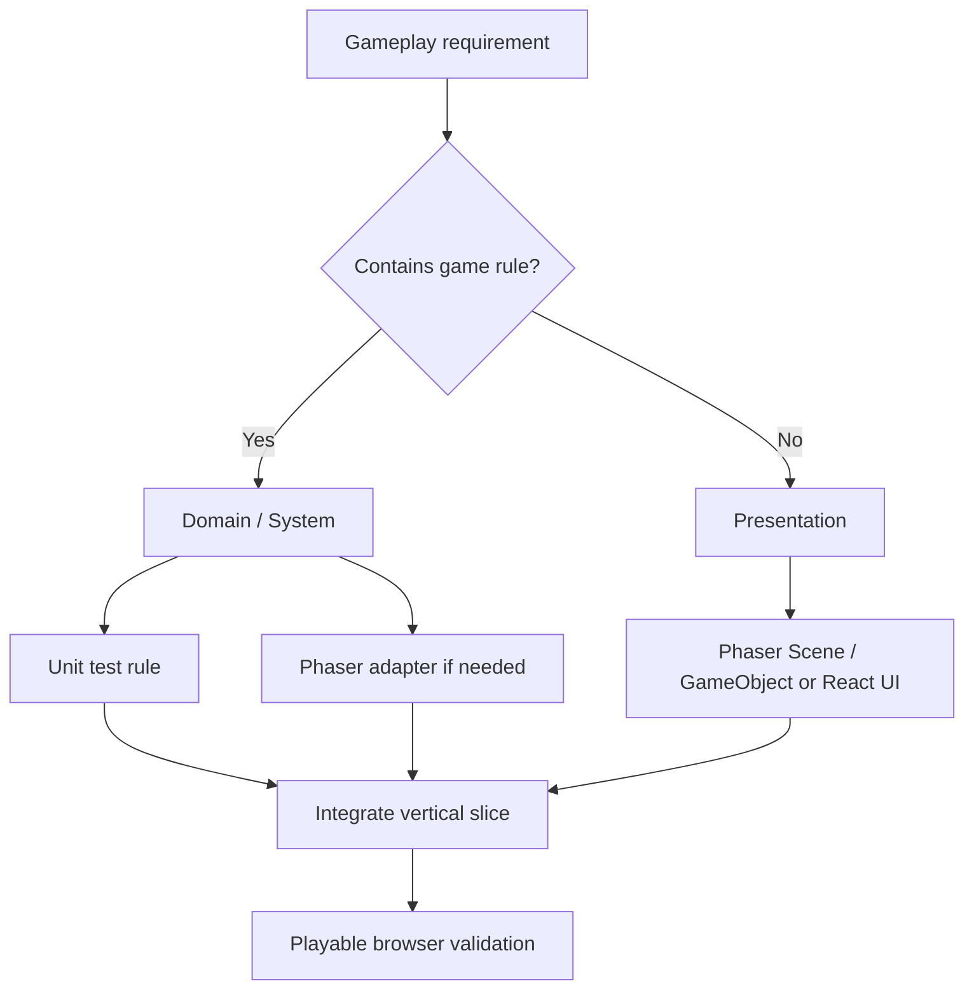

# Phaser Web Pixel Game

## Goal

Build a real, shippable Web 2D pixel game with **TypeScript + Phaser** while keeping the codebase maintainable as gameplay and content grow.

Primary principle:

> Gameplay first, architecture second.

Do not turn feature work into a custom game-engine project.

## Core Architecture Rules

1. **Domain rules MUST NOT depend on Phaser.**
   - Do not import `phaser` from domain modules.
   - Do not model characters, quests, inventory, combat, economy, or progression as Phaser GameObjects.
2. **Phaser Scene is an orchestrator / runtime boundary.**
   - Scene may manage lifecycle, Tilemap, camera, input adapters, object creation, and render synchronization.
   - Scene must not own substantial combat, loot, quest, inventory, or progression rules.
3. **Phaser GameObjects are presentation objects, not domain entities.**
   - Keep domain data as plain TypeScript data.
   - Map domain entity IDs to sprites/views in the presentation layer.
4. **Prefer explicit systems for gameplay behavior.**
   - Examples: `MovementSystem`, `CombatSystem`, `InteractionSystem`, `QuestSystem`, `InventorySystem`, `LootSystem`.
5. **Cross-boundary communication should use explicit commands/events when it reduces coupling.**
   - Do not introduce events for every method call.
   - Use events mainly for cross-module or one-to-many side effects.
6. **Complex Web UI should use React rather than forcing everything into Phaser.**
   - Inventory, equipment, quest log, skill tree, shop, settings, account UI, and text-heavy interfaces belong in React when practical.
   - World-space HP bars, floating damage, interaction hints, target markers, and sprite-bound HUD belong in Phaser.
7. **Do not introduce ECS unless existing complexity justifies it.**
   - Start with simple entities + systems.
   - Consider ECS only when entity composition/query complexity becomes a real problem.
8. **Start with Phaser Arcade Physics.**
   - Upgrade to Matter.js, Rapier, or another solution only when the gameplay needs complex rigid bodies, rotation collision, constraints, or higher-fidelity simulation.
9. **Save data must be plain serializable domain data.**
   - Never serialize Sprite, Texture, Scene, Camera, Tween, Physics Body, or other Phaser objects.
   - Include a save schema `version` from the beginning.
10. **Avoid speculative abstraction.**
    - Do not create generic repositories, plugin frameworks, DI containers, custom renderers, custom physics engines, or wrappers around every Phaser API without a concrete use case.

## Dependency Direction

Prefer:

```text
Phaser Runtime
    ↓
Phaser Adapter / Presentation
    ↓
Application / Game Systems
    ↓
Domain
```

Avoid:

```text
Domain
    ↓
Phaser
```

## Recommended Project Shape

Use the following only as a guide. Do not create empty architecture layers before they are needed.

```text
src/
├── game/
│   ├── bootstrap/
│   ├── scenes/
│   ├── domain/
│   ├── systems/
│   ├── adapters/
│   │   └── phaser/
│   ├── presentation/
│   ├── application/
│   │   ├── commands/
│   │   └── events/
│   └── infrastructure/
├── ui/
├── shared/
└── main.ts
```

See `references/development-guide.md` for the full rationale and examples.

## Feature Implementation Workflow

When implementing a gameplay feature, follow this order:



### Step 1 — Identify the gameplay rule

Ask:

- What is the state transition?
- What is visual-only?
- What belongs to input/render/audio?
- What must remain valid even if Phaser is replaced?

If the behavior defines game rules, place it in domain/system code.

### Step 2 — Implement the smallest vertical slice

Prefer:

```text
Input → Rule → State change → Presentation → Playtest
```

Do not spend multiple feature cycles creating infrastructure before the gameplay is runnable.

### Step 3 — Add tests around rules, not Phaser internals

Prioritize tests for:

- combat calculations
- inventory rules
- quests
- loot
- progression
- economy
- AI decisions
- save migrations

Do not unit-test Phaser itself.

### Step 4 — Validate in browser

A feature is incomplete until its player-facing flow can actually be exercised.

## Scene Review Checklist

When creating or reviewing a Scene:

- Keep lifecycle/orchestration in Scene.
- Move game rules into systems/domain.
- Avoid direct cross-module business logic calls.
- Avoid large `update()` methods containing multiple gameplay domains.
- Treat a Scene approaching roughly 500 lines as a review signal, not an automatic failure threshold.

Bad pattern:

```ts
update() {
  // movement
  // combat rules
  // quest completion
  // loot generation
  // save progression
}
```

Better:

```ts
update(_: number, delta: number) {
  this.worldController.update(delta);
}
```

## GameObject Review Checklist

Reject domain-rich Phaser subclasses such as:

```ts
class Enemy extends Phaser.Physics.Arcade.Sprite {
  calculateLoot() {}
  completeQuest() {}
  addExperience() {}
  saveProgress() {}
}
```

Prefer plain domain data plus a view mapping:

```ts
interface Character {
  id: string;
  hp: number;
  attack: number;
  position: Vec2;
}

type CharacterView = {
  entityId: string;
  sprite: Phaser.GameObjects.Sprite;
};
```

## React + Phaser Boundary

When React is present, do not let React reach into Phaser internal state and do not let Phaser manipulate React internals.

Use a small bridge:

```ts
interface GameBridge {
  dispatch(command: GameCommand): void;
  subscribe(listener: (event: GameEvent) => void): () => void;
}
```

Typical flow:

```text
React Inventory
  ↓ UseItem command
GameBridge
  ↓
InventorySystem
```

and:

```text
QuestSystem
  ↓ QuestCompleted event
GameBridge
  ↓
React Quest UI
```

## Pixel Art Rendering Rules

Prefer:

```ts
const config: Phaser.Types.Core.GameConfig = {
  pixelArt: true,
  roundPixels: true,
};
```

Use a fixed logical resolution when practical, such as `320×180` or `640×360`, and prefer integer scaling to reduce pixel shimmering.

## Assets and Content

Centralize asset and animation keys instead of scattering magic strings.

```ts
export const Assets = {
  Player: {
    Idle: 'player-idle',
    Walk: 'player-walk',
  },
} as const;
```

For maps, prefer a data pipeline such as:

```text
Tiled → TMJ/JSON → Phaser Tilemap
```

Move content definitions out of hard-coded gameplay logic as the game grows:

- maps
- NPC definitions
- items
- quests
- enemies
- dialogue

## Save System Rules

Save snapshots should resemble:

```ts
interface SaveGame {
  version: number;
  player: PlayerSnapshot;
  inventory: InventorySnapshot;
  quests: QuestSnapshot[];
}
```

Loading should support migration:

```text
Stored Save → Deserialize → Migrate → Restore Domain
```

## Recommended Delivery Order

Build in vertical slices:

1. **Playable Core** — map, player spawn, movement, collision, camera.
2. **Interaction** — interactable objects/NPC, dialogue.
3. **Combat** — attack, damage, death, loot.
4. **Progression** — inventory, equipment, quest, reward, save.
5. **Content Pipeline** — map/NPC/item/quest/enemy/dialogue data-driven definitions.

Do not build the entire final architecture before Milestone 1 is playable.

## Architecture Warning Signs

Investigate when any of the following appears:

- `phaser` imports under domain code.
- Scene owns quest/combat/inventory/economy rules.
- Phaser GameObject carries persistent domain state.
- Save snapshots contain Phaser objects.
- Systems directly form long dependency chains such as `CombatSystem → QuestSystem → UISystem → AudioSystem`.
- New abstraction has no current second consumer or replacement requirement.
- Event count grows faster than meaningful domain behavior.
- Significant engine infrastructure is being written while the next gameplay loop is still unplayable.

## Definition of Done

A gameplay feature is done when:

- Gameplay can be exercised in the browser.
- Domain rules do not require Phaser.
- Scene contains orchestration rather than substantial business/game rules.
- Important game rules have tests.
- Assets do not introduce avoidable magic-string sprawl.
- Save state contains only serializable game data.
- No speculative framework was introduced without an active need.
- The complete feature flow works from player input to visible result.

## Decision Heuristic

When uncertain between a cleaner abstraction and a simpler implementation, prefer the simpler implementation **unless the current feature already demonstrates a coupling or maintenance problem**.

The target is not a beautiful engine. The target is a game that remains understandable while it grows.
