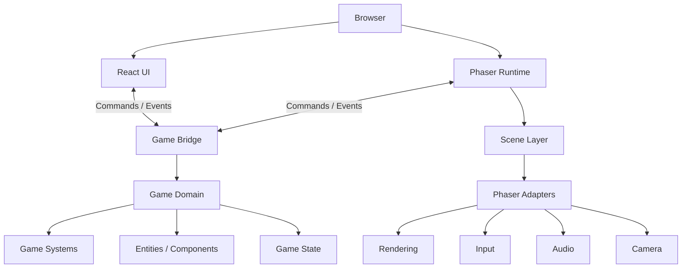
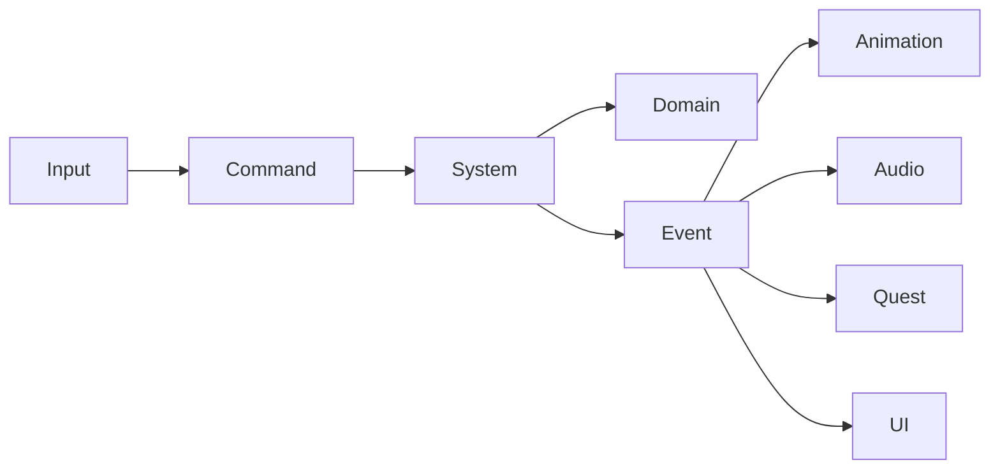
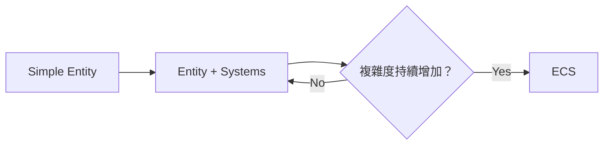
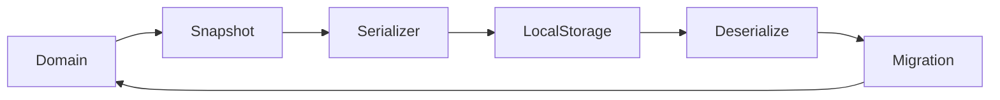
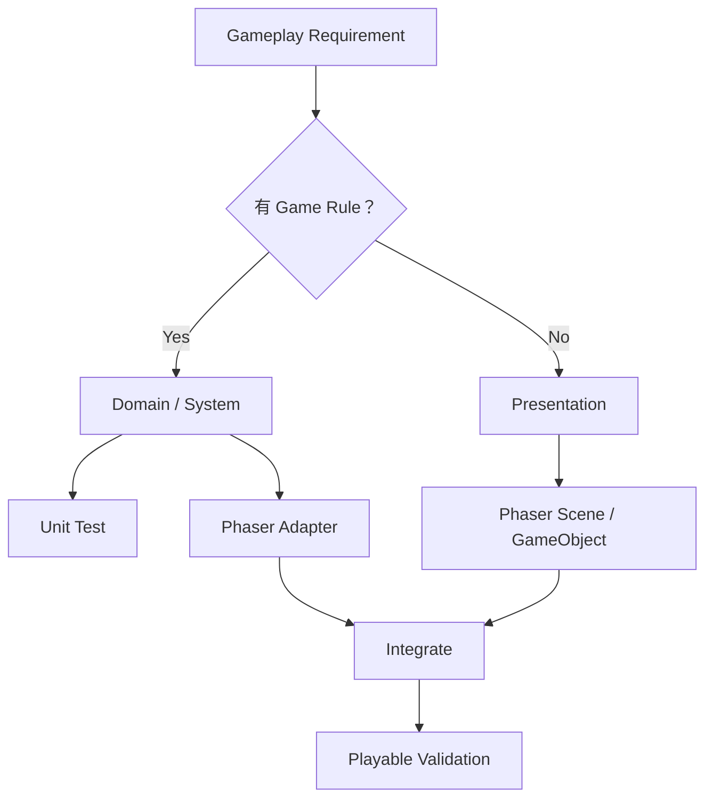

# Web 像素遊戲開發指引

> 目標：使用 **TypeScript + Phaser** 開發一款可實際完成、發布與長期維護的 Web 2D 像素遊戲，同時避免遊戲邏輯與 Phaser Framework 過度耦合。

## 1. 核心原則

本專案不是為了打造自製 Game Engine，而是為了 **完成一款遊戲**。

因此技術決策遵循以下優先順序：

1. Gameplay 可快速迭代
2. Domain Logic 可獨立測試
3. Phaser 僅負責遊戲 Runtime / Presentation
4. 複雜 UI 優先使用 Web 技術
5. 避免過早抽象與過度工程化
6. 當需求真正出現時才引入 ECS、Physics abstraction 等額外層

核心設計原則：

```text
Game Rules ≠ Phaser
```

遊戲規則不應依賴 `Phaser.Scene`、`Phaser.GameObjects.Sprite` 或其他 Phaser-specific API。

## 2. 建議技術棧

### 基礎

```text
TypeScript
Vite
Phaser
Vitest
ESLint
Prettier
```

### UI

當遊戲存在較複雜的 Web UI 時：

```text
React
Zustand（可選）
```

適合交給 React 的 UI：Inventory、Equipment、Quest Log、Skill Tree、Shop、Settings、Login / Account、Leaderboard、大量文字型 Dialogue UI。

適合留在 Phaser 的 UI：Floating Damage、World-space HP Bar、Target Indicator、Interaction Hint、遊戲世界中的 Tooltip、與 Camera / Sprite 高度綁定的 HUD。

### 地圖

```text
Tiled
  ↓
TMJ / JSON
  ↓
Phaser Tilemap
```

## 3. 整體架構



依賴方向：

```text
Phaser
  ↓
Adapter
  ↓
Application / Game Systems
  ↓
Domain
```

避免：

```text
Domain
  ↓
Phaser
```

## 4. 建議目錄結構

```text
src/
├── game/
│   ├── bootstrap/
│   ├── scenes/
│   ├── domain/
│   ├── systems/
│   ├── adapters/
│   │   └── phaser/
│   ├── presentation/
│   ├── application/
│   │   ├── commands/
│   │   └── events/
│   └── infrastructure/
├── ui/
├── shared/
└── main.ts
```

這不是硬性 Clean Architecture。只建立目前遊戲真正需要的層，不為未來假想需求建立 abstraction。

## 5. Scene 的責任

Phaser `Scene` 應視為 Runtime Orchestrator。

Scene 可以做 Phaser lifecycle、建立 Sprite、載入 Tilemap、Camera 初始化、Input adapter 初始化、將 Phaser Object 綁定 Domain Entity、呼叫 Game Systems、Render synchronization。

Scene 不應承擔 death、quest、loot、inventory、progression 等核心遊戲規則。

```ts
export class WorldScene extends Phaser.Scene {
  private controller!: WorldController;

  create() {
    this.controller = createWorldController({
      input: new PhaserInputAdapter(this),
      renderer: new PhaserRenderAdapter(this),
    });
  }

  update(_: number, delta: number) {
    this.controller.update(delta);
  }
}
```

## 6. GameObject 的責任

不要把 `Phaser.Sprite` 當 Domain Entity。

```ts
interface Character {
  id: string;
  hp: number;
  attack: number;
  position: Vec2;
}

type CharacterView = {
  entityId: string;
  sprite: Phaser.GameObjects.Sprite;
};
```

## 7. System 設計

以行為 / 規則拆 System，而不是依畫面拆：

```text
MovementSystem
CombatSystem
InteractionSystem
InventorySystem
QuestSystem
LootSystem
SpawnSystem
```

System 應盡可能無 Phaser dependency、接收明確 input、產生明確 state mutation / event，並可透過 Unit Test 測試。

## 8. Event / Command 邊界

不要讓各模組直接互相存取。



避免形成 `CombatSystem → QuestSystem → UISystem → AudioSystem` 的 chain coupling。

## 9. React 與 Phaser 整合

兩者不要直接互相操作 internal state。

```ts
interface GameBridge {
  dispatch(command: GameCommand): void;
  subscribe(listener: (event: GameEvent) => void): () => void;
}
```

React 可透過 command 控制遊戲，遊戲則透過 event 通知 React UI。

## 10. Physics 策略

初期優先使用 Phaser Arcade Physics。只有需求真的需要複雜剛體、Rotation collision、Constraint、高精度 Physics Simulation 時，再考慮 Matter.js、Rapier 或其他方案。

Domain 層不要持有 `Phaser.Physics.Arcade.Body`，而使用自己的 velocity、position 等資料結構。

## 11. ECS 使用原則

第一版不要預設使用 ECS。初期 `Entity + Systems` 通常足夠。

當同畫面數百～數千 Entity、組合變化頻繁、大量共享 Component、System 需要批量 Query Entity、OOP hierarchy 開始失控時，再評估 ECS。



## 12. Asset 管理

建立統一 Asset Key，避免 magic strings 散落。

```ts
export const Assets = {
  Player: {
    Idle: 'player-idle',
    Walk: 'player-walk',
  },
} as const;
```

Animation key 同樣集中管理。

## 13. Game State

Domain State 包含 Player、Inventory、Quest、World、NPC State、Progress。

Presentation State 包含 Current Animation、Camera Shake、Particle、Selected UI Tab、Tooltip。

不要把 Sprite、Texture、Camera、Scene、Tween 存進 Save Game。

## 14. Save System

Save data 必須是純資料，且一開始就包含 schema version。

```ts
interface SaveGame {
  version: number;
  player: {
    position: Vec2;
    hp: number;
  };
  inventory: InventorySnapshot;
  quests: QuestSnapshot[];
}
```



## 15. 測試策略

不需要測 Phaser 本身。

Unit Test 主要測 Combat、Inventory、Quest、Loot、Progression、Economy、AI Decisions、Save Migration。

Integration Test 主要覆蓋 `Command → System → Domain → Event`。

E2E 只覆蓋關鍵 Gameplay Flow。

## 16. Pixel Art Rendering 規則

```ts
const config: Phaser.Types.Core.GameConfig = {
  pixelArt: true,
  roundPixels: true,
};
```

像素遊戲應優先固定 Logical Resolution，例如 `320×180` 或 `640×360`，再以整數倍率放大，盡量避免非整數 Scale 造成 Pixel Shimmering。

## 17. 第一階段不要做的事情

避免：自製 Renderer、自製 Physics Engine、完整 ECS Framework、Plugin architecture、Dependency Injection Container、Distributed Event Bus、自製 Scene Framework、自製 Animation Engine、Generic Repository Pattern、為所有 Phaser API 建 Interface。

只有在有真實替換需求時才建立 Adapter。

## 18. 架構警訊

- Scene 接近或超過約 500 行：視為 review signal，檢查是否可拆 System / Controller。
- `domain/` 直接 import Phaser：重新檢查 dependency boundary。
- GameObject 包含 loot、quest、experience、save 等大量 game rules：責任失控。
- 每個 method 都發 Event：可能形成 event spaghetti。

## 19. Definition of Done

- Gameplay 可實際操作
- Domain rule 不依賴 Phaser
- Scene 沒有塞入大量 Business Logic
- 必要 Domain Rule 有 Unit Test
- Asset Key 沒有散落 Magic String
- Save Data 不包含 Phaser Object
- 沒有為假想需求增加 abstraction
- 可以在瀏覽器完成完整 Feature Flow

## 20. 建議開發順序

以 Vertical Slice 推進。

### Milestone 1 — Playable Core

```text
Load Map → Player Spawn → Movement → Collision → Camera
```

### Milestone 2 — Interaction

```text
Player → NPC / Object → Interaction → Dialogue
```

### Milestone 3 — Combat

```text
Attack → Damage → Death → Loot
```

### Milestone 4 — Progression

加入 Inventory、Equipment、Quest、Reward、Save。

### Milestone 5 — Content Pipeline

逐步建立 Tiled Map、NPC、Item、Quest、Enemy、Dialogue 的 data-driven 定義。

## 21. AI Agent 開發規則

```text
1. Domain layer MUST NOT import Phaser.
2. Phaser Scene is orchestration / presentation only.
3. Do not introduce new abstraction without an existing use case.
4. Prefer vertical-slice gameplay delivery over engine infrastructure.
5. Business/game rules require tests.
6. Phaser GameObjects must not be serialized as game state.
7. Cross-module communication should use explicit commands/events when useful.
8. Do not create ECS unless existing entity complexity justifies it.
```



## 22. 最終技術定位

```text
Phaser = Web 2D Game Runtime
```

而不是：

```text
Phaser = 整個 Game Architecture
```

> **Gameplay First，Architecture Second。**

架構的目的不是讓程式碼看起來像 Engine，而是讓遊戲可以持續增加內容而不失控。第一個版本應優先證明「這個遊戲好不好玩？」而不是「這個 Engine 架構夠不夠漂亮？」
