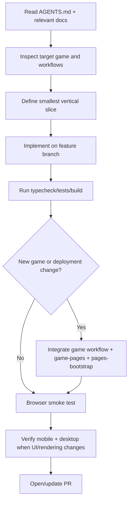
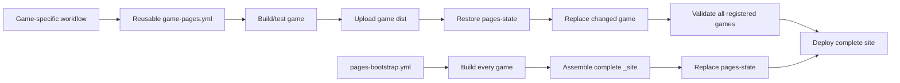

# AGENTS.md — 2D Game Playground Agent Guide

This repository is a collection of independently buildable web-game projects published together through GitHub Pages. AI agents working here must treat gameplay implementation **and** repository-level CI/Pages integration as part of delivering a game.

## Mandatory first step

Before planning or changing code:

1. Read this file completely.
2. Read `docs/` and identify documents relevant to the game, renderer, CI, deployment, architecture, or incident being touched.
3. Read the target game's own `README.md`, `docs/`, package scripts, Vite/configuration files, and existing tests.
4. Inspect the current `.github/workflows/<game>.yml`, `.github/workflows/game-pages.yml`, and `.github/workflows/pages-bootstrap.yml` before changing deployment behavior.
5. Reuse repository conventions; do not invent a second deployment architecture for one game without an explicit reason.

**Incident/postmortem documents in `docs/` are engineering constraints, not optional background reading.** If a previous incident documents a failure mode, new code must preserve its prevention rules unless the change explicitly supersedes them and updates the document.

## Development workflow



- Work on a feature/fix/docs branch. Do not commit directly to `main`.
- Keep slices small enough to test and review independently.
- Preserve gameplay behavior unless the task intentionally changes it.
- Prefer fixing root causes over suppressing errors or adding arbitrary retries.
- Add/update tests when changing domain/gameplay logic.
- For rendering/bootstrap/deployment fixes, include observable diagnostics and a browser smoke-test procedure.

## Required validation

For a game directory, use its committed package scripts and lock file. At minimum validate:

```bash
npm ci
npm test       # when the project defines tests / CI expects them
npm run build
```

Do not assume `vite build` alone is sufficient if the package `build` script also runs TypeScript checks.

If a lock file exists, CI should normally use `npm ci`. Do not replace a valid committed lock file with `npm install` merely to make CI pass.

## Adding a new game

Adding `<game>/` is incomplete until all repository integration points are updated.

### 1. Game project

The game should normally provide:

- `<game>/package.json`
- `<game>/package-lock.json`
- `<game>/index.html`
- `<game>/src/...`
- a `build` script producing `<game>/dist`
- tests and `npm test` where appropriate
- Vite/base-path configuration compatible with deployment under `/2D-game-playground/<game>/`

Never assume root-path hosting. Verify generated asset URLs under the actual Pages subdirectory.

### 2. Per-game CI workflow

Create `.github/workflows/<game>.yml` following an existing game workflow and call the reusable `.github/workflows/game-pages.yml` workflow with the correct:

- `game`
- install command
- test flag
- deploy flag / branch behavior
- path filters for the game and shared workflow when appropriate

PRs must build/test without unintentionally publishing. `main` is the normal deployment source.

### 3. `game-pages.yml`

Update `.github/workflows/game-pages.yml` in **both** relevant places:

1. Add the game to the complete-site validation list so partial Pages state cannot silently omit it.
2. Add a landing-page `<li>` link/description.

The reusable publisher restores `pages-state`, replaces only the changed game's dist, validates that every registered game has an `index.html`, refreshes the landing page, persists `pages-state`, then deploys the complete site. Do not change this into a single-game-only Pages artifact.

### 4. `pages-bootstrap.yml`

Update `.github/workflows/pages-bootstrap.yml` in **all** relevant places:

1. `Build games`: add `build_game <game> ...` with the correct deterministic install/test commands.
2. `Assemble complete site`: add the game to the `games="..."` list.
3. Landing page: add the game link/description.

`pages-bootstrap.yml` is the recovery/full-rebuild path. A game present only in its per-game workflow or `game-pages.yml` can disappear during a future full bootstrap.

### 5. Verify full-site behavior

A new-game PR is not complete until the agent verifies that:

- the game builds to `dist/`;
- its generated `index.html` references valid subpath assets;
- the per-game workflow includes it;
- `game-pages.yml` validates and links it;
- `pages-bootstrap.yml` builds, copies, and links it;
- existing games remain in the complete-site lists.

## GitHub Pages architecture



Maintain both paths. Incremental publishing and full bootstrap must describe the same set of games.

## Rendering and browser compatibility

Web games must be tested as deployed applications, not only as successful bundles.

For PixiJS or other renderer-backed games:

- renderer initialization must be observable;
- do not allow application bootstrap to wait forever on renderer initialization;
- show a useful bootstrap failure state instead of leaving an empty mount element;
- verify that the canvas is actually inserted;
- test desktop and mobile when renderer/bootstrap/input/layout code changes.

For the concrete PixiJS desktop-black-screen incident and its prevention rules, read:

- `docs/gomoku-rpg-pixijs-desktop-bootstrap-incident.md`

A black page with successful network requests is not automatically a Vite base-path problem. Inspect the DOM and application logs first.

## Blank-page debugging order

Use evidence in this order:

1. Confirm `index.html` and JS/CSS/assets return successfully.
2. Confirm the expected mount element exists.
3. Check whether a `canvas` or application root was inserted.
4. Check logs emitted by the application's own bundle.
5. Instrument renderer/application initialization if the mount remains empty.
6. Only then modify renderer, base-path, CSP, or deployment configuration according to the evidence.

Do not treat browser-extension `contentscript.js` warnings as game errors unless they can be causally tied to the application.

## TypeScript safety

Do not bypass strict TypeScript errors with broad casts or non-null assertions when control flow can establish the invariant.

For DOM elements used across async bootstrap boundaries, prefer:

```ts
const hostElement = document.querySelector<HTMLElement>('#app');
if (!hostElement) throw new Error('Missing #app');
const host: HTMLElement = hostElement;
```

This avoids regressions such as `TS18047: 'host' is possibly 'null'` in CI.

## Documentation responsibility

When a non-obvious production/CI/browser failure is resolved:

1. Record symptoms and observed evidence.
2. Separate misleading signals from causal evidence.
3. Record the root cause.
4. Record the actual fix.
5. Add prevention and smoke-test rules.
6. Link the document from this file when the lesson applies repository-wide or is likely to recur.

Do not let important operational knowledge exist only in PR comments or chat history.

## Definition of done

A slice is complete when applicable code/tests/build pass, deployment integration remains coherent, relevant docs are updated, desktop/mobile smoke testing has been considered, and the change is delivered through a PR with a concise explanation of behavior, validation, and risks.
