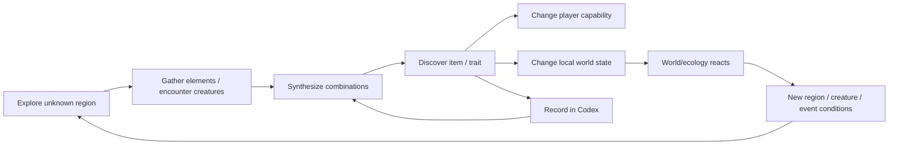

# Bitland

Bitland is a 2D pixel sandbox RPG set inside a binary virtual world. The world is built from simple geometric primitives and a small set of root elements; exploration, synthesis, and ecology all evolve under explicit world laws.

## Product pillars

1. **Rule-Bounded Generation** — generated content may be surprising, but it must pass deterministic world rules.
2. **Player-Shaped Ecology** — gathering, synthesis, combat, and resource pressure influence future regions and creatures.
3. **Discovery as Progression** — the main progression layer is learning combinations, traits, and world laws through the Codex.
4. **Primitive Pixel Identity** — terrain, creatures, resources, and effects are assembled from simple pixel/geometric primitives rather than bespoke high-detail art.

## Core loop

## MVP direction

The first MVP validates the systemic loop before adding broad AI generation. The simulation core owns legality, stats, seeds, and persistence. AI is introduced later as a constrained semantic proposal layer only.

See [`docs/MVP.md`](./docs/MVP.md) for scope, milestones, architecture, risks, and acceptance criteria.

## Target stack

- TypeScript
- Vite
- PixiJS 8
- Vitest for deterministic simulation/domain tests
- GitHub Pages under `/2D-game-playground/bitland/`

## Status

**P0.0 — project foundation / MVP planning**

Initial implementation should prioritize desktop-first keyboard controls while keeping the rendering/input architecture compatible with later mobile controls.
