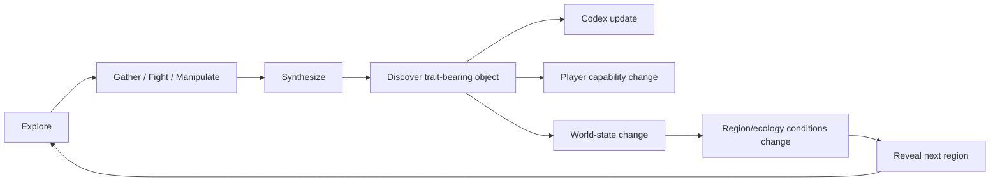
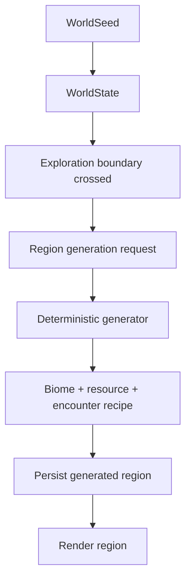
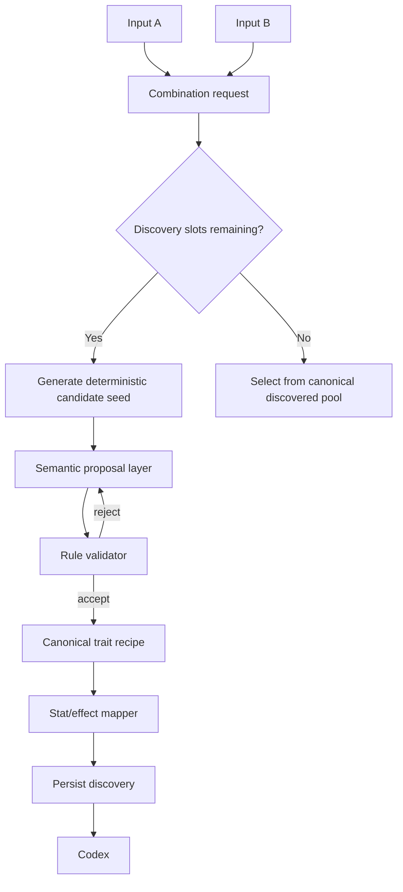
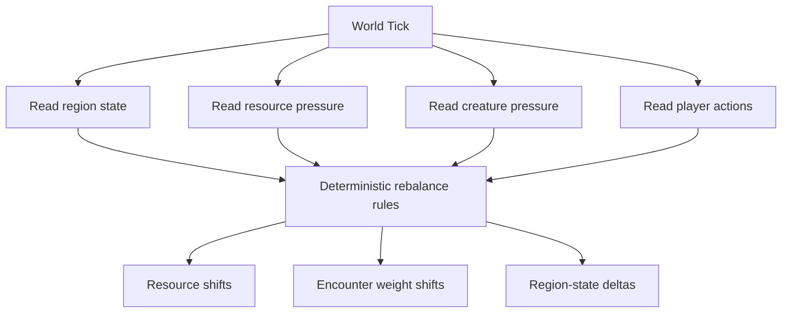
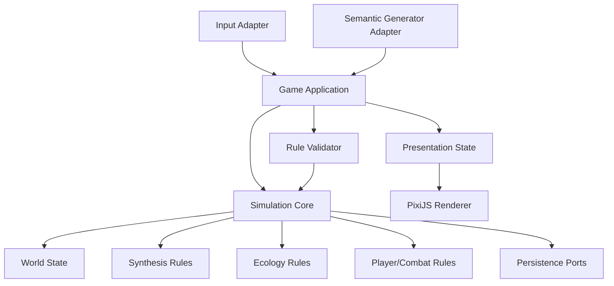

# Bitland — MVP v0.1 Plan

## 1. Product thesis

Bitland is a systemic 2D sandbox RPG in a virtual world built from `0/1`, geometric primitives, and a deliberately small set of absolute laws.

The MVP is not trying to prove that an LLM can generate infinite content. It is trying to prove a tighter proposition:

> A small deterministic simulation becomes meaningfully replayable when exploration, synthesis, and ecology continuously feed each other, while generated semantic content is constrained by world laws.

The product should feel like discovering and manipulating a living digital ecosystem rather than consuming authored levels.

## 2. Design pillars

### 2.1 Rule-Bounded Generation

Generated content must be constrained by deterministic game rules. AI may propose names, descriptions, trait combinations, ecology concepts, or visual recipes, but it must not directly own legality, combat numbers, economy values, persistence, or simulation outcomes.

### 2.2 Player-Shaped Ecology

Player actions write back into local and global world state. Gathering, defeating creatures, moving resources, and synthesizing objects should eventually influence future generation and ecology pressure.

### 2.3 Discovery as Progression

Progression is driven primarily by discovering elements, combinations, object traits, region conditions, and ecological relationships. A Codex records stable discoveries and exposes unknown relationships as explicit goals.

### 2.4 Primitive Pixel Identity

Visual language is built from lines, rectangles, triangles, circles, binary glyphs, and low-resolution pixel forms. This keeps generated content visually coherent without requiring unique authored art for every generated object.

## 3. MVP success criteria

The v0.1 vertical slice is successful when a fresh player can complete the following loop in one browser session:

1. Move through a compact side-view region using run/jump/climb-capable traversal foundations.
2. Gather at least three root resource types from the environment or creatures.
3. Carry/interact with at least one physical world object.
4. Combine two inputs at a synthesis node.
5. Discover a deterministic generated result with traits.
6. See the result added to the Codex.
7. Use the result to alter either traversal, combat, or a local world-state value.
8. Cross an exploration boundary and generate/reveal a new region from the current seed and world state.
9. Save and reload the same world without changing established discoveries.

The slice should make the player want to try another combination or push into another unknown region.

## 4. MVP non-goals

The following are explicitly deferred:

- unrestricted LLM-driven generation;
- online multiplayer;
- server-authoritative simulation;
- infinite map streaming;
- full daily real-time world rebalance;
- procedural civilization simulation;
- deep equipment rarity/economy systems;
- large combo trees or character skill trees;
- live-service monetization;
- production-scale content moderation pipeline.

## 5. First world laws

The MVP should begin with a deliberately small rule vocabulary. Names are placeholders until playtesting confirms the model.

### Root elements

- `MATTER`
- `ENERGY`
- `LIFE`
- `SIGNAL`

These are not merely crafting currencies. They are reusable semantic/world-state variables.

Example traits derived from them:

- `HEAVY`
- `LIGHTWEIGHT`
- `HOT`
- `REFLECTIVE`
- `ORGANIC`
- `PULSING`
- `CONDUCTIVE`
- `UNSTABLE`

### Combination rule

A pair of input identities has a bounded discovery pool.

For MVP:

- maximum new discoveries per unordered pair: **3**;
- after the pool is exhausted, synthesis draws from discovered results using deterministic weighted selection;
- world seed + pair identity + discovery index must reproduce the same canonical result;
- generated semantic proposals must map to a finite supported trait vocabulary before being accepted.

This prevents synthesis from becoming an unbounded random-content slot machine.

## 6. Core gameplay loop



## 7. MVP world model

The MVP should use chunk/region-based lazy generation instead of constructing a large world up front.



A region becomes canonical once generated and persisted. Revisiting it must not reroll its identity.

### Initial region set

Use three visual/ecological archetypes for v0.1:

1. **Data Field** — green/teal baseline region; matter/life biased.
2. **Crystal Node** — blue/cyan signal/energy-rich region.
3. **Corruption Field** — red/orange unstable region with higher hostile pressure.

Only a small subset needs to be reachable in the first slice; the architecture must support deterministic expansion.

## 8. Player interaction model

### Movement foundation

Initial player verbs:

- walk/run;
- jump;
- climb up/down where surfaces permit;
- basic dodge;
- basic attack;
- basic guard;
- contextual interact.

Do not add advanced movement systems until the exploration loop is proven.

### Grab / manipulation

`Interact / Grab` is a first-class sandbox verb.

Supported physical interactions should grow toward:

- push;
- pull;
- carry;
- drop;
- throw;
- place into a synthesis node.

MVP may implement only push/pull/carry if needed to keep scope controlled.

## 9. Combat scope

Combat exists to support ecology/resource pressure, not to become the primary progression system.

Initial combat:

- one light attack;
- one guard action;
- one dodge action;
- one grounded creature archetype;
- one floating or crawling variant if schedule permits;
- readable hit feedback and short recovery windows.

Creature loot should feed root-element acquisition or world-state pressure.

## 10. Synthesis system



### Separation of responsibility

**AI / semantic generator may own**

- display name proposal;
- short description;
- supported trait proposal;
- ecology flavor;
- primitive visual recipe proposal.

**Deterministic game code owns**

- legal trait vocabulary;
- combination cap;
- numeric stats;
- combat effects;
- resource costs;
- world-state mutation values;
- seed/reproducibility;
- save data;
- fallback behavior when AI is unavailable.

The MVP must remain playable with a local deterministic fallback generator.

## 11. Codex

The Codex is both progression UI and a debugging surface for the systemic design.

Minimum entry fields:

- canonical id;
- display name;
- source inputs;
- traits;
- first-discovered timestamp or simulation tick;
- short description;
- known effects;
- visual recipe id;
- discovery index for the input pair.

The UI should expose unknown pair outcomes as `???` rather than revealing the entire graph.

## 12. World tick / ecology

Full daily rebalance is deferred until the base loop works.

For v0.1, implement a manual or session-end `World Tick` simulation API so the architecture is ready for later scheduling.



No LLM should be required for this simulation step.

## 13. Entropy — experimental meta-system

Entropy is a promising differentiator but should be treated as an experiment until the core loop is validated.

Potential rule:

- new discoveries and unstable traits raise entropy;
- entropy thresholds unlock mutation/anomaly conditions;
- high entropy creates meaningful tradeoffs rather than merely increasing difficulty.

Do not make world reset/rewrite mandatory in the first MVP.

## 14. Architecture

Use a simulation-first architecture. PixiJS is the renderer/presentation layer, not the owner of domain state.



### Suggested project boundaries

```text
bitland/src/
├── main.ts
├── app/
│   └── GameApp.ts
├── simulation/
│   ├── world/
│   ├── synthesis/
│   ├── ecology/
│   ├── combat/
│   └── player/
├── generation/
│   ├── SemanticGenerator.ts
│   ├── LocalGenerator.ts
│   └── RuleValidator.ts
├── persistence/
├── input/
├── presentation/
│   ├── world/
│   ├── entities/
│   ├── effects/
│   └── ui/
└── shared/
```

Domain/simulation modules should remain testable without PixiJS.

## 15. Visual direction

The visual target established for the concept is a side-view binary wilderness with:

- primitive pixel geometry;
- layered teal/green, cyan/blue, and red/orange biome language;
- visible `0/1` glyph/data motifs;
- simple but recognizable player silhouette;
- geometric resource nodes and creatures;
- synthesis nodes as major landmarks;
- minimal diegetic UI rather than a HUD-heavy presentation.

Generated entities should resolve to a finite primitive visual grammar so the world remains coherent.

## 16. Milestones

### P0 — Playable world foundation

#### P0.0 Project foundation

- Vite + TypeScript + PixiJS project shell;
- observable renderer bootstrap with visible failure state;
- CI/build/Pages integration;
- deterministic simulation boundary established.

#### P0.1 Movement + camera

- side-view player locomotion;
- run/jump;
- collisions/platform traversal;
- camera follow;
- keyboard controls;
- architecture ready for mobile input adapter.

#### P0.2 Interaction + resources

- interact/grab foundation;
- resource nodes;
- inventory with 3–4 root resources;
- one manipulate/pushable world object.

#### P0.3 Combat foundation

- attack/guard/dodge;
- one ground creature;
- loot/resource pressure;
- hit feedback.

**P0 exit:** moving, gathering, manipulating, and fighting in one compact region feels coherent.

### P1 — Discovery loop

#### P1.1 Synthesis node

- combine two inputs;
- deterministic pair key;
- bounded result pool;
- trait mapping;
- local fallback generator.

#### P1.2 Codex

- persistent discovered result registry;
- unknown outcome slots;
- item/trait inspection.

#### P1.3 Effect feedback

- at least one synthesized result changes traversal/combat/world state;
- discovery presentation strong enough to feel rewarding.

**P1 exit:** `gather → synthesize → discover → use` is fun without external AI.

### P2 — Generative exploration

#### P2.1 Region generator

- deterministic region seed;
- 3 biome archetypes;
- lazy generation at exploration boundaries;
- persistence of revealed regions.

#### P2.2 World-state influence

- region generation reads global/local state;
- resource and trait usage influence generation weights.

#### P2.3 Semantic generator adapter

- optional external AI adapter behind a port;
- strict schema/trait validation;
- timeout and deterministic fallback;
- generated semantics never directly set gameplay numbers.

**P2 exit:** two fresh worlds can diverge while remaining explainable and reproducible.

### P3 — Living ecology slice

#### P3.1 World Tick

- deterministic rebalance step;
- resource shifts;
- creature encounter-weight shifts;
- region-state deltas.

#### P3.2 Ecological feedback

- repeated harvesting/hunting creates observable pressure;
- at least one creature/resource relationship responds to player behavior.

#### P3.3 Emergent event prototype

- one boss/anomaly event triggered from world-state thresholds rather than a fixed level index.

**P3 exit:** the player can cause a world change, leave, advance simulation, and observe a meaningful consequence.

## 17. Acceptance tests by capability

### Simulation

- same world seed and same action sequence produce the same deterministic state;
- synthesis pair cap cannot be exceeded;
- persisted discoveries retain canonical identity;
- generated region identity does not reroll after revisit.

### Rendering/bootstrap

- `#app` exists;
- canvas is mounted after successful bootstrap;
- renderer initialization has observable logs;
- renderer failure/timeouts surface a visible error state rather than a black page;
- desktop and mobile browser smoke tests are considered for rendering/input changes.

### Pages

- Bitland builds to `bitland/dist`;
- generated asset paths work under `/2D-game-playground/bitland/`;
- Bitland exists in per-game CI, reusable complete-site validation, full bootstrap build list, and both landing-page paths.

## 18. Product risks

| Risk | Impact | MVP response |
|---|---|---|
| AI output feels arbitrary | Discovery loses meaning | bounded pair pools + finite trait vocabulary + deterministic validator |
| Generated content breaks balance | progression/economy collapse | numeric values owned only by deterministic rule mapping |
| Infinite-system scope | project never reaches playable slice | gate work through P0 → P1 → P2 → P3 exits |
| Visual incoherence | generated world feels cheap | finite primitive pixel grammar |
| World simulation is opaque | player cannot connect cause/effect | expose Codex/world-state feedback and keep early ecology rules simple |
| AI/network dependency | game becomes unavailable or nondeterministic | local generator is mandatory; AI adapter is optional |
| Renderer/bootstrap regression | published game is blank | observable bounded PixiJS bootstrap + visible failure state |

## 19. MVP measurement

Before expanding content, evaluate:

- Do players voluntarily try multiple synthesis combinations?
- Can they explain why a discovered object is useful?
- Does seeing `???` in the Codex create a clear next goal?
- Does the first generated region feel causally related to the current world rather than purely random?
- Can a player notice at least one world/ecology consequence of their behavior?

If these answers are weak, adding more AI-generated content should not be the next step.

## 20. Immediate next implementation slice

Start with **P0.0 → P0.1** only:

1. establish PixiJS bootstrap and deterministic simulation/application boundary;
2. render one Data Field test region using primitive geometry;
3. implement player movement/collision/camera;
4. keep resources, synthesis, AI adapters, and ecology behind future milestone interfaces rather than premature production implementations.

This gives the project a playable foundation while preserving the architecture required by the larger concept.
