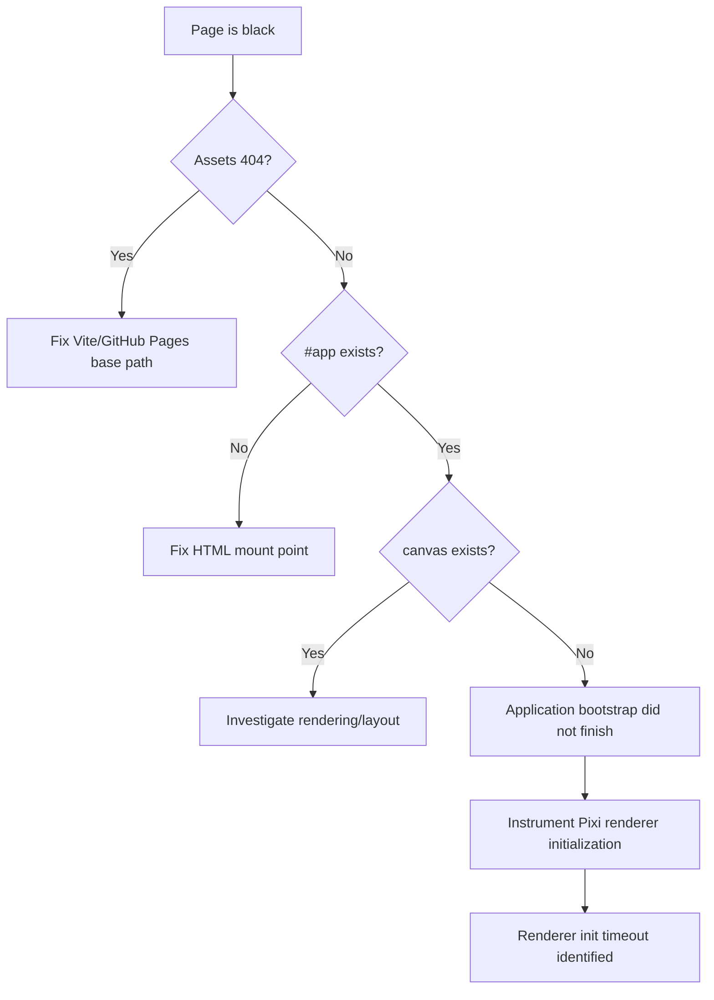

# Gomoku RPG — PixiJS Desktop Bootstrap Incident

## Summary

`gomoku-rpg` could load normally on mobile while desktop Chromium displayed only a black page. Network requests for the HTML and bundled assets were successful, but `document.querySelector('canvas')` returned `null` and `#app` remained empty.

This was therefore **not an asset-path / GitHub Pages 404 problem**. The application module loaded, but PixiJS never completed renderer initialization, so the canvas was never mounted.

## Evidence observed in production

Desktop console eventually showed:

```text
[Gomoku RPG] Initializing WebGL renderer.
[Gomoku RPG] WebGL renderer initialization failed.
Error: WebGL renderer initialization timed out after 5000ms

[Gomoku RPG] Initializing WebGPU renderer.
[Gomoku RPG] WebGPU renderer initialization failed.
Error: WebGPU renderer initialization timed out after 5000ms
```

DOM inspection showed:

```js
document.querySelector('canvas') // null
document.querySelector('#app')   // exists
document.querySelector('#app')?.innerHTML // ""
```

The `contentscript.js` / `ObjectMultiplex` / `MaxListenersExceededWarning` messages were browser-extension noise and were not the game failure.

## Root cause

The failure was caused by the PixiJS application bootstrap path used by the game. Renderer initialization was allowed to stall during module/application startup on the affected desktop environment. Because mounting the Pixi canvas depended on that initialization completing, the application never reached the point where it inserted a canvas into `#app`.

The important diagnostic distinction was:



## Resolution

The bootstrap was changed so that renderer startup happens explicitly after module evaluation rather than relying on a fragile initialization path. Renderer creation is isolated in an async bootstrap function, instrumented, bounded by a timeout, and attempted with explicit renderer preferences/fallbacks.

Conceptually:

```ts
const hostElement = document.querySelector<HTMLElement>('#app');
if (!hostElement) throw new Error('Missing #app');
const host: HTMLElement = hostElement;

async function bootstrap() {
  try {
    const app = await createRenderer();
    host.replaceChildren(app.canvas);
    app.stage.addChild(root);
    render();
  } catch (error) {
    console.error('Renderer bootstrap failed', error);
    host.dataset.bootstrapError = 'renderer';
    host.textContent = 'Unable to start the game renderer.';
  }
}

void bootstrap();
```

Renderer initialization must also be observable. Do not leave an indefinite `await app.init(...)` with no logging or failure UI.

## TypeScript follow-up

A CI-only TypeScript failure occurred after the bootstrap change:

```text
TS18047: 'host' is possibly 'null'
```

Checking `if (!host) throw ...` was insufficient for the later async closure/control-flow usage. Preserve the narrowed value explicitly:

```ts
const hostElement = document.querySelector<HTMLElement>('#app');
if (!hostElement) throw new Error('Missing #app');
const host: HTMLElement = hostElement;
```

Do not silence this with `host!` unless there is no safer alternative.

## Prevention rules

1. A successful HTTP/network panel does **not** prove the game booted.
2. For a blank page, inspect `#app` and `canvas` before changing deployment paths.
3. Renderer initialization must have explicit logs, timeout/error handling, and visible bootstrap failure output.
4. Verify both mobile and desktop browsers for rendering/bootstrap changes.
5. Do not diagnose extension `contentscript.js` logs as application failures without matching evidence from the game bundle.
6. Keep a committed lock file and use deterministic installs (`npm ci`) once the lock file exists.
7. `npm run build` must include TypeScript checking and must pass before merge.
8. When changing async bootstrap code, preserve DOM null narrowing across async boundaries with a non-null local binding.

## Desktop smoke test

After deployment, verify:

```js
document.querySelector('#app') !== null
document.querySelector('canvas') !== null
document.querySelector('#app')?.dataset.bootstrapError === undefined
```

Also confirm the console reaches the game's renderer-ready/application-bootstrap-complete log and that the first interactive screen is visible.
