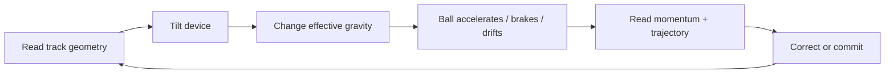
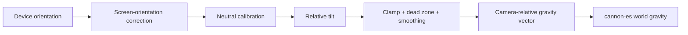
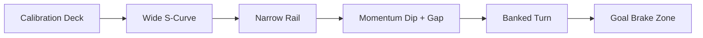
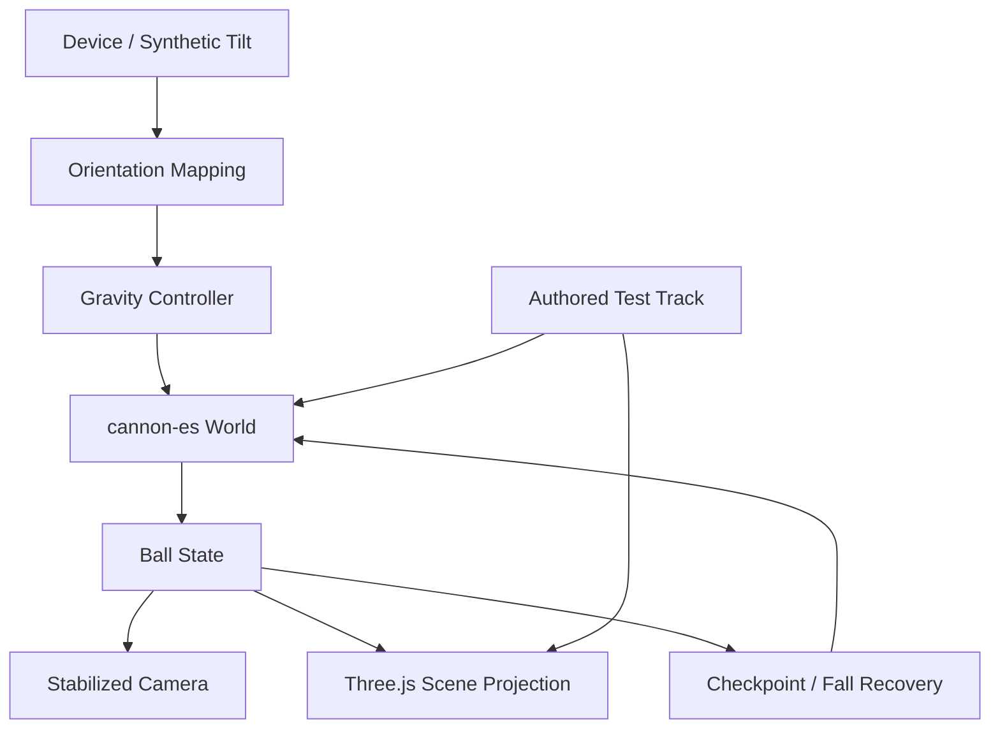
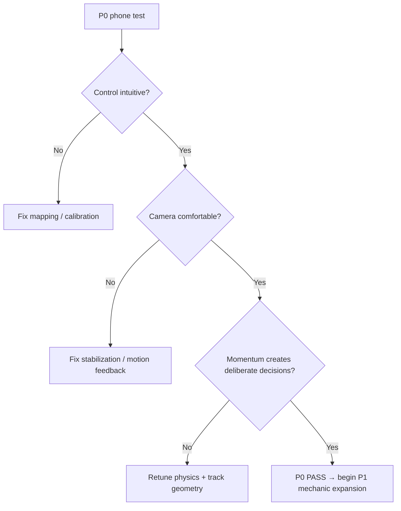

# Inner Rail — P0 Gameplay Prototype Spec

## 1. Product objective

P0 exists to validate one experience before adding puzzle machinery, content systems, progression, or final art:

> The player tilts the phone, feels that tilt become force on a rolling ball, and deliberately manages momentum from a stabilized first-person viewpoint inside that ball.

The prototype succeeds only if the control/physics/camera combination is intrinsically enjoyable on a phone.

### P0 hypotheses

1. **Tilt can read as force rather than steering.** The player should learn to accelerate, coast, brake, and correct without a virtual joystick.
2. **Momentum can create decisions.** A gap, curve, and narrow section should require planning speed and line rather than merely holding a direction.
3. **First-person can remain comfortable.** The player can feel rotation and impact without the horizon rolling with the rigid body.
4. **Geometry can teach the mechanic.** The track should explain the required action through shape and motion, with almost no instructional HUD.

If these do not hold, do not add more mechanics to compensate.

---

## 2. Gameplay identity

**Genre:** first-person kinetic puzzle / physical rail maze.

**Player fantasy:**

> I am inside a mechanical sphere, using gravity and momentum to survive and solve a giant spatial toy.

The core verb is not `move`. It is:

> **tilt the physical system**.



P0 intentionally contains only one controllable rule set. The depth must come from the interaction between **force × velocity × track geometry × timing**.

---

## 3. Platform and presentation contract

### Primary target

- Mobile web.
- **Landscape-first** for a wider forward field of view and two-axis tilt control.
- Portrait should show a single clear rotate-device state rather than compressing gameplay.
- Desktop exists for development/smoke testing, not as the P0 product target.

### Session shape

- One tap to enter the prototype and request motion permission where required.
- Neutral calibration immediately before play.
- One authored run lasting roughly **60–90 seconds** for a competent player.
- Instant restart/recenter available without leaving gameplay.

No menu hierarchy, level map, inventory, score screen, or meta progression in P0.

---

## 4. Device tilt → gravity contract

The control must behave as a physical field, not position steering.

### Input pipeline



### Player-facing behavior

- Tilt phone left/right → gravity gains a left/right component.
- Tilt phone forward/back → gravity gains a forward/back component.
- Returning toward neutral removes that horizontal component; it does **not** directly stop the ball.
- To brake, the player tilts against current momentum.
- Input should preserve a meaningful neutral zone so natural hand tremor does not constantly steer the ball.
- Extreme tilt should saturate rather than continue increasing acceleration.

### Mapping rules

- Use orientation relative to a calibrated neutral pose; never depend on a fixed table angle.
- Correct for current screen orientation before gameplay mapping.
- Map control in the player's current camera-heading frame so `tilt forward` remains perceptually forward.
- Keep total effective gravity magnitude approximately constant while changing its direction.
- Initial tuning target: useful control within roughly **±20–30°** of device tilt.
- Sensor smoothing must reduce noise without making corrections feel delayed.

### Permission / fallback

- Motion permission must be requested from a user gesture where the browser requires it.
- A failed/denied sensor state must show a visible explanation rather than a dead game.
- Desktop/dev fallback: keyboard or pointer-based synthetic tilt feeding the **same control abstraction**.
- Fallback input does not count as passing the phone gameplay gate.

---

## 5. Ball physics contract

### Physical model

- One dynamic sphere rigid body.
- Static authored track collision bodies.
- Gravity is the only continuous player control force in P0.
- Track friction, restitution, damping, and ball mass are global tuning parameters, not per-section tricks.

### Required feel

The ball should communicate:

- **weight** — direction changes have inertia;
- **traction** — mild corrections are readable, not ice-like;
- **commitment** — high speed requires advance braking;
- **impact** — walls and landings visibly/sound-wise register without becoming chaotic;
- **predictability** — repeating the same approach should produce substantially the same outcome.

### Initial tuning policy

Use physically coherent values first, then tune for readability. Do not hide poor handling with arbitrary per-track impulses, invisible magnets, or scripted velocity changes during P0.

A speed cap may exist only as a safety bound against simulation instability, not as the normal movement model.

---

## 6. First-person camera contract

The camera is part of the control system and is a P0 blocker if it causes disorientation.

### Core rule

> **The ball rotates. The camera does not inherit rigid-body roll.**

The camera lives near the ball center and follows translation, but its orientation is stabilized independently.

### Orientation behavior

- **Roll:** fixed at 0° for P0.
- **Yaw:** follows travel/track direction with damped convergence rather than snapping to instantaneous velocity.
- **Pitch:** restrained and may respond to slope/trajectory, but must remain within a conservative comfort range.
- Very low speed must not cause yaw hunting from noisy velocity vectors.
- Airborne movement must preserve a stable view instead of trying to point exactly along every ballistic change.

### Motion feedback

Allowed:

- subtle FOV expansion with speed;
- brief impact impulse;
- faint inner-shell/reference geometry;
- speed lines or environment streaking only if they improve motion reading.

Not allowed in P0:

- camera inheriting sphere spin;
- full-screen rotational shake;
- large head-bob;
- uncontrolled roll on banked track;
- constant decorative camera motion.

Provide a reduced-motion path that removes nonessential FOV/impact motion while preserving control readability.

---

## 7. P0 test track

The track is a **measurement instrument**, not a showcase level. Every section must isolate one control question.

### Sequence



### A. Calibration Deck — basic cause/effect

- Wide, forgiving surface.
- Player can accelerate, reverse, and stop without falling.
- Visual references make left/right/forward motion obvious.

**Question:** does tilt immediately read as force?

### B. Wide S-Curve — correction timing

- Broad walls and readable curvature.
- Requires alternating lateral corrections while preserving forward speed.

**Question:** can the player anticipate momentum rather than chase position?

### C. Narrow Rail — precision

- Slower section with little lateral margin.
- No new mechanic.

**Question:** can small tilt produce stable fine control?

### D. Momentum Dip + Gap — commitment

- Visible downhill run-up into one modest gap.
- Enough room to retreat and rebuild speed after failure.

**Question:** can the player intentionally create and judge launch speed?

### E. Banked Turn — physical line choice

- One fast curved section with strong banking.
- No inversion or magnetic attachment yet.

**Question:** does track geometry + velocity produce a satisfying physical line?

### F. Goal Brake Zone — mastery check

- Finish target requires reducing speed rather than merely crossing a line at maximum velocity.

**Question:** has the player learned that reverse tilt is braking?

### Scope guard

Do **not** add loops, magnetic rails, moving platforms, switches, alternate materials, or branching maze logic until this track passes the P0 gate.

---

## 8. Failure and recovery

P0 should minimize dead time.

### Falling

- Falling off the track triggers a short spatial recovery, then restores the ball to the most recent authored checkpoint.
- Recovery must preserve orientation clarity and take only a brief moment.
- Checkpoints exist for iteration speed, not as a progression system.

### Restart / recenter

Persistent minimal actions:

- **Restart** — reset the run.
- **Recenter** — treat the current comfortable device pose as neutral.

Do not use lives, fail screens, currency penalties, or completion stars.

---

## 9. UI / UX contract

Gameplay occupies the viewport. Persistent UI only exists where the player continuously needs agency.

### Visible states

1. **Start / motion permission** — one dominant action.
2. **Rotate device** — shown only when portrait blocks the intended experience.
3. **Calibration** — concise physical instruction and neutral-pose confirmation.
4. **Gameplay** — restart/recenter only; no permanent speedometer required.
5. **Sensor unavailable/denied** — clear recovery/fallback state.

### Information hierarchy

Prefer world feedback over HUD:

- track width and curvature communicate risk;
- movement itself communicates acceleration;
- goal is a physical world object/zone;
- checkpoint/recovery state is spatially visible;
- optional debug telemetry is hidden behind a dev flag.

Touch targets should remain comfortably at or above 44 CSS px and respect mobile safe areas.

---

## 10. Technical architecture

Reuse the repository's Three.js + cannon-es precedent rather than introducing another 3D stack.



### Proposed modules

```text
inner-rail/
  src/
    app/
      bootstrap.ts
      GameApp.ts
    input/
      TiltInput.ts
      DeviceOrientationSource.ts
      SyntheticTiltSource.ts
      orientationMath.ts
    physics/
      PhysicsWorld.ts
      BallController.ts
      physicsConfig.ts
    camera/
      FirstPersonCamera.ts
    track/
      TestTrack.ts
      checkpoints.ts
    render/
      GameScene.ts
      materials.ts
    ui/
      PrototypeOverlay.ts
    telemetry/
      PrototypeTelemetry.ts
```

### Dependency rules

- Sensor APIs terminate at the input layer.
- Orientation mapping is pure/testable math.
- Physics owns authoritative ball position/velocity.
- Render objects project physics state; they do not drive it.
- Camera reads ball state but never writes physical velocity.
- Track collision and visible geometry should derive from the same authored section definitions where practical.

---

## 11. Debug / telemetry requirements

P0 needs enough instrumentation to tune by evidence without turning debug UI into player UI.

Development telemetry should expose at least:

- raw + filtered tilt;
- calibrated neutral orientation;
- effective gravity vector;
- ball linear speed;
- ball vertical state / grounded approximation;
- camera yaw target vs current yaw;
- current track section/checkpoint;
- fall/reset count.

A query flag or dev mode may expose this overlay. It must be absent from the normal gameplay presentation.

---

## 12. Validation gate

P0 passes only after **real-phone playtesting**. Bundle success is not enough.

### Functional gate

- Motion permission/calibration works on supported mobile browsers.
- Recenter works during a run.
- The same input abstraction works with desktop synthetic tilt for development.
- The complete track can be finished without scripted assists.
- Falling always recovers; the player cannot become permanently stuck.
- Camera never inherits sphere roll.

### Gameplay gate

For a small external test (target **5 players**, no explanation beyond the start/calibration screen):

- at least **4/5** can intentionally accelerate, brake, and change direction after the calibration section;
- at least **3/5** finish the complete track within three attempts;
- at least **3/5** succeed at the gap by visibly adjusting run-up speed rather than through repeated random attempts;
- no more than **1/5** reports that the camera is the primary reason they cannot continue the short session;
- players can describe the control in terms equivalent to **tilting / gravity / momentum**, not "moving a joystick with the phone".

### Product decision



Do not solve a failed P0 gate by adding more obstacles, rewards, tutorials, or progression.

---

## 13. Explicitly deferred after P0

Candidates only after the baseline passes:

- magnetic / inverted rail surfaces;
- wall rides and loops;
- moving or rotating track pieces;
- switches and stateful gates;
- alternate ball materials;
- authored spatial maze levels;
- diegetic inner-shell instrumentation;
- rolling/impact audio system and richer haptics;
- progression and level structure.

The next implementation slice after this spec is accepted is **P0.1 — Repository Scaffold + Tilt Input Harness**.
