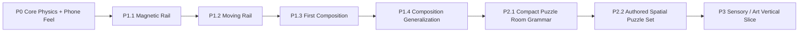

# Inner Rail — Prototype Roadmap

> Goal: prove the first-person gyro / physics identity, then expand only with physical rules that multiply force, momentum, spatial, and timing decisions.

## Delivery flow

Every slice ends in an observable gameplay gate. New rules are kept only when they create a decision that the existing vocabulary cannot already produce.

---

## P0 — Core Identity

**Status:** implementation complete; formal external validation remains open.

Accepted implementation contracts:

- device tilt changes effective gravity rather than steering position directly;
- Cannon physics is authoritative;
- camera follows authored route-forward rather than instantaneous ball velocity;
- braking and deliberate backward motion remain readable without 180° camera flips;
- P0 validation route remains available through `?stage=p0`;
- P0.4 tuning and local validation instrumentation remain available for later formal phone testing.

Remaining formal P0 evidence:

- baseline feel lock;
- primary orientation lock;
- five-player external protocol.

---

## P1 — Physical Puzzle Vocabulary

**Status:** **COMPLETE for current vertical-slice scope**.

P1 is closed without adding a third mechanic. Magnetic + Moving already demonstrate distinct decisions individually and in composition; adding more vocabulary now would increase feature count before spatial level design has tested the depth of the accepted system.

### P1.1 — Magnetic Rail

**Status:** **ACCEPTED as core vocabulary**.

Accepted evidence:

- magnetic surfaces establish a local down direction while preserving camera-relative tilt intent;
- progressive geometry supports a controllable 78° wall ride;
- braking / reverse remain usable while attached;
- magnetic release changes approach speed, braking, and momentum planning;
- no detach button, auto-forward force, or velocity rewrite is required.

Full 90°+ inversion remains an extension rather than a requirement.

### P1.2 — Moving Rail

**Status:** implementation accepted as reusable vocabulary; isolated route retained for regression.

Accepted implementation contract:

- deterministic kinematic rail motion;
- Cannon owns the live transform / collision velocity;
- Three.js projects simulation state only;
- no countdown HUD, random timing, scripted impulse, or new player input;
- restart resets the authored cycle while checkpoint recovery leaves live timing intact.

The isolated route remains available through `?stage=p1-moving` for diagnosis.

### P1.3 — Moving Rail × Magnetic Rail Composition

**Status:** **ACCEPTED on real phone**.

The first composition places both rules on the same physical collider: a 48° magnetic shuttle moving laterally between two magnetic lanes.

Accepted product result:

- moving magnetic attachment remains usable on-device;
- the composition reads as one physical object rather than two sequential mechanics;
- player decision centers on reading lateral alignment and choosing when to commit;
- collision, kinematic velocity, render pose, and magnetic field sampling share one live simulation transform;
- no new input, detach command, countdown HUD, hidden floor, or scripted route force is required.

### P1.4 — Composition Generalization / System Depth Gate

**Status:** **PASS on real phone**.

The second composition uses the same Moving + Magnetic vocabulary as a vertical magnetic lift instead of a lateral shuttle.

Accepted phone result:

- P1.3 is understood primarily as **waiting for lateral alignment and choosing the transfer moment**;
- P1.4 is understood as **controlling position while being transported, then preparing momentum before leaving the lift**;
- the two puzzles therefore create materially different decision structures despite sharing the same mechanics;
- no third mechanic, new input, countdown, height meter, hidden floor, or scripted impulse is needed to create that distinction.

**System-depth decision:** PASS. The accepted vocabulary is sufficiently composable to move into spatial puzzle level design. Do not add a third mechanic until P2 demonstrates an actual content gap that the current system cannot solve.

---

## P2 — Spatial Puzzle Levels

**Status:** active.

P2 changes the unit of design from a linear mechanic-validation track to a compact 3D puzzle room. The goal is to make players understand **where to go and why** from world geometry, then use the accepted physics vocabulary to execute that plan.

### P2.1 — Compact Puzzle Room Grammar

**Status:** **PASS on real phone**.

Accepted result:

- elevated goal and folded route are understandable without minimap / waypoint / tutorial text;
- elevation and moving / magnetic surfaces read as route structure rather than decoration;
- returning through the same chamber at a different height is spatially coherent;
- the space reads as one puzzle room rather than a longer obstacle course;
- height-aware route camera and checkpoint logic support stacked traversal without breaking the existing route-forward control contract.

**Spatial grammar decision:** KEEP. The project can now author multiple rooms from this grammar before adding another gameplay rule.

### P2.2 — Authored Spatial Puzzle Set

**Status:** implementation active; real-phone progression gate pending.

**Goal:** prove the accepted room grammar can support a short teach → vary → mastery progression through spatial relationship changes alone.

#### Room A — Teach

- reuse the accepted P2.1 room;
- goal visible near spawn;
- lower route → moving magnetic lift → upper moving bridge → return over known space;
- establishes the baseline grammar and visual language.

#### Room B — Vary

- move the ordinary moving-bridge timing problem **before** the elevation change;
- cross the floor first, then discover the magnetic lift on the far side;
- return above the floor-level path toward a goal near the starting side;
- tests whether reordering known relationships creates a distinct plan without a new mechanic.

#### Room C — Mastery

- use a moving magnetic lift to reach the upper route;
- later use a second moving magnetic surface as a lateral shuttle;
- fold the upper return around the chamber toward the start-side goal;
- combines the two accepted Moving × Magnetic relationships inside one larger mental map.

#### P2.2 constraints

- exactly the existing ordinary / magnetic / moving / moving-magnetic vocabulary;
- no switch, key, friction surface, jump, detach input, countdown HUD, minimap, waypoint, or text tutorial;
- room difficulty should increase through topology, ordering, and composition rather than longer corridors or narrower rails;
- every room remains directly selectable for diagnosis through stable `?stage=` ids.

#### P2.2 phone gate

- [ ] Room A teaches the spatial grammar without explanation;
- [ ] Room B feels related but requires a different plan because timing now precedes elevation;
- [ ] Room C reads as mastery of already-known relationships rather than a hidden new rule;
- [ ] moving / magnetic world language remains readable as multiple candidate surfaces appear together;
- [ ] each completed room can be summarized as a small set of spatial relationships rather than a memorized sequence of platforms;
- [ ] later-room difficulty comes from planning further ahead, not from raw execution difficulty alone;
- [ ] after Room C, the current vocabulary still feels capable of producing more authored spatial puzzles without immediately requiring a third mechanic.

**Gate rule:** do not enter P3 merely because three rooms are completable. P2.2 passes only if the set feels like a coherent authored progression and Room C demonstrates planning over several known relationships at once.

---

## P3 — Sensory / Art Vertical Slice

After spatial puzzle structure is stable, establish the premium kinetic-toy identity through restrained materials, lighting, rolling/contact audio, meaningful haptics where supported, and diegetic state cues rather than persistent HUD.

The immediate gameplay gate is **P2.2 A → B → C authored progression on a real phone**. P1 vocabulary expansion remains intentionally paused.
