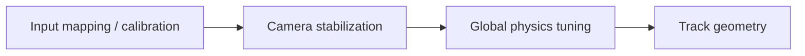

# Inner Rail — Prototype Roadmap

> Goal: prove the first-person gyro/physics identity on a real phone before investing in puzzle devices, content production, or progression.

## Delivery strategy

Every slice ends in an observable gameplay gate. P0 implementation is complete only when the 60–90 second test track is playable on phone and the control/camera hypotheses have been evaluated.

```mermaid
flowchart LR
    S[P0 Spec] --> P01[P0.1 Scaffold + Tilt Harness]
    P01 --> P011[P0.1.1 Orientation-Agnostic Harness]
    P011 --> P02[P0.2 Ball Physics + Stable Camera]
    P02 --> P03[P0.3 Validation Track]
    P03 --> P031[P0.3.1 Track-Forward Camera]
    P031 --> P04[P0.4 Phone Feel Gate]
    P04 --> P1[P1 Physical Puzzle Vocabulary]
    P1 --> P2[P2 Spatial Puzzle Levels]
    P2 --> P3[P3 Sensory / Art Vertical Slice]
```

## P0 — Gameplay Prototype Spec

**Status:** defined in `P0-GAMEPLAY-PROTOTYPE-SPEC.md`.

**Decision:** validate **tilt → force → momentum → correction** and stabilized first-person comfort before adding mechanics.

---

## P0.1 — Repository Scaffold + Tilt Input Harness

**Status:** complete.

**Objective:** create the deployable `inner-rail/` project and prove that device orientation can be permissioned, calibrated, normalized, and observed reliably.

### Deliverables

- [x] `inner-rail/` Vite + strict TypeScript project
- [x] full-screen mobile harness
- [x] device-orientation permission flow
- [x] neutral calibration / recenter
- [x] screen-orientation correction
- [x] dead-zone / clamp / smoothing pipeline
- [x] desktop synthetic tilt source using the same `TiltInput` contract
- [x] dev telemetry overlay
- [x] unit tests for orientation math
- [x] complete CI / GitHub Pages registration

---

## P0.1.1 — Orientation-Agnostic Harness

**Status:** complete; real-device portrait/landscape input mapping accepted.

**Objective:** remove the premature landscape assumption and make portrait/landscape an explicit real-device comparison.

- [x] portrait and landscape share one `TiltInput` contract
- [x] viewport rotation invalidates the old neutral calibration
- [x] both orientations reach the same physics path

---

## P0.2 — Ball Physics + Stabilized First-Person Camera

**Status:** implementation complete; real-device direction mapping accepted, with final feel/orientation tuning deferred to P0.4.

**Objective:** establish the physical sensation before building a level.

- [x] cannon-es dynamic sphere
- [x] tilt-driven camera-relative effective gravity
- [x] global friction / restitution / damping
- [x] stable fixed-step simulation
- [x] camera translation follows ball while roll remains stabilized
- [x] restrained pitch and speed FOV
- [x] restart / recenter
- [x] debug telemetry + live feel tuning

---

## P0.3 — 60–90 Second Validation Track

**Status:** implementation complete; real-phone course-completion / timing gate pending.

**Objective:** turn the established movement model into deliberate physical decisions without adding new rules.

- [x] Calibration Deck
- [x] Wide S-Curve
- [x] Narrow Rail
- [x] Momentum Dip + Gap
- [x] Banked Turn
- [x] Goal Brake Zone
- [x] authored recovery checkpoints

Every challenge uses the same gravity/ball rule set. No invisible assists, per-section handling changes, magnets, moving hazards, switches, or scripted launch forces.

---

## P0.3.1 — Track-Forward Camera

**Status:** complete; real-phone backward-motion behavior accepted.

**Objective:** separate **where the ball is moving** from **where the player is looking**.

- [x] camera yaw follows authored track-forward rather than velocity heading
- [x] rolling backward no longer rotates the camera 180°
- [x] lateral drift does not redefine facing
- [x] authored bends still rotate the view smoothly
- [x] checkpoint recovery restores authored route-facing heading
- [x] ball velocity only affects non-directional presentation feedback

**Accepted phone result:** braking and deliberate backward movement read more naturally while the camera continues to face the route-forward direction.

---

## P0.4 — Phone Feel / Comfort Gate

**Status:** tuning + validation instrumentation implemented; real-phone tuning, orientation lock, and external 5-player gate pending.

**Objective:** decide whether the product identity deserves expansion.

### Feel tuning

- [x] live tilt sensitivity tuning
- [x] live neutral dead-zone tuning
- [x] live full-force saturation tuning
- [x] live sensor smoothing / response tuning
- [x] live global ball inertia / damping tuning
- [x] live global contact friction tuning
- [x] live global contact restitution tuning
- [x] live camera track-follow / FOV tuning
- [x] all tuning remains debug-only and locally persisted
- [ ] add impact / motion feedback only if phone testing shows that contact state is not readable enough

### Validation instrumentation

- [x] record orientation and active input source per completed run
- [x] record total completion time and fall count
- [x] record per-section elapsed time
- [x] record the tuning snapshot used by the run
- [x] persist recent completed runs locally on the test device
- [x] expose best device-motion portrait / landscape runs in debug telemetry
- [x] provide `P0-VALIDATION-LOG.md` for the external test protocol

### Remaining phone gate

- [ ] settle the P0 baseline tuning values from real-phone runs
- [ ] compare portrait vs landscape on control precision, posture comfort, forward readability, first-person presence, and camera comfort
- [ ] lock the primary product orientation from accumulated evidence
- [ ] execute the 5-player external validation protocol
- [ ] record observations against every P0 acceptance threshold

### Decision

**PASS** only when control is understood, momentum produces intentional decisions, and the stabilized first-person view is acceptable for the short session.

If P0 fails, iterate in this order:

Do not add tutorials or mechanics to hide a weak physical core.

---

## P1 — Physical Puzzle Vocabulary

**Objective:** expand the passed physical identity with the smallest set of mechanics that multiply decisions.

Candidates to evaluate one at a time:

- magnetic / attached rail state;
- wall ride / inversion;
- moving or rotating rail section;
- stateful gate / switch;
- alternate friction surface.

### Gate

A new mechanic must change how the player plans force/momentum and interact with existing track geometry. If it only adds spectacle or timing noise, remove it.

---

## P2 — Spatial Puzzle Levels

**Objective:** turn mechanics into readable 3D mental-map puzzles.

- authored compact mechanical objects rather than long race tracks;
- route preview through visible geometry, not minimap dependence;
- intentional reuse/crossing of previously visited space;
- level sequence teaches one spatial concept at a time;
- no content-count target until P1 vocabulary is proven.

---

## P3 — Sensory / Art Vertical Slice

**Objective:** establish the premium kinetic-toy identity after gameplay is proven.

Candidates:

- transparent / mechanical inner shell references;
- material language for rail states;
- restrained environment lighting and depth cues;
- rolling/contact/impact audio driven from physical state;
- meaningful haptics where platform support allows;
- diegetic direction/state cues instead of persistent HUD.

Final art must strengthen motion, surface state, and spatial readability before decoration.

---

## Explicitly later

Do not schedule these until a multi-level core exists:

- multiple collectible ball bodies;
- progression economy;
- cosmetics store;
- daily/season content;
- online leaderboards;
- backend accounts;
- monetization.

The immediate gate is **P0.4 real-phone feel / comfort validation**. Do not enter P1 until the baseline tuning and primary orientation are locked and the 5-player protocol passes.
