# Inner Rail — Prototype Roadmap

> Goal: prove the first-person gyro/physics identity, then expand it only with physical rules that multiply force/momentum decisions.

## Delivery strategy

Every slice ends in an observable gameplay gate. P1 vocabulary work evaluates one mechanic at a time; a candidate is kept only when it changes planning rather than adding spectacle or handling exceptions.

```mermaid
flowchart LR
    S[P0 Spec] --> P01[P0.1 Scaffold + Tilt Harness]
    P01 --> P011[P0.1.1 Orientation-Agnostic Harness]
    P011 --> P02[P0.2 Ball Physics + Stable Camera]
    P02 --> P03[P0.3 Validation Track]
    P03 --> P031[P0.3.1 Track-Forward Camera]
    P031 --> P04[P0.4 Phone Feel Gate]
    P04 --> P11[P1.1 Magnetic Rail]
    P11 --> P111[P1.1.1 Attachment Correction]
    P111 --> P112[P1.1.2 Transition Geometry]
    P112 --> P1X[P1 Further Vocabulary]
    P1X --> P2[P2 Spatial Puzzle Levels]
    P2 --> P3[P3 Sensory / Art Vertical Slice]
```

## P0 — Gameplay Prototype Spec

**Status:** implementation complete; final external validation remains open.

**Decision:** validate **tilt → force → momentum → correction** and stabilized first-person comfort before allowing P1 mechanics to redefine the experience.

---

## P0.1 — Repository Scaffold + Tilt Input Harness

**Status:** complete.

- [x] mobile web scaffold
- [x] device-orientation permission flow
- [x] neutral calibration / recenter
- [x] screen-orientation correction
- [x] dead-zone / clamp / smoothing pipeline
- [x] desktop synthetic tilt using the same abstraction
- [x] debug telemetry

---

## P0.1.1 — Orientation-Agnostic Harness

**Status:** complete; real-device portrait/landscape input mapping accepted.

- [x] portrait and landscape share one `TiltInput` contract
- [x] viewport rotation invalidates stale calibration
- [x] both orientations reach the same physics path

---

## P0.2 — Ball Physics + Stabilized First-Person Camera

**Status:** implementation complete; real-device direction mapping accepted.

- [x] cannon-es dynamic sphere
- [x] tilt-driven camera-relative gravity
- [x] global friction / restitution / damping
- [x] fixed-step simulation
- [x] stabilized first-person camera
- [x] debug feel tuning

---

## P0.3 — 60–90 Second Validation Track

**Status:** implementation complete.

- [x] Calibration Deck
- [x] Wide S-Curve
- [x] Narrow Rail
- [x] Momentum Dip + Gap
- [x] Banked Turn
- [x] Goal Brake Zone
- [x] authored recovery checkpoints

P0 track geometry uses one shared gravity/ball rule set. No magnets, per-section handling changes, scripted launch forces, or hidden assists exist in the baseline track.

---

## P0.3.1 — Track-Forward Camera

**Status:** complete; real-phone backward-motion behavior accepted.

- [x] camera yaw follows authored track-forward rather than velocity heading
- [x] backward motion no longer rotates the camera 180°
- [x] lateral drift does not redefine facing
- [x] authored bends still rotate the view smoothly
- [x] checkpoint recovery restores route-facing heading

**Accepted phone result:** braking and deliberate backward movement read more naturally while the camera continues to face route-forward.

---

## P0.4 — Phone Feel / Comfort Gate

**Status:** tuning + validation instrumentation implemented; baseline lock, primary orientation decision, and external 5-player protocol remain open.

### Implemented

- [x] live sensitivity / dead-zone / saturation / smoothing tuning
- [x] live inertia / friction / restitution tuning
- [x] live camera FOV / track-follow tuning
- [x] local completed-run timing / falls / section splits
- [x] portrait / landscape device-run comparison telemetry
- [x] `P0-VALIDATION-LOG.md`

### Remaining P0 evidence

- [ ] settle baseline feel values from real-phone runs
- [ ] lock the primary product orientation
- [ ] execute the 5-player external protocol
- [ ] record all P0 acceptance thresholds

The user has chosen to begin P1 exploration before those external checks are complete. This does **not** mark P0 PASS; the frozen P0 validation route remains available via `?stage=p0` for regression and later formal validation.

---

## P1 — Physical Puzzle Vocabulary

**Status:** active exploration.

**Objective:** expand the core identity with the smallest set of physical rules that multiply decisions. Evaluate one vocabulary item at a time and reject mechanics that merely add spectacle, timing noise, or bespoke controls.

### P1.1 — Magnetic Rail / Attached Surface

**Status:** mechanic established; geometry/readability iteration active.

The first implementation used only a local surface-normal attraction force and failed on phone because ordinary world gravity still pulled the sphere downward along steep surfaces.

### P1.1.1 — Magnetic Attachment Correction

**Status:** technical attachment accepted on real phone.

**Corrected rule:** magnetic rail anchors the passive down component of effective gravity into the local surface while preserving camera-relative horizontal tilt intent. The explicit magnetic force remains only as local surface-normal seam/capture adhesion.

Accepted phone result:

- [x] magnetic attraction is clearly perceptible;
- [x] the sphere remains attached instead of immediately dropping from steep magnetic surfaces;
- [x] forward/back tilt remains the source of route motion;
- [x] no automatic route-forward propulsion is introduced.

The remaining failure was geometric rather than physical: the authored `25° → 55° → 85° → 115°` box sequence created hard collision seams, and the near-90° transition became effectively impassable.

### P1.1.2 — Magnetic Transition Geometry Pass

**Status:** implementation complete; real-phone gate pending.

**Goal:** prove that magnetic wall riding is readable and controllable before attempting inversion.

Changes:

- [x] preserve the accepted P1.1.1 magnetic gravity rule unchanged;
- [x] replace the large 25°–30° roll jumps with a maximum 12° step;
- [x] shorten and slightly overlap transition pieces to reduce hard seam gaps;
- [x] cap this vocabulary gate at a steep 78° wall ride;
- [x] add a short 78° hold section before returning gradually to horizontal;
- [x] defer 90°+ overhang/inversion until the wall-ride transition itself is proven.

#### P1.1.2 phone gate

- [ ] enter the luminous transition without a noticeable collision wall at the first roll change;
- [ ] maintain forward motion through 60° / 70° / 78° using the same tilt controls;
- [ ] remain attached when briefly returning toward neutral at 78°;
- [ ] reverse/brake while on the steep surface without camera or control inversion;
- [ ] return to flat magnetic rail without a hard seam stop;
- [ ] leave magnetic material and immediately recover ordinary gravity behavior.

**KEEP** Magnetic Rail only if this readable transition creates meaningful approach/speed/release decisions. Full inversion is a later extension, not a requirement for the base vocabulary.

### Later candidates — one at a time

Do not schedule these automatically. Choose the next only after P1.1.2 evidence:

- 90°+ overhang / inversion using a continuous or sufficiently refined transition representation;
- moving or rotating rail section;
- stateful gate / switch;
- alternate friction surface.

---

## P2 — Spatial Puzzle Levels

**Objective:** turn accepted mechanics into readable 3D mental-map puzzles.

- authored compact mechanical objects rather than long race tracks;
- route preview through visible geometry, not minimap dependence;
- intentional reuse/crossing of previously visited space;
- one spatial concept taught at a time;
- no content-count target until P1 vocabulary is proven.

---

## P3 — Sensory / Art Vertical Slice

**Objective:** establish the premium kinetic-toy identity after gameplay vocabulary is proven.

Candidates:

- transparent / mechanical inner-shell references;
- material language for rail states;
- restrained environment lighting and depth cues;
- rolling/contact/impact audio driven from physical state;
- meaningful haptics where platform support allows;
- diegetic state cues instead of persistent HUD.

---

## Explicitly later

Do not schedule these until a multi-level core exists:

- collectible ball bodies;
- progression economy;
- cosmetics store;
- daily / season content;
- online leaderboards;
- backend accounts;
- monetization.

The immediate gameplay gate is **P1.1.2 Magnetic Transition Geometry on a real phone**. Prove a smooth, controllable steep wall ride before spending more complexity on inversion.
