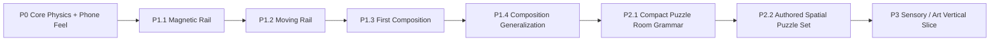

# Inner Rail — Prototype Roadmap

> Goal: prove the first-person gyro / physics identity, then expand only with physical rules that multiply force, momentum, spatial, and timing decisions.

## Delivery flow

Every slice ends in an observable gameplay gate. New rules are kept only when they create a decision that the existing vocabulary cannot already produce.

---

## P0 — Core Identity

**Status:** implementation complete; formal external validation remains open.

Accepted implementation contracts:

- device tilt changes effective gravity rather than steering position directly;
- Cannon physics is authoritative;
- camera follows authored route-forward rather than instantaneous ball velocity;
- braking and deliberate backward motion remain readable without 180° camera flips;
- P0 validation route remains available through `?stage=p0`;
- P0.4 tuning and local validation instrumentation remain available for later formal phone testing.

Remaining formal P0 evidence:

- baseline feel lock;
- primary orientation lock;
- five-player external protocol.

---

## P1 — Physical Puzzle Vocabulary

**Status:** **COMPLETE for current vertical-slice scope**.

P1 is closed without adding a third mechanic. Magnetic + Moving already demonstrate distinct decisions individually and in composition; adding more vocabulary now would increase feature count before spatial level design has tested the depth of the accepted system.

### P1.1 — Magnetic Rail

**Status:** **ACCEPTED as core vocabulary**.

Accepted evidence:

- magnetic surfaces establish a local down direction while preserving camera-relative tilt intent;
- progressive geometry supports a controllable 78° wall ride;
- braking / reverse remain usable while attached;
- magnetic release changes approach speed, braking, and momentum planning;
- no detach button, auto-forward force, or velocity rewrite is required.

Full 90°+ inversion remains an extension rather than a requirement.

### P1.2 — Moving Rail

**Status:** implementation accepted as reusable vocabulary; isolated route retained for regression.

Accepted implementation contract:

- deterministic kinematic rail motion;
- Cannon owns the live transform / collision velocity;
- Three.js projects simulation state only;
- no countdown HUD, random timing, scripted impulse, or new player input;
- restart resets the authored cycle while checkpoint recovery leaves live timing intact.

The isolated route remains available through `?stage=p1-moving` for diagnosis.

### P1.3 — Moving Rail × Magnetic Rail Composition

**Status:** **ACCEPTED on real phone**.

The first composition places both rules on the same physical collider: a 48° magnetic shuttle moving laterally between two magnetic lanes.

Accepted product result:

- moving magnetic attachment remains usable on-device;
- the composition reads as one physical object rather than two sequential mechanics;
- player decision centers on reading lateral alignment and choosing when to commit;
- collision, kinematic velocity, render pose, and magnetic field sampling share one live simulation transform;
- no new input, detach command, countdown HUD, hidden floor, or scripted route force is required.

### P1.4 — Composition Generalization / System Depth Gate

**Status:** **PASS on real phone**.

The second composition uses the same Moving + Magnetic vocabulary as a vertical magnetic lift instead of a lateral shuttle.

Accepted phone result:

- P1.3 is understood primarily as **waiting for lateral alignment and choosing the transfer moment**;
- P1.4 is understood as **controlling position while being transported, then preparing momentum before leaving the lift**;
- the two puzzles therefore create materially different decision structures despite sharing the same mechanics;
- no third mechanic, new input, countdown, height meter, hidden floor, or scripted impulse is needed to create that distinction.

**System-depth decision:** PASS. The accepted vocabulary is sufficiently composable to move into spatial puzzle level design. Do not add a third mechanic until P2 demonstrates an actual content gap that the current system cannot solve.

---

## P2 — Spatial Puzzle Levels

**Status:** active.

P2 changes the unit of design from a linear mechanic-validation track to a compact 3D puzzle room. The goal is to make players understand **where to go and why** from world geometry, then use the accepted physics vocabulary to execute that plan.

### P2.1 — Compact Puzzle Room Grammar

**Status:** implementation complete; real-phone spatial-read gate pending.

**Goal:** prove one room can create a readable spatial plan without a minimap, waypoint arrow, or explanatory HUD.

Implemented first-room contract:

- [x] elevated goal is visible / spatially inferable from the lower start but has no direct lower connection;
- [x] route folds west, north, upward, east, south, then back toward the original chamber instead of extending as a corridor;
- [x] lower and upper traversal deliberately reuse overlapping X/Z space;
- [x] static Magnetic Rail teaches the bank into one moving magnetic lift;
- [x] the lift raises the player 4.8 world units using the accepted Moving + Magnetic composition;
- [x] the upper route includes one separate ordinary moving bridge so timing remains part of the room plan;
- [x] the final upper return crosses previously seen lower space before reaching the original visible goal;
- [x] material grammar remains cyan = magnetic, amber = moving, both = composed;
- [x] camera route selection is height-aware when upper/lower track footprints overlap;
- [x] checkpoint / section progress is height-aware so stacked routes cannot trigger each other by X/Z alone;
- [x] recovery checkpoints shorten retries without adding solution markers;
- [x] no minimap, objective arrow, tutorial text, switch, key, friction surface, jump, or third mechanic is introduced.

P2.1 phone gate:

- [ ] player can identify a plausible route from the room itself before completing it;
- [ ] player understands that elevation / rail orientation are part of the route, not decorative geometry;
- [ ] revisiting the same chamber from another height or direction feels spatially coherent;
- [ ] failure is attributed to route planning, timing, or momentum rather than not knowing what the game wants;
- [ ] the room feels like a **puzzle space**, not a longer obstacle course;
- [ ] accepted Magnetic + Moving vocabulary remains readable when multiple candidate surfaces are visible at once.

**Gate rule:** do not enter P2.2 merely because the room is completable. P2.1 passes only when the player can form a spatial plan from the room itself and recognizes the return over previously seen space.

### P2.2 — Authored Spatial Puzzle Set

Only after P2.1 passes, author a small level set that varies spatial relationships rather than adding mechanics. Reuse the same grammar to test teach → vary → compose → mastery progression.

---

## P3 — Sensory / Art Vertical Slice

After spatial puzzle structure is stable, establish the premium kinetic-toy identity through restrained materials, lighting, rolling/contact audio, meaningful haptics where supported, and diegetic state cues rather than persistent HUD.

The immediate gameplay gate is **P2.1 Compact Puzzle Room on a real phone**. P1 vocabulary expansion remains intentionally paused.
