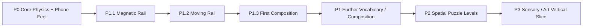

# Inner Rail — Prototype Roadmap

> Goal: prove the first-person gyro / physics identity, then expand only with physical rules that multiply force, momentum, spatial, and timing decisions.

## Delivery flow

Every slice ends in an observable gameplay gate. New rules are kept only when they create a decision that the existing vocabulary cannot already produce.

---

## P0 — Core Identity

**Status:** implementation complete; formal external validation remains open.

Accepted implementation contracts:

- device tilt changes effective gravity rather than steering position directly;
- Cannon physics is authoritative;
- camera follows authored route-forward rather than instantaneous ball velocity;
- braking and deliberate backward motion remain readable without 180° camera flips;
- P0 validation route remains available through `?stage=p0`;
- P0.4 tuning and local validation instrumentation remain available for later formal phone testing.

Remaining formal P0 evidence:

- baseline feel lock;
- primary orientation lock;
- five-player external protocol.

---

## P1 — Physical Puzzle Vocabulary

**Status:** active.

### P1.1 — Magnetic Rail

**Status:** **ACCEPTED as core vocabulary**.

Accepted evidence:

- magnetic surfaces establish a local down direction while preserving camera-relative tilt intent;
- progressive geometry supports a controllable 78° wall ride;
- braking / reverse remain usable while attached;
- magnetic release changes approach speed, braking, and momentum planning;
- no detach button, auto-forward force, or velocity rewrite is required.

Full 90°+ inversion remains an extension rather than a requirement.

### P1.2 — Moving Rail

**Status:** implementation complete; isolated phone route retained for regression.

Implemented contract:

- deterministic kinematic rail motion;
- Cannon owns the live transform / collision velocity;
- Three.js projects simulation state only;
- no countdown HUD, random timing, scripted impulse, or new player input;
- restart resets the authored cycle while checkpoint recovery leaves live timing intact.

The user elected to proceed directly to composition before formally closing the isolated P1.2 phone gate. The isolated route remains available through `?stage=p1-moving` for diagnosis.

### P1.3 — Moving Rail × Magnetic Rail Composition

**Status:** implementation active; real-phone composition gate pending.

**Goal:** prove the two accepted/implemented rules create an emergent decision when they act on the **same physical surface**, rather than merely appearing sequentially in one level.

#### Composition contract

- one 48° magnetic shuttle is also a kinematic moving collider;
- the shuttle travels 5.2 world units laterally on a deterministic seven-second cycle;
- it starts aligned with the magnetic entry lane and reaches the opposite magnetic receiver halfway through the cycle;
- collision, motion velocity, and magnetic field sampling all use the same live simulation pose;
- player input remains only tilt → effective gravity → momentum;
- no detach button, countdown, hidden floor, scripted carry, or automatic route propulsion is added;
- previous P1.1 and P1.2 routes remain independently selectable for regression.

#### P1.3 phone gate

- [ ] sphere remains attached to the moving 48° shuttle without magnetic-field lag;
- [ ] moving contact carries / pushes the sphere without collider jitter or tunneling;
- [ ] receiver alignment is understandable from world motion without HUD explanation;
- [ ] player intentionally chooses when to leave the shuttle;
- [ ] failed transfers cause a different timing, braking, or momentum decision on retry;
- [ ] camera and screen-relative controls remain comfortable while the attached surface moves sideways;
- [ ] magnetic unwind and return to ordinary gravity remain continuous after the transfer.

**KEEP the composition pattern** only if the resulting decision is richer than two independent set pieces.

---

## Later P1 candidates

Choose one only after the P1.3 gate:

- rotating magnetic rail as a true orientation-changing composition;
- 90°+ magnetic inversion with continuous geometry;
- stateful gate / switch;
- alternate friction surface;
- multi-surface timing puzzles using accepted vocabulary.

---

## P2 — Spatial Puzzle Levels

Turn accepted vocabulary into compact 3D mental-map puzzles rather than long race tracks:

- one spatial concept taught at a time;
- visible geometry should preview routes without minimap dependence;
- reuse and crossing of previously visited space is preferred over content length;
- combine rules only when each rule has already demonstrated a readable decision.

---

## P3 — Sensory / Art Vertical Slice

After gameplay vocabulary is stable, establish the premium kinetic-toy identity through restrained materials, lighting, rolling/contact audio, meaningful haptics where supported, and diegetic state cues rather than persistent HUD.

The immediate gameplay gate is **P1.3 Magnetic Shuttle composition on a real phone**.
