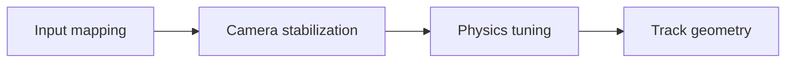

# Inner Rail — Prototype Roadmap

> Goal: prove the first-person gyro/physics identity on a real phone before investing in puzzle devices, content production, or progression.

## Delivery strategy

Every slice ends in an observable gameplay gate. P0 implementation is complete only when the 60–90 second test track is playable on phone and the control/camera hypotheses have been evaluated.

```mermaid
flowchart LR
    S[P0 Spec] --> P01[P0.1 Scaffold + Tilt Harness]
    P01 --> P011[P0.1.1 Orientation-Agnostic Harness]
    P011 --> P02[P0.2 Ball Physics + Stable Camera]
    P02 --> P03[P0.3 Validation Track]
    P03 --> P04[P0.4 Phone Feel Gate]
    P04 --> P1[P1 Physical Puzzle Vocabulary]
    P1 --> P2[P2 Spatial Puzzle Levels]
    P2 --> P3[P3 Sensory / Art Vertical Slice]
```

## P0 — Gameplay Prototype Spec

**Status:** defined in `P0-GAMEPLAY-PROTOTYPE-SPEC.md`.

**Decision:** validate **tilt → force → momentum → correction** and stabilized first-person comfort before adding mechanics.

---

## P0.1 — Repository Scaffold + Tilt Input Harness

**Status:** complete.

**Objective:** create the deployable `inner-rail/` project and prove that device orientation can be permissioned, calibrated, normalized, and observed reliably.

### Deliverables

- [x] `inner-rail/` Vite + strict TypeScript project
- [x] Three.js + cannon-es dependencies and committed lockfile
- [x] full-screen mobile harness
- [x] explicit bootstrap failure state
- [x] device-orientation permission flow
- [x] neutral calibration / recenter
- [x] screen-orientation correction
- [x] dead-zone / clamp / smoothing pipeline
- [x] desktop synthetic tilt source using the same `TiltInput` contract
- [x] dev telemetry overlay
- [x] unit tests for orientation math
- [x] complete CI / GitHub Pages registration for the new game

---

## P0.1.1 — Orientation-Agnostic Harness

**Status:** complete; real-device portrait/landscape input mapping accepted.

**Objective:** remove the premature landscape product assumption and make portrait/landscape an explicit real-device comparison before P0.2 locks presentation.

### Deliverables

- [x] remove portrait gameplay blocker
- [x] responsive portrait and landscape harness layouts
- [x] visible current-orientation test label
- [x] preserve one shared `TiltInput` contract across both orientations
- [x] invalidate neutral calibration when the viewport changes orientation
- [x] require a fresh neutral pose after portrait/landscape rotation
- [x] expose viewport orientation in debug telemetry

### Gate

On a real phone, both portrait and landscape must reach the same calibrated gravity-vector test without hidden input differences. Rotating the viewport must return the harness to calibration rather than carrying a stale neutral pose across coordinate systems.

P0.1.1 does **not** choose the winning orientation. It only makes the comparison valid.

---

## P0.2 — Ball Physics + Stabilized First-Person Camera

**Status:** implementation complete; real-phone movement/camera gate pending.

**Objective:** establish the physical sensation before building a level, while comparing portrait and landscape using the exact same physics/camera rules.

### Deliverables

- [x] cannon-es world + dynamic sphere
- [x] tilt-driven camera-relative effective gravity
- [x] one broad sandbox plane with walls
- [x] global friction/restitution/damping config
- [x] stable fixed-step physics update
- [x] camera follows ball translation
- [x] camera roll fixed independent of sphere rotation
- [x] damped velocity/heading-based yaw
- [x] conservative pitch behavior
- [x] low-speed heading stability
- [x] restart + recenter controls
- [x] reduced-motion suppression of nonessential camera feedback
- [x] first-person inner-shell rotation cue independent of camera roll
- [x] debug telemetry for ball, world gravity, and camera state
- [x] pure tests for camera-relative gravity and camera angle damping
- [ ] portrait/landscape A/B notes for control precision, holding comfort, forward readability, and first-person presence

### Phone gate

From the same sandbox in both orientations, the player can intentionally:

1. accelerate forward;
2. turn left/right;
3. reverse direction;
4. brake to near-stop;
5. hit a wall and recover orientation;
6. perceive sphere rotation without the camera horizon inheriting roll.

Record which orientation better supports:

- fine two-axis force control;
- comfortable physical posture;
- forward track readability;
- the fantasy of being inside the ball.

Do not lock the final product orientation until this comparison exists. If the camera is uncomfortable or braking feels like direct steering, remain in P0.2.

---

## P0.3 — 60–90 Second Validation Track

**Objective:** turn the established movement model into deliberate physical decisions without adding new rules.

### Track sections

- [ ] Calibration Deck
- [ ] Wide S-Curve
- [ ] Narrow Rail
- [ ] Momentum Dip + Gap
- [ ] Banked Turn
- [ ] Goal Brake Zone
- [ ] authored recovery checkpoints

### Design constraint

Every challenge must be solvable with the same gravity/ball rule set. No invisible assists, per-section handling changes, magnets, moving hazards, switches, or scripted launch forces.

### Gate

A competent player can complete the track through force/momentum control alone, and each section tests a visibly different skill: basic cause/effect, correction timing, precision, run-up judgment, fast line choice, and braking.

---

## P0.4 — Phone Feel / Comfort Gate

**Objective:** decide whether the product identity deserves expansion.

### Deliverables

- [ ] tune sensor smoothing/dead zone/saturation
- [ ] tune global ball friction/damping/restitution
- [ ] tune camera yaw/pitch/FOV behavior
- [ ] minimal impact/motion feedback only where it improves physical readability
- [ ] lock primary phone orientation from accumulated P0 evidence
- [ ] execute the P0 5-player validation protocol
- [ ] record observations against the P0 acceptance thresholds

### Decision

**PASS** only when control is understood, momentum produces intentional decisions, and the stabilized first-person view is acceptable for the short session.

If P0 fails, iterate the three fundamentals in this order:

Do not add tutorials or mechanics to hide a weak physical core.

---

## P1 — Physical Puzzle Vocabulary

**Objective:** expand the passed physical identity with the smallest set of mechanics that multiply decisions.

Candidates to evaluate one at a time:

- magnetic / attached rail state;
- wall ride / inversion;
- moving or rotating rail section;
- stateful gate / switch;
- alternate friction surface.

### Gate

A new mechanic must change how the player plans force/momentum and interact with existing track geometry. If it only adds spectacle or timing noise, remove it.

---

## P2 — Spatial Puzzle Levels

**Objective:** turn mechanics into readable 3D mental-map puzzles.

- authored compact mechanical objects rather than long race tracks;
- route preview through visible geometry, not minimap dependence;
- intentional reuse/crossing of previously visited space;
- level sequence teaches one spatial concept at a time;
- no content-count target until P1 vocabulary is proven.

---

## P3 — Sensory / Art Vertical Slice

**Objective:** establish the premium kinetic-toy identity after gameplay is proven.

Candidates:

- transparent / mechanical inner shell references;
- material language for rail states;
- restrained environment lighting and depth cues;
- rolling/contact/impact audio driven from physical state;
- meaningful haptics where platform support allows;
- diegetic direction/state cues instead of persistent HUD.

Final art must strengthen motion, surface state, and spatial readability before decoration.

---

## Explicitly later

Do not schedule these until a multi-level core exists:

- multiple collectible ball bodies;
- progression economy;
- cosmetics store;
- daily/season content;
- online leaderboards;
- backend accounts;
- monetization.

The immediate next gate is **P0.2 real-phone movement + camera validation**. P0.3 should not begin until that sandbox feel is accepted.
