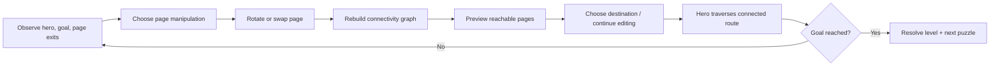
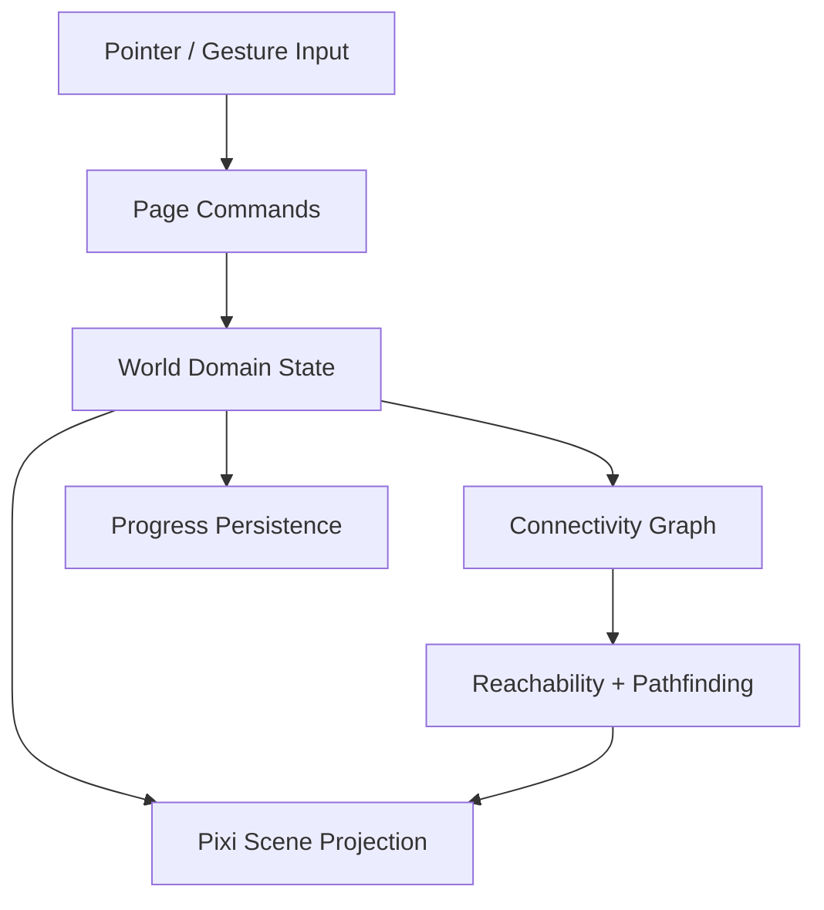

# Paper Trails — MVP Spec

## 1. Product objective

Validate one mechanic before adding roguelike/RPG systems:

> The player manipulates book pages to change world connectivity, then watches the hero traverse the newly created route.

The MVP succeeds if players understand that **the world is the object being controlled**, deliberately reconfigure it, and want to try a second or alternative solution.

## 2. Design system

### Visual tone

- Dark antique book + ruined fantasy pixel art.
- Low saturation; scenery should read through value and silhouette before color.
- Main palette families: parchment, ink, moss, stone, antique gold.
- Gold is reserved for selected/interactive/goal states, never used as a broad decorative fill.
- Avoid rarity rainbow, neon outlines, large particle bursts, and modern glossy mobile-game UI.

### Layout

- Mobile portrait is the primary target.
- The playable book occupies the central visual focus.
- Top area: chapter/level/title and minimal actions.
- Center: 3×3 page board.
- Bottom: contextual action/goal strip only when needed.
- Desktop: centered portrait game viewport; no separate desktop layout required for MVP.

### Motion language

- Page rotate: short physical pivot, ~140–180 ms.
- Page swap: lift → travel → settle, ~220–300 ms.
- Valid connection: subtle antique-gold pulse, no explosion.
- Character movement: stepwise pixel walk with short pauses at page boundaries.
- Goal unlock: light spilling through ink/paper rather than large VFX.

## 3. Core gameplay loop



## 4. Board model

### MVP board

- Fixed **3×3 page grid**.
- Each page is a world cell with four possible exits: N/E/S/W.
- The hero occupies one page and a local anchor inside that page.
- A route exists only when adjacent pages have matching exits.

Example:

```text
Page A east exit = true
Page B west exit = true
=> A <-> B connected
```

### Connectivity rules

After every page manipulation:

1. Recompute each page's rotated exits.
2. Rebuild adjacency edges.
3. Run BFS/DFS from the hero page.
4. Mark reachable pages.
5. Allow movement only to reachable destination anchors.

No hidden collision or ambiguous edge tolerance in MVP; the logical graph is authoritative.

## 5. Six Page archetypes

All six are visually distinct but share one consistent 32 px logical pixel grid and low-saturation palette.

| Page | Logical exits / rule | Puzzle role | Art direction |
|---|---|---|---|
| **Forest Path** | straight or corner path depending authored variant | baseline connector | dense moss trees framing pale paper trail |
| **Ruined Gate** | one entrance + one exit; may contain the level goal | destination / gate | broken masonry, restrained warm light from arch |
| **Stone Bridge** | straight crossing; visually reads as a bridge over void/water | constrained connector | pale stone bridge, dark water/ink below |
| **Crossroads** | 3-way connector | routing hub | sparse clearing with strong readable fork silhouette |
| **Shrine / Seal** | route passes only after required key condition in later tutorial level; MVP can author one unlocked and one sealed state | rule introduction | small shrine, paper seal, antique-gold accent |
| **Hidden Grove / Treasure** | optional endpoint; entering awards treasure objective | optional-route incentive | closed grove, chest/relic, denser foliage and warm glint |

### Scope note

The six archetypes are **content archetypes**, not six hard-coded classes. Runtime behavior should be data-driven through page definitions: exits, rotation permission, tags, goal/treasure metadata.

## 6. Character

### Role

One unnamed traveler. The character is intentionally visually subordinate to the book/world.

### MVP states

- Idle
- Walk
- Turn/face direction
- Goal-arrival pose

No combat, inventory animation, emotes, or dialogue portrait in MVP.

### Movement model

- Player taps a reachable page/destination anchor.
- Pathfinding runs over the current page graph.
- Character walks page-to-page automatically.
- If the player changes the world, movement must be complete or paused first; no mid-walk page swap in MVP.

## 7. Mobile controls

### Primary gestures

- **Tap page** — select / inspect.
- **Tap rotate control** or short rotate gesture — rotate selected page 90° clockwise.
- **Drag page onto another page** — swap positions.
- **Tap reachable destination** — move hero.
- **Two-finger pinch** — optional camera scale only if the board does not fit comfortably; avoid making this required.

### UX constraints

- Minimum touch target: 44 CSS px.
- Never require pixel-perfect drag placement.
- Selected page has a single gold keyline; legal swap target gets a muted outline.
- Invalid rotate/swap gives a short shake and no state mutation.
- Reachability should be visible but subtle: path edges or page border illumination, not full-page bright colors.

## 8. MVP level set

Target: **10 handcrafted levels**.

### L1 — Learn rotate
- 2–3 relevant pages.
- One obvious broken path.
- No swap required.

### L2 — Rotate twice / understand exit matching
- Introduce corner versus straight orientation.

### L3 — Learn swap
- Correct page exists but is in the wrong slot.

### L4 — Rotate + swap
- First combined puzzle.

### L5 — Optional treasure
- Goal is reachable directly, treasure requires temporarily breaking the direct route.

### L6 — Crossroads hub
- Multiple valid routes; teach reading of connectivity rather than fixed sequence.

### L7 — Shrine/seal rule
- One page has a state requirement or one-way authored gating rule.

### L8 — Deliberate route destruction
- Player must break an already-valid route to open a better one.

### L9 — Multi-step treasure + goal
- Optional objective before exit.

### L10 — MVP mastery
- Full 3×3 board, all six page archetypes represented, no new rule introduced.

## 9. Win / loss / retry

### Win

Hero reaches the goal page's target anchor.

### Loss

No hard fail is required in MVP. A puzzle may enter an unhelpful configuration, but rotate/swap keeps it recoverable.

### Retry

One-tap reset restores the authored initial board state.

## 10. Reward and progression

Keep progression minimal:

- Chapter completion state.
- Per-level optional treasure badge.
- Local best move count may be shown only after completion.

Do **not** add stars, currencies, equipment, level XP, or permanent stats before mechanic validation.

## 11. Technical architecture

Suggested dependency direction:



### Proposed modules

```text
paper-trails/
  src/
    app/
      bootstrap.ts
      GameApp.ts
    game/
      GameState.ts
      LevelController.ts
      commands.ts
    world/
      Page.ts
      PageDefinition.ts
      Board.ts
      connectivity.ts
      pathfinding.ts
    input/
      PointerController.ts
      DragSwapController.ts
    render/
      BookScene.ts
      PageView.ts
      CharacterView.ts
      effects.ts
    content/
      pages.ts
      levels.ts
    persistence/
      save.ts
```

### Domain rules should be renderer-independent

Unit-test these without PixiJS:

- exit rotation transform
- adjacency matching
- swap behavior
- locked-page rejection
- reachability
- shortest path
- reset to authored level state
- treasure/goal completion state

## 12. Renderer/bootstrap requirements

- Pixi initialization must be explicit and observable.
- Renderer startup needs logs, error handling, and a visible bootstrap failure state.
- Do not leave `#app` empty if renderer initialization fails.
- Confirm both `#app` and `canvas` in deployed smoke tests.
- Prefer WebGL-first compatible setup; renderer fallback strategy should match repository PixiJS conventions.
- Pixel art textures must use nearest-neighbor sampling.
- Camera/output scale should prefer integer scaling where practical to avoid pixel shimmer.

## 13. Performance target

MVP target devices are ordinary current mobile browsers, not high-end-only devices.

Budget guidance:

- 60 fps target during idle/drag/movement.
- No full-screen post-processing required.
- Keep page layers mostly batched sprites.
- Avoid per-frame object allocation in connectivity/pathfinding; recompute only after board mutation.
- Character/path tweens should not trigger graph recalculation every frame.

## 14. MVP validation

### Primary qualitative signal

After solving a direct path, does the player willingly reconfigure the board to obtain the optional treasure or test another route?

### Behavioral signals

- Player understands rotate without textual instruction after L1.
- Player understands swap by L3.
- Player can predict whether two page edges connect before trying.
- Player uses reset rarely because state remains legible.
- Player voluntarily breaks a working route in L5/L8.
- Player starts the next level after completing one.

### Suggested lightweight telemetry during local testing

If instrumentation is added later, keep it local/dev-only initially:

- manipulation count per level
- reset count
- hint count
- time to first successful connection
- treasure-before-goal rate
- completion time

## 15. MVP acceptance criteria

The first playable MVP is accepted when:

- [ ] 3×3 board renders correctly on portrait mobile.
- [ ] All six page archetypes have final MVP pixel assets.
- [ ] Traveler has idle/walk/arrival animation.
- [ ] Rotate and swap are reliable with touch.
- [ ] Connectivity graph updates deterministically after every manipulation.
- [ ] Reachable destinations are correctly previewed.
- [ ] Character pathfinding/movement follows the current graph.
- [ ] 10 handcrafted levels are complete.
- [ ] Optional treasure flow exists in at least three levels.
- [ ] Reset works from every level state.
- [ ] Domain tests cover rotation, swap, connectivity, reachability, pathfinding, completion.
- [ ] `npm ci`, tests, and production build pass.
- [ ] GitHub Pages subpath assets resolve under `/2D-game-playground/paper-trails/`.
- [ ] Desktop and mobile smoke tests confirm a mounted canvas and visible first interactive frame.
