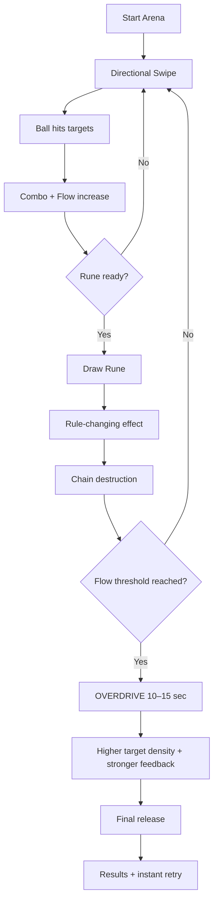
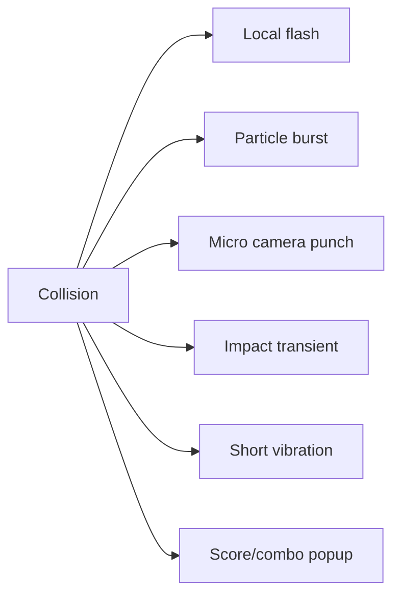
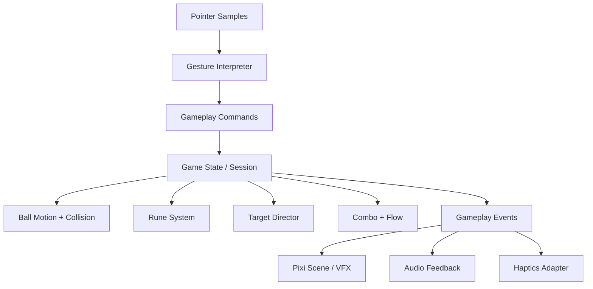
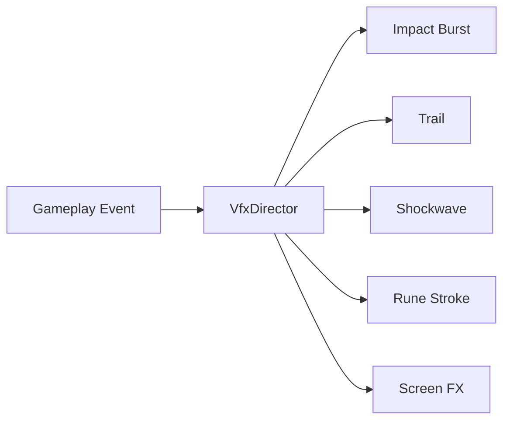

# Rune Ball — MVP Spec

## 1. Product objective

Validate one core fantasy before adding progression systems:

> The player redirects a magical ball with simple swipes, then draws rune gestures that alter the arena and convert accumulated Flow into large chain reactions.

The MVP succeeds if the player can enter Flow quickly, understands the difference between directional swipes and rune gestures, experiences at least one memorable Overdrive climax, and voluntarily retries.

## 2. Session structure

Target run length: **60–90 seconds**.



No HP or hard fail in the first MVP. Poor play reduces combo/Flow efficiency rather than ending the run early.

## 3. Primary controls

### Basic directional swipe

A short directional gesture maps to one of four intent vectors:

- Up — strong upward redirect.
- Left / right — lateral redirect.
- Down — Slam / downward redirect.

Diagonal movement may emerge from current velocity + directional impulse; the MVP does not need eight discrete gesture directions.

### Input qualities

- one-thumb playable
- forgiving angle buckets
- no pixel-perfect starting region
- input should be recognized across the active playfield
- directional action should resolve immediately on pointer-up
- short accidental movements below threshold are ignored

### Rune mode

Rune gestures are intentionally different from basic directional swipes. Recognition uses the sampled pointer path, normalized for scale and position.

MVP runes:

| Gesture | Rune | Gameplay purpose |
|---|---|---|
| Circle / closed loop | **Vortex** | Pull nearby targets toward the ball for setup |
| V shape | **Split** | Temporarily split the ball into three attack traces / echoes |
| Z shape | **Chain** | Mark the next impact to propagate through nearby targets |

The MVP should prefer generous recognition over handwriting accuracy. False negatives are more damaging than slightly permissive matches.

## 4. Ball model

The ball is a magical core, not a realistic sports simulation.

### Required state

- position
- velocity
- speed tier
- active modifiers
- collision radius
- combo ownership / last-hit timing

### Physics policy

Use deterministic lightweight arcade motion rather than a general-purpose rigid-body simulation unless implementation evidence proves otherwise.

- fixed-step or clamped-delta update
- circular target overlap / swept collision where needed
- authored wall bounce response
- speed clamps per normal / Overdrive state
- directional swipe applies controlled impulse/redirect, not raw force integration

The goal is authored feel and readability, not physical realism.

## 5. Arena

### MVP arena

- fixed portrait arena
- no camera traversal
- bounded playfield with readable wall response
- target spawn lanes / zones authored for useful chain opportunities
- background remains visually quiet relative to gameplay VFX

### Target archetypes

**Crystal**
- one-hit destructible baseline target
- clear neon core
- breaks into low-cost shards / spark particles

**Armored Crystal**
- requires two meaningful hits or one empowered/rune hit
- visually distinct outer shell
- exists to create setup/payoff contrast

No enemy AI is required in MVP. Targets can drift or follow simple authored motion patterns.

## 6. Combo and Flow

### Combo

Combo represents uninterrupted offensive rhythm.

Increment on valid target destruction. Reset or decay only after a readable inactivity window; do not punish every wall bounce or imperfect swipe.

Combo controls presentation intensity:

- score multiplier
- trail length/intensity
- impact layer intensity
- audio layer / pitch or transient escalation
- subtle screen response

### Flow

Flow is the session escalation meter.

Gain Flow from:

- target destruction
- chain destruction
- successful rune usage
- high-combo hits

Flow should not be a separate grind bar detached from play. The arena presentation should increasingly communicate rising Flow even if a compact meter exists.

## 7. Rune resource

Use one shared rune charge meter for MVP.

- basic hits generate charge
- rune use spends one charge tier
- Overdrive can temporarily remove or reduce rune cost

Do not add mana regeneration stats, cooldown trees, per-rune rarity, or inventory slots in MVP.

## 8. Overdrive

Overdrive is the primary climax mechanic and should trigger approximately once per competent 60–90 second run.

Target duration: **10–15 seconds**.

During Overdrive:

- ball speed increases moderately
- combo does not decay
- target spawn density increases
- normal impacts gain small shockwaves
- rune cost is reduced or temporarily removed
- trail/glow/particles intensify
- music gains an additional bass/percussion layer
- camera/haptic feedback becomes stronger but remains controlled

Overdrive must improve clarity and impact, not turn the screen into unreadable particle noise.

## 9. Feedback stack

Every major hit may combine several layers, but each layer has a budget.



Feedback tiers:

1. **Normal hit** — small flash + transient + sparks.
2. **Break** — shards + brighter flash + micro punch.
3. **Rune chain** — trail/shockwave + layered transient.
4. **Overdrive release** — strongest screen/audio/haptic treatment.

Do not apply maximum feedback to every hit; escalation requires contrast.

## 10. Audio direction

Audio is part of gameplay feedback, not background decoration.

- normal hit: short low-mid transient
- crystal break: sharper high-frequency layer
- combo milestones: musical accent
- rune draw complete: short pre-impact suction / silence window
- rune activation: distinct signature hit
- Overdrive entry: bass drop + added music layer
- Overdrive exit: short resolved release

Web autoplay restrictions must be handled via user interaction before audio starts.

## 11. UI / UX

### Portrait layout

Top:
- score
- combo
- compact Flow/Overdrive state

Center:
- uninterrupted arena

Bottom / lower edge:
- rune readiness indicators only

### UI principles

- minimal chrome
- no joystick
- no permanent skill buttons required to activate runes
- UI should never compete with the ball trajectory
- gestures may start over the arena
- onboarding uses short visual gesture cues, then disappears

Desktop uses a centered portrait viewport; no separate desktop gameplay layout is required.

## 12. Technical architecture

Recommended MVP stack:

- Vite
- strict TypeScript
- PixiJS
- renderer-independent gameplay/domain state
- lightweight custom arcade collision/motion
- Web Audio / HTML audio abstraction for initial MVP

Do not introduce Three.js, Babylon.js, or a second rendering engine for the first slice.

### Dependency direction



### Proposed modules

```text
rune-ball/
  src/
    app/
      bootstrap.ts
      GameApp.ts
    game/
      GameSession.ts
      GameState.ts
      GameEvents.ts
    input/
      PointerSampler.ts
      GestureClassifier.ts
      gestureMath.ts
    ball/
      BallState.ts
      BallController.ts
      motion.ts
    targets/
      Target.ts
      TargetDirector.ts
      collision.ts
    rune/
      RuneSystem.ts
      RuneDefinition.ts
      effects/
        VortexRune.ts
        SplitRune.ts
        ChainRune.ts
    progression/
      ComboSystem.ts
      FlowSystem.ts
      OverdriveSystem.ts
    render/
      ArenaScene.ts
      BallView.ts
      TargetView.ts
      VfxDirector.ts
      CameraFeedback.ts
    audio/
      AudioDirector.ts
    content/
      arena.ts
      balance.ts
```

## 13. VFX architecture

For MVP, keep VFX event-driven rather than embedding particle logic into gameplay entities.



Use a small number of reusable pooled effects:

- ball trail
- crystal break burst
- impact spark
- shockwave ring
- rune stroke / glyph reveal
- Overdrive aura

Effekseer or baked sprite-sheet authoring can be evaluated later if authoring throughput becomes a bottleneck; it is not an MVP dependency.

## 14. Gesture recognition strategy

Rune recognition should be deterministic and testable outside PixiJS.

Pipeline:

1. sample pointer path
2. remove points below minimum distance
3. normalize translation and scale
4. simplify path
5. derive direction changes / closure / segment structure
6. score against MVP gesture templates
7. apply confidence threshold

Acceptance priority:

- Circle reliably differentiates from a swipe.
- V reliably requires a meaningful direction reversal.
- Z reliably requires three directional segments.
- Recognition tolerates different gesture sizes and screen positions.

Do not start with ML/AI gesture recognition.

## 15. Performance target

Primary target: ordinary current mobile browsers.

- 60 fps target during normal play.
- maintain playable frame pacing during Overdrive.
- avoid per-frame allocations in motion/collision loops.
- particle and shard objects are pooled.
- cap simultaneous cosmetic particles.
- prefer additive sprites / meshes over expensive full-screen filters.
- full-screen post-processing is optional, not required for MVP acceptance.
- reduced-motion mode may lower shake, trail density, and large flashes.

## 16. MVP validation metrics

### Primary qualitative questions

- Does redirecting the ball feel satisfying before rune effects are added?
- Can a new player distinguish a normal swipe from rune drawing?
- Does the player intentionally hold/use a rune to create a bigger chain?
- Is Overdrive perceived as a meaningful climax rather than visual noise?
- Does the player immediately retry after a completed run?

### Lightweight local telemetry

- run duration
- total swipes
- rune attempts / recognized / rejected
- rune usage by type
- longest combo
- time to first rune
- time to Overdrive
- targets destroyed during Overdrive
- retry rate
- average frame time / worst frame spike

No backend analytics is required for first implementation; dev/local instrumentation is sufficient.

## 17. MVP acceptance criteria

The first playable MVP is accepted when:

- [ ] portrait arena boots reliably on mobile and desktop
- [ ] directional swipe reliably redirects the ball
- [ ] ball/wall/target motion feels responsive and authored rather than floaty
- [ ] Circle, V, Z gestures are recognized with forgiving thresholds
- [ ] all three runes produce mechanically distinct effects
- [ ] Crystal and Armored Crystal targets are readable
- [ ] combo and Flow respond deterministically to gameplay events
- [ ] competent play triggers one 10–15 second Overdrive in a normal run
- [ ] VFX has at least four readable intensity tiers
- [ ] audio feedback distinguishes normal hit, break, rune, and Overdrive
- [ ] score/results/retry closes the 60–90 second loop
- [ ] gesture/domain tests run without PixiJS
- [ ] `npm ci`, tests, and production build pass
- [ ] GitHub Pages assets resolve under `/2D-game-playground/rune-ball/`
- [ ] deployed smoke test confirms `#app`, mounted canvas, touch input, and first interactive frame
