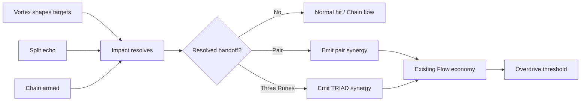

# P8.5 — Cross-Rune Composition Gate

## Why

Vortex, Split, and Chain now each have two authored evolution paths, but a build can still read as three independent choices placed beside each other.

This gate starts build depth by making one Rune create a meaningful handoff for another Rune. It intentionally avoids a second resource, set-bonus table, or damage multiplier layer.

## Risk question

Will players intentionally overlap Rune effects because the interaction changes *what they try to set up next*, rather than because the UI promises a flat numerical bonus?

## Product rule

```text
Vortex = shape the target field
Split  = shape the attack footprint
Chain  = convert an impact into propagation / delayed territory
Flow   = reward successful composition
```

Cross-Rune synergy is earned from resolved gameplay state, not merely from casting two gestures close together.

## First composition grammar

| Handoff | Qualification | Reward |
|---|---|---|
| Vortex → Split | A Split echo actually hits a target while that target is inside the active Vortex field. | Pair synergy +3 Flow. Once per Split cast. |
| Vortex → Chain | A qualified Chain route begins from an impact inside the active Vortex field. | Pair synergy +3 Flow. |
| Split → Chain | A qualified Chain route is consumed by a Split echo impact. | Pair synergy +3 Flow. |
| TRIAD | A qualified Chain route is consumed by a Split echo impact inside the active Vortex field. | One Triad synergy +7 Flow on that impact. |

A qualified Chain keeps the existing Chain evolution rule: at least two meaningful secondary targets. Weak or empty Chain casts do not become a Flow-farming shortcut.

## Runtime flow



## Why Flow instead of damage

The existing product grammar already uses Flow to convert competent offense and Rune use into the Overdrive climax. Synergy therefore feeds the same escalation loop instead of creating another meter.

The first tuning is deliberately small:

- pair handoff: +3 Flow;
- TRIAD handoff: +7 Flow;
- no direct damage multiplier;
- no Rune cost discount;
- no extra hit / target / zone count;
- no evolution progress shortcut.

This lets playtest evidence answer whether the composition itself is desirable before stronger rewards distort behavior.

## Build-depth thesis

The selected Rune paths should change how easy, precise, or delayed each handoff becomes without requiring a bespoke bonus table for every path pair.

Examples to observe rather than hard-code in this gate:

- Gravity clustering can improve Split coverage and Chain topology.
- Orbit's longer control window can make overlap timing easier but less static.
- Prism can discover side-target Chain origins; Lance can deliberately choose a deeper origin.
- Relay converts the prepared topology immediately.
- Detonation leaves delayed world-space zones, so later Vortex repositioning can naturally move targets into already seeded danger.

The desired result is **emergent composition from existing rules**.

## Presentation contract

A successful handoff gets one short world-space composition beat at the impact point:

- pair synergy shows the two involved glyphs linked together;
- TRIAD shows all three glyphs in one linked formation;
- existing Rune colors are reused;
- no persistent HUD meter or badge is added;
- normal hit, Chain, evolution, and Overdrive feedback remain dominant when they are more important.

## Architecture

- `RuneSynergy` is a pure resolver for pair / Triad classification.
- `DestructionSession` supplies authoritative resolved state: Split source, active Vortex containment, and qualified Chain outcome.
- `FlowSystem` owns the small pair / Triad reward through the existing Flow economy.
- `RuneCausalityOverlay` renders the transient world-space result only; it owns no synergy rules.

## Scope guard

Not in P8.5:

- path-specific damage / radius / duration bonuses;
- new Rune resources or resonance meters;
- combo-gesture recognizers;
- new target types;
- Overdrive Archetypes;
- build rarity / loot systems;
- authored pair names or collection UI;
- balance changes to Vortex, Split, Relay, or Detonation themselves.

## Phone gate

1. A player can produce each pair handoff intentionally after learning the rule.
2. TRIAD is understandable as a three-Rune composition rather than three unrelated effects firing together.
3. Players begin changing Rune order / timing to pursue a handoff.
4. Pair rewards do not encourage empty Rune spam or weak Chain casts.
5. Synergy feedback is readable without becoming another HUD object to watch.
6. Existing 3 / 6 Rune evolution, charge economy, combo, Flow, Overdrive, armor, Chain delay behavior, and mobile pacing show no regression.

## Follow-up decision

Only after phone playtest:

- If composition is already strategically meaningful, proceed to **P8.5.1 — Path Composition Tuning** and tune only the combinations that need stronger identity.
- If players notice the Flow reward but do not change decisions, rework the interaction condition instead of increasing the bonus.
- If the arena becomes visually noisy, reduce the composition beat before adding new UI.
