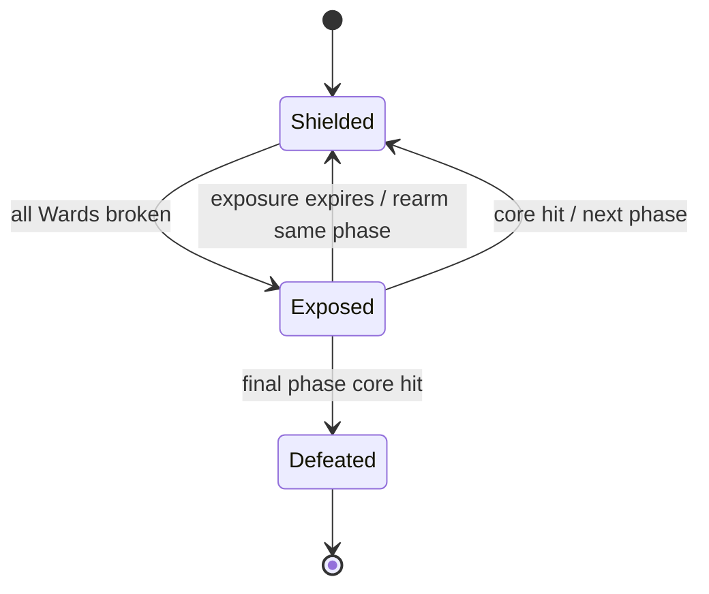
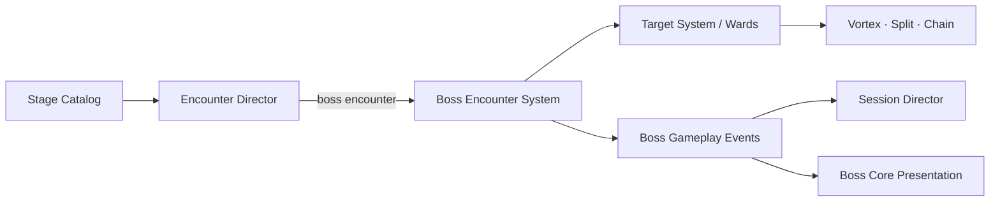

# Rune Ball — P9.2 Boss Encounter Contract

## Why this phase exists

P9.1 proved that authored formations can create different tactical reads. P9.2 extends that content model to a Boss without abandoning Rune Ball's core setup/payoff loop.

The Boss must not become a large HP target. Its job is to turn arena structure into a repeated tactical question:

> Can the player use movement and Runes to dismantle protection, recognize the payoff window, and deliberately cash out on the core?

## Risk question

**Can a Boss create a readable setup → break → payoff loop using the existing Rune systems, without turning the game into generic DPS or adding a second combat model?**

If the answer is no, later Bosses should not add more phases, attacks, or spectacle. The contract itself must be fixed first.

## Product contract

A Boss phase contains:

- an authored Ward formation;
- a phase title and objective;
- a finite exposure window;
- one discrete core payoff.

There is no generic Boss HP pool in P9.2. One successful exposed-core hit breaks one authored phase.

## Architecture

Boss rules remain renderer-independent.

`EncounterDirector` no longer assumes that an Encounter is complete when target count reaches zero. It receives an objective-complete signal from `DestructionSession`:

- Formation Encounter → complete when authored targets are gone.
- Boss Encounter → complete when Boss state is `defeated`.

This is intentionally reusable for future survival, ritual, escort, or other objective types.

## Rune interaction rule

The Boss protection structure uses normal targets, so the current Rune vocabulary remains meaningful:

| Rune | Boss role |
| --- | --- |
| **Vortex** | Reposition Wards and collapse awkward protection geometry. |
| **Split** | Cover separated Ward lanes; Split echoes may also cash out on an exposed core. |
| **Chain** | Solve Ward topology and accelerate protection collapse. |

In P9.2, Chain does **not** directly damage the Boss core. It is a setup tool for the Ward structure. The exposed core accepts direct Ball or Split contact as the payoff. This keeps Chain from becoming an automatic remote Boss-finisher and preserves target-selection meaning.

## Shattered Gate vertical slice — Fracture Sentinel

The first Boss is appended as Encounter 4 after the three P9.1 formations.

### Phase 1 — Aegis Ring

- Six Wards form a readable protection ring.
- One armored Ward creates a small asymmetry.
- Exposure window: **4.0 seconds**.
- Intended question: can the player collapse a broad protection structure and immediately redirect into the exposed core?

### Phase 2 — Fracture Relay

- Six Wards form a more directional relay topology.
- Two armored Wards make Chain origin and Rune order matter more.
- Exposure window: **3.6 seconds**.
- Intended question: can the player solve a denser topology and preserve enough control to cash out during the shorter window?

Shattered Gate's stage timer is provisionally increased from 75 to **100 seconds** for this gate. This is tuning data, not a permanent duration target.

## Presentation rule

Boss readability stays in the arena rather than moving attention to a conventional health bar.

- Shielded core: closed violet shell / sealed sigil.
- Exposed core: bright cyan-white core with a decaying exposure treatment.
- Two compact phase pips communicate discrete phase progress.
- Session chrome reuses its existing status line for `BOSS n/N` and `CORE EXPOSED` countdown.
- Reduced-motion mode removes continuous orbit/breathe animation while preserving state contrast.

Presentation consumes gameplay events and owns no Boss rules.

## Event contract

P9.2 introduces explicit Boss causality events:

- `boss-phase-started`
- `boss-exposed`
- `boss-core-blocked`
- `boss-core-hit`
- `boss-rearmed`
- `boss-defeated`

These events are the boundary for future audio, camera, telemetry, and richer Boss presentation. Presentation code should never infer phase transitions by inspecting target counts.

## Scope guard

P9.2 deliberately does **not** add:

- a Boss HP bar or damage-stat system;
- Boss projectiles or player health;
- moving Boss AI;
- new Rune damage coefficients;
- loot, materials, currencies, or unlock rewards;
- bespoke Boss-only input;
- multiple Boss archetypes;
- phase-specific music assets;
- world-map progression.

Those only become useful after the protection → exposure → payoff loop proves itself.

## Phone playtest gate

Before P9.3, validate that:

1. the player understands that Wards protect the core without tutorial text;
2. the visual state change from shielded → exposed is immediately readable;
3. missing an exposure window feels attributable to timing/aim rather than unclear rules;
4. at least one Rune is deliberately saved or sequenced to solve a Ward formation rather than cast immediately on charge;
5. Phase 2 reads as a new tactical problem rather than simply more HP;
6. Ball and Split core payoffs both feel intentional and legible;
7. Chain feels valuable through Ward topology even though it does not directly finish the core;
8. the Boss still feels like Rune Ball rather than a separate combat mode;
9. the provisional 100-second stage timer creates pressure without making the Boss feel rushed or trivial.

## Success condition

P9.2 is complete when a reusable Boss contract can run end-to-end through authored content, simulation, events, session state, arena presentation, Stage Clear, Retry, and timeout — and phone playtest evidence supports the core protection → exposure → payoff loop.
