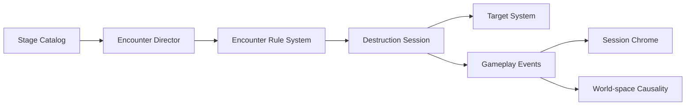
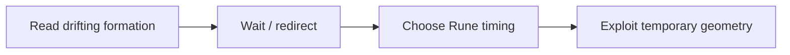
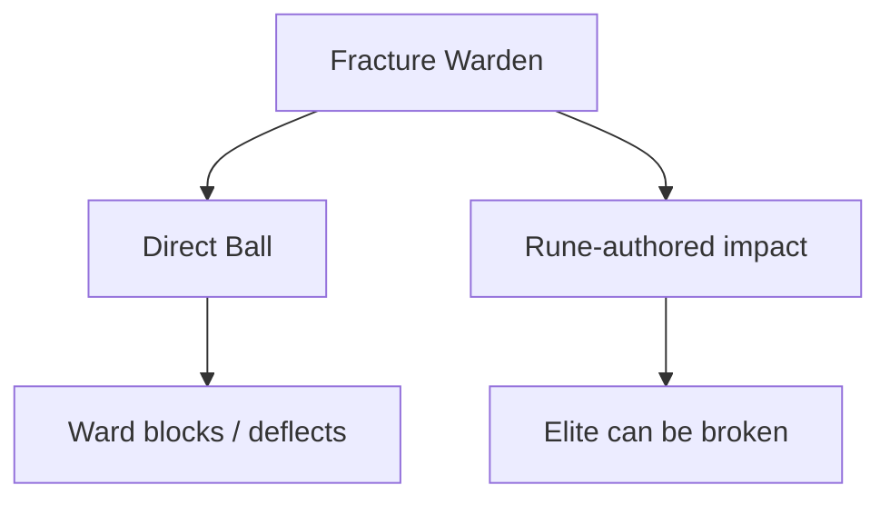

# Rune Ball — P9.3 Encounter Modifier & Elite Contract

## Why P9.3 exists

P9.1 proved that authored formations can turn arena geometry into a tactical question. P9.2 proved that the same encounter lifecycle can support a Boss that asks for setup → break → payoff rather than raw DPS.

The next content-scaling risk is repetition. If every non-Boss encounter only changes target coordinates, the authored system still needs a large amount of bespoke content to keep Rune decisions fresh.

P9.3 adds two small reusable vocabulary layers:

- **Encounter Modifiers** change a local arena rule for the duration of one encounter.
- **Elites** are readable rule carriers that change target priority without becoming HP sponges.

## Risk question

**Can a small set of local rules create meaningfully different Rune timing and target-priority decisions without bespoke encounter code, stat inflation, or a generic scripting engine?**

## Product rules

1. A Modifier changes the field, not the player's control scheme.
2. An Elite introduces a rule, not merely more HP or damage.
3. Rules must remain legible in world space; do not add modal tutorial text or a second persistent HUD.
4. Modifier and Elite behavior remains renderer-independent and authored in Stage data.
5. One encounter should carry only enough rule variation for the player to understand what changed.
6. Existing Rune verbs should solve the new rule whenever possible.

## Architecture

`EncounterRuleSystem` owns only the local rule contract. It does not own target rendering, Rune simulation, Stage progression, or Boss phases.

## Primitive 1 — Drift Field

`drift-field` slowly rotates the authored formation around the arena center.

The intended decision is not reflex difficulty. It creates a changing geometry window:

### Authored guardrails

- Direction is authored as clockwise or counterclockwise.
- Speed is deliberately capped so the formation remains readable.
- It does not alter Ball physics or input.
- It composes with Vortex rather than replacing it.

### Shattered Gate use

**Convergence** gains a slow clockwise Drift Field. The two clusters no longer present one static best cast moment; the player can wait for a stronger Vortex / Split geometry.

## Primitive 2 — Rune Ward Elite

The first Elite is the **Fracture Warden**.

Its `rune-ward` trait has one rule:

> Direct Ball contact is rejected. Rune-authored impact can break the Elite.

Accepted current payoff paths include:

- Split echo;
- Chain propagation;
- Vortex Singularity collapse.

The Elite is movement-locked so its identity remains stable while the surrounding relay lattice can still be repositioned by Rune effects.

This makes the Elite a priority / routing problem instead of a large health pool.

## Shattered Gate vertical slice

| Encounter | Rule vocabulary | Intended decision |
| --- | --- | --- |
| **Opening Vector** | None | Read baseline rebound geometry. |
| **Convergence** | Drift Field | Wait for / create a better Rune window. |
| **Fracture Warden** | Rune Ward Elite | Change target priority and route a Rune-authored hit into the Elite. |
| **Fracture Sentinel** | Boss phase contract | Apply setup → break → payoff at the Stage climax. |

The Stage remains four encounters and keeps the provisional 100-second timer from P9.2. P9.3 should deepen vocabulary, not increase runtime by adding more rooms.

## Presentation contract

- Session chrome reuses the existing encounter label and displays `ELITE n/N` for Elite encounters.
- The Rune Ward uses a persistent world-space geometric marker around the Elite.
- A blocked Ball contact produces a short Ward rejection pulse.
- Rune defeat removes the marker and produces a compact break pulse.
- No Elite health bar, trait card, floating paragraph, or separate tutorial overlay is added.

## Scope guard

P9.3 deliberately does **not** add:

- random affix rolls;
- elemental weakness / resistance matrices;
- Elite HP multipliers;
- enemy attacks or player health;
- loot rarity or Elite drops;
- procedural modifier stacking;
- a general-purpose encounter scripting language;
- additional currencies;
- a second Elite archetype before the first contract is validated.

## Phone playtest gate

Before expanding the vocabulary or moving to progression, validate that:

1. Convergence visibly behaves differently because the formation drifts, without explanatory text.
2. The Drift Field sometimes causes the player to wait, redirect, or change Rune timing rather than cast immediately.
3. The first direct Ball hit on Fracture Warden clearly reads as **blocked**, not as a collision bug.
4. After that block, the player can infer that Rune interaction is the answer from the world-space Ward feedback and existing Rune language.
5. Split and Chain both feel like legitimate Warden solutions; Singularity remains a viable build-dependent solution.
6. The Warden changes target priority without creating a long time-to-kill.
7. The Elite encounter feels meaningfully different from a normal formation but does not compete with the Sentinel as the Stage climax.
8. The 100-second Stage timer still provides pressure without making the added decision space feel rushed.

## Success condition

P9.3 succeeds when Rune Ball can create several distinct tactical questions by composing **formation geometry + a small local modifier + an optional rule-carrying Elite**, while keeping the same core Ball and Rune verbs.

If the gate passes, the next product-level phase should be **P9.4 — Rune Unlock & Stage Progression**, using the proven encounter vocabulary to teach and reward new capabilities rather than adding more rules first.
