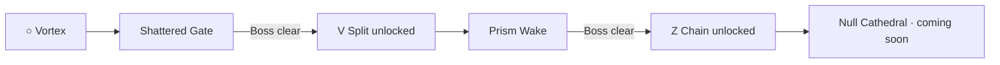
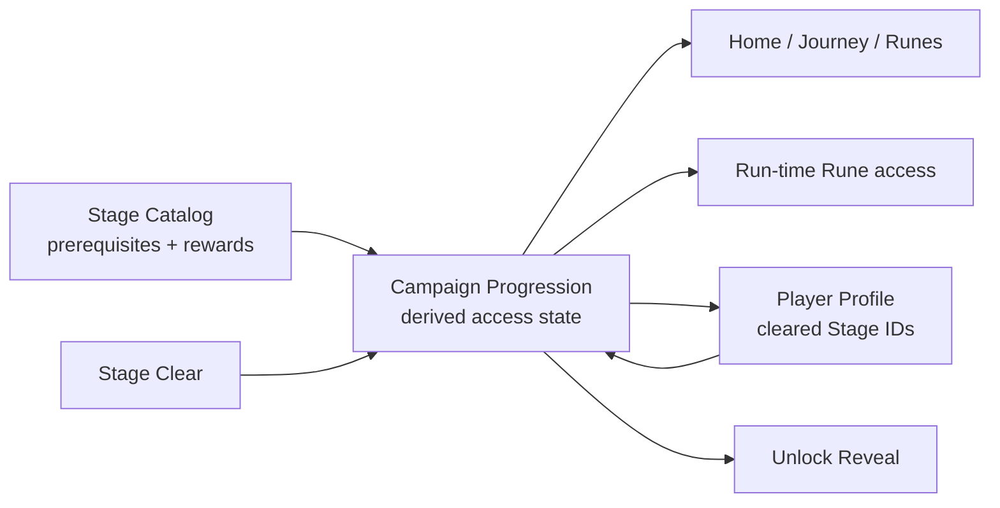

# Rune Ball — P9.4 Rune Unlock & Stage Progression

## Why P9.4 exists

P9.1–P9.3 established a reusable authored encounter vocabulary: formation geometry, Drift Field modifiers, Rune Ward Elites, and Boss phase contracts. P9.3.1 exposed the next product problem clearly: showing several Rune answers before the player has learned them creates ambiguity, and mandatory rules must not depend on knowledge the game never established.

P9.4 turns Stage clear into a rules-changing progression loop.

The goal is not account leveling. The goal is:

> Clear a Stage → learn a new verb → enter a Stage that immediately gives that verb a reason to exist.

## Risk question

**Does unlocking a new Rune after a Boss create a stronger reason to continue, while making the game's teaching curve clearer than exposing the full Rune vocabulary up front?**

## Teaching curve

P9.4 uses the first playtest-supported order:



This order is intentionally evidence-driven. P9.3.1 showed that expecting the player to infer `Z` during Shattered Gate was premature. The first Stage therefore teaches Vortex as the only Rune verb, then rewards Split. Prism Wake teaches Split through authored geometry before rewarding Chain.

## Product contract

1. A fresh profile starts with **Vortex only**.
2. A locked Rune is absent from the arena Rune guide and cannot activate through gesture input.
3. Boss / Stage clear persists clear state and derives rewards from Stage data.
4. Replaying a cleared Stage never duplicates an unlock.
5. The Journey screen reflects `available`, `cleared`, `locked`, and `coming-soon` states.
6. Home Continue points at the first authored, available, uncleared Stage.
7. Results reveal a newly unlocked Rune before offering the next Stage.
8. A new Rune must be followed by authored content that makes its spatial role legible.

## Architecture



### `StageCatalog`

Authored content owns:

- Stage prerequisite clears;
- featured Rune;
- Rune reward;
- authored / coming-soon content state;
- encounter sequence.

It does not read browser storage or mutate player state.

### `PlayerProfile`

Persists:

- selected Rune evolution paths;
- cleared Stage IDs.

It does **not** persist an independent unlocked-Rune list. Rune access is derived from Stage clears so progression cannot drift into contradictory states.

### `CampaignProgression`

Renderer-independent progression rules derive:

- Stage state;
- unlocked Rune set;
- Continue Stage;
- clear reward;
- next available authored Stage.

Presentation consumes this snapshot but does not decide unlock rules.

### Run-time access

`DestructionScene` receives the derived Rune set through explicit configuration.

A locked Rune gesture:

- does not activate `DestructionSession`;
- does not spend charge;
- reports a compact `RUNE LOCKED` failure;
- is omitted from the normal arena Rune guide.

This keeps input mapping aligned with progression rather than making lock state cosmetic.

## Stage 1 — Shattered Gate

**Featured Rune:** ○ Vortex  
**Reward:** V Split

Shattered Gate remains the accepted four-encounter structure, but its authored language no longer assumes Split or Chain knowledge.

- Opening Vector — baseline rebound geometry.
- Convergence — Drift Field + Vortex timing.
- Fracture Warden — Rune influence gate solvable with Vortex.
- Fracture Sentinel — setup → break → core payoff.

The player can complete the Stage using Ball + Vortex.

## Stage 2 — Prism Wake

**Prerequisite:** clear Shattered Gate  
**Featured Rune:** V Split  
**Reward:** Z Chain

Prism Wake is the first progression vertical slice built entirely from existing P9 encounter contracts.

| Encounter | Existing vocabulary | Split teaching purpose |
| --- | --- | --- |
| **Mirror Lanes** | Formation | Mirrored lanes reward simultaneous lateral coverage. |
| **Crosscurrent** | Drift Field | Wait for two lanes to enter a useful Split window. |
| **Prism Keeper** | Rune Ward Elite | Route Split echoes or another active Rune impact into a priority target. |
| **Prism Anchor** | Boss Contract | Break paired / crossed Ward structures before core payoff. |

No new enemy combat model or Boss rule is introduced.

## Results payoff

A first-time Stage clear uses the existing Results surface to reveal the new capability.

Example after Shattered Gate:

```text
STAGE CLEAR // NEW CAPABILITY

RUNE UNLOCKED
V  SPLIT

PRISM WAKE AVAILABLE
```

The player can then choose **NEXT STAGE**, which opens the next Stage briefing rather than bypassing the product shell.

A replay clear shows normal results and does not repeat the reward reveal.

## Persistence

Campaign progression is intentionally small:

```text
PlayerProfile
├─ vortexPath
├─ splitPath
├─ chainPath
└─ clearedStageIds[]
```

Unlocked Runes and available Stages are derived every load.

Old profiles remain readable. Existing evolution path choices are preserved; missing campaign state begins with no Stage clears so the P9.4 teaching curve can be exercised cleanly.

## Scope guard

P9.4 deliberately does **not** add:

- account XP or player level;
- materials or crafting;
- permanent currencies;
- equipment or loot rarity;
- flat Rune stat upgrades;
- daily missions or LiveOps;
- world-map traversal;
- procedural campaign branches;
- a new Boss ruleset;
- a new Elite archetype;
- Stage star ratings.

The reward is a new gameplay verb and the authored problem that follows it.

## Phone playtest gate

Before moving toward P9.5, validate from a fresh campaign state:

1. Shattered Gate shows only `○` in the arena Rune guide and only Vortex is usable.
2. Shattered Gate remains fully solvable with Ball + Vortex.
3. Clearing the Sentinel makes the **V Split** unlock immediately understandable without a tutorial modal.
4. Home / Journey naturally point toward Prism Wake after the clear.
5. Prism Wake makes Split useful within its first encounter rather than merely allowing it.
6. `Z Chain` is neither advertised as an available arena Rune nor usable before Prism Wake is cleared.
7. Clearing Prism Wake reveals Chain while Null Cathedral remains honestly marked `COMING SOON`.
8. Replay clears do not duplicate unlocks or corrupt Stage state.
9. Reloading the page preserves cleared Stages and Rune access.
10. The two-Stage sequence creates a stronger desire to continue than the previous all-Runes-up-front shell.

## Success condition

P9.4 succeeds when Rune Ball has a credible short progression loop:

**learn one Rune → solve authored Stage → defeat Boss → gain a new Rune → immediately face content designed around that new verb.**

If this loop works on phone, P9.5 can organize proven Stage / encounter content into a broader Region / Expedition structure without first inventing more meta systems.
