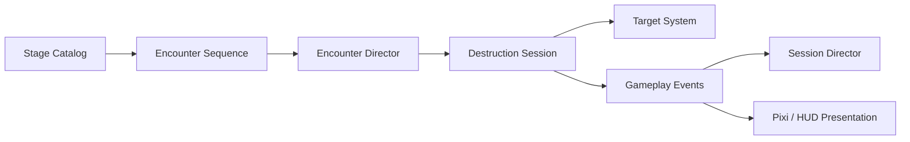
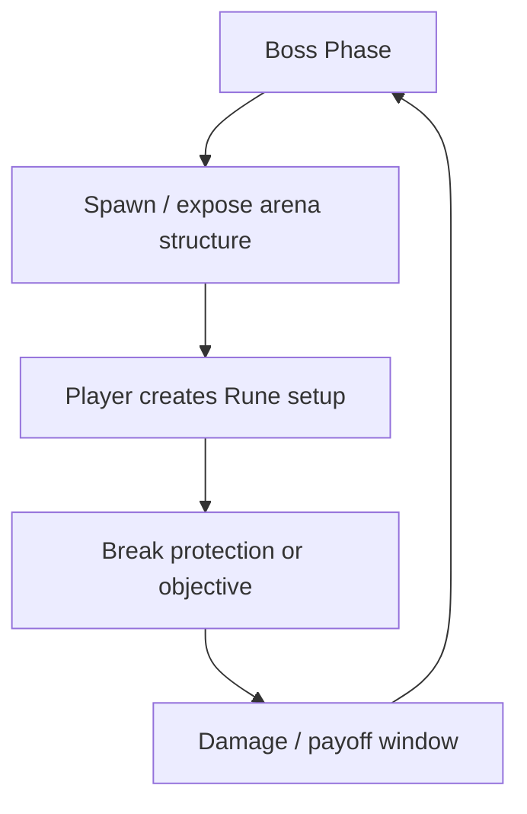
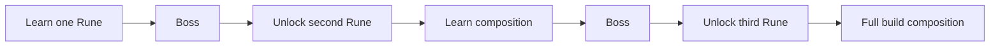

# Rune Ball — P9 Authored Stage & Encounter System

## Why P9 exists

Rune Ball's MVP proved that redirecting the ball, breaking targets, casting Runes, building Flow, and reaching Overdrive can produce a satisfying short-session power fantasy.

The current content loop has a larger structural limitation: targets continuously refill inside one arena. That preserves action density, but it gives the player little reason to read a situation, prepare a Rune setup, or choose one Rune sequence over another.

P9 changes the primary question from:

> How many targets can I destroy before the timer ends?

into:

> What is this encounter asking me to solve, and which Rune setup gives me the cleanest answer?

The timer remains pressure. It is no longer the primary objective.

## Risk question

**Do authored formations create recognizable tactical problems that make players deliberately change Rune timing, ordering, and target selection?**

If the answer is no, adding more stages, bosses, loot, or world traversal would only hide a shallow encounter vocabulary behind more content.

## Product rule

A Stage is authored content data. Runtime systems execute that data; presentation reports state but does not own encounter rules.

This preserves the existing simulation / presentation boundary while creating a reusable content-authoring layer for future stages, elites, objectives, and bosses.

## P9.1 — Authored Encounter Foundation

### Deliverables

- Stage data can define an ordered Encounter sequence.
- Each Encounter owns a title, objective, and normalized target formation.
- `EncounterDirector` owns encounter lifecycle: start → active → clear → intermission → next → stage clear.
- `TargetSystem` supports explicit authored spawning without automatic refill.
- Legacy endless-spawn behavior remains available when no authored sequence is supplied.
- `DestructionSession` is the integration boundary between encounter lifecycle and combat simulation.
- Overdrive does not inject additional targets into an authored formation.
- Stage clear ends the run early through the existing session/result flow.
- A normal directional swipe can begin the run; a Rune cast is no longer required to start the timer.
- Existing session chrome reports encounter number/name and clear/timeout outcome without adding a second persistent HUD layer.

### Shattered Gate vertical slice

`Shattered Gate` becomes the first authored Stage and contains three formation hypotheses:

| Encounter | Tactical hypothesis | Intended pressure |
| --- | --- | --- |
| **Opening Vector** | Rebound readability | Establish that formation geometry matters before Rune optimization. |
| **Convergence** | Vortex → Split setup | Two separated clusters make repositioning and broad Split coverage more valuable than immediate casting. |
| **Relay Array** | Chain origin selection | A linked diagonal / armored topology gives Chain a visibly stronger and weaker origin choice. |

These are playtest hypotheses, not permanent level-design templates. P9.1 succeeds only if players actually react differently to them.

## P9.2 — Boss Encounter Contract

Only after authored formations are readable, add a reusable Boss encounter contract.

The Boss should be an **arena problem**, not merely a target with a large HP pool. Boss phases should expose Rune opportunities through formation, protection, movement, or break-state rules.

Candidate structure:

P9.2 should establish reusable phase/objective primitives before authoring multiple bosses.

## P9.3 — Rune Unlock & Stage Progression

Once one Boss works, connect authored Stage completion to progression:

- Boss clear unlocks a new Rune or equivalent rules-changing capability.
- Later encounters teach composition between previously learned Runes.
- Stage selection reflects clear/unlock state.
- Rune Tree progression should favor new behavior and build identity over flat stat inflation.

A likely teaching curve is:

The exact Rune unlock order should be decided from playtest evidence rather than assumed in P9.1.

## P9.4 — Region / Expedition Layer

Do not build a full open world yet.

After Rune Ball has roughly 10–15 proven encounter patterns, those authored arenas can be organized into a Region / Expedition structure with branches, hidden routes, elites, Rune shrines, and region bosses.

The goal is to gain exploration and route choice without prematurely creating a second traversal-focused core loop.

## Scope guard

P9.1 deliberately does **not** add:

- open-world traversal;
- materials or crafting;
- additional permanent currencies;
- boss HP / phase logic;
- new target families;
- bespoke encounter HUD panels;
- arbitrary Rune damage / radius / duration buffs;
- a large explicit synergy bonus matrix.

Cross-Rune causal-memory changes can be revisited after encounter geometry gives those handoffs a clear tactical purpose.

## Phone playtest gate

Before moving to P9.2, validate `Shattered Gate` on a phone:

1. Players notice that the target arrangement has changed between encounters without needing a modal tutorial.
2. Players use Runes differently between `Opening Vector`, `Convergence`, and `Relay Array`.
3. At least one formation causes the player to delay a Rune briefly to create a better setup instead of casting immediately on charge.
4. Clearing all encounters feels like the goal; the 75-second timer reads as pressure/failure risk rather than the main scoring objective.
5. The 0.7-second formation transition creates a readable beat without feeling like dead air.
6. Overdrive remains exciting even though it no longer silently increases target count inside authored encounters.

If these fail, tune formation geometry and encounter pacing before adding Boss content.

## Success condition

P9.1 is complete when the game has moved from **continuous target refill** to a demonstrably readable **authored encounter sequence**, and that sequence begins to create intentional Rune decisions rather than merely changing where crystals happen to appear.
