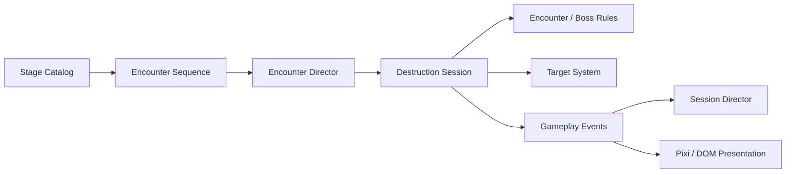
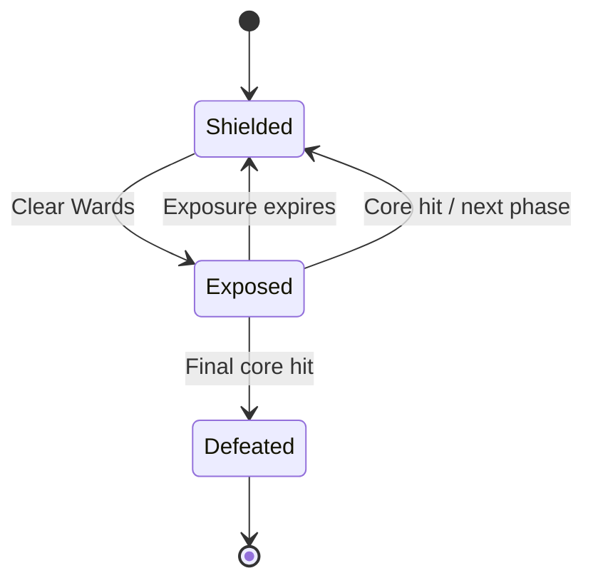
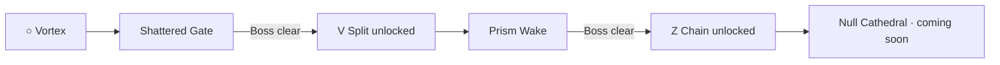
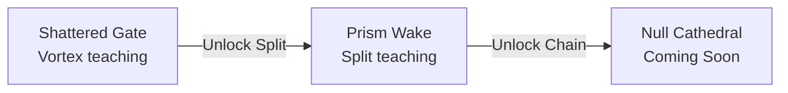

# Rune Ball — P9 Authored Stage & Encounter System

## Why P9 exists

Rune Ball's MVP proved that redirecting the ball, breaking targets, casting Runes, building Flow, and reaching Overdrive can produce a satisfying short-session power fantasy.

The larger structural limitation was repetition: targets continuously refilled inside one arena, so the player had little reason to read a situation, prepare a Rune setup, or choose one Rune sequence over another.

P9 changes the primary question from:

> How many targets can I destroy before the timer ends?

into:

> What is this encounter asking me to solve, and which Rune setup gives me the cleanest answer?

The timer remains pressure. It is no longer the primary objective.

## Product rule

A Stage is authored content data. Runtime systems execute that data; presentation reports state but does not own encounter rules.

This preserves the simulation / presentation boundary while creating a reusable content-authoring layer for stages, formations, modifiers, Elites, objectives, and Bosses.

## P9.1 — Authored Encounter Foundation — Complete

Established the Stage → Encounter sequence contract:

- Stage data owns an ordered encounter sequence.
- `EncounterDirector` owns start → active → clear → intermission → next → stage clear.
- `TargetSystem` supports explicit authored spawning without automatic refill.
- `DestructionSession` is the integration boundary between encounter lifecycle and combat simulation.
- Overdrive does not inject extra targets into authored formations.
- Stage clear ends the run through the existing session/result flow.
- Existing session chrome reports encounter progress without a second persistent HUD.

## P9.2 — Boss Encounter Contract — Complete

Established Boss as an **arena problem**, not a large HP target.

Key contract:

- Boss phases author Ward formation, objective, exposure duration, and core geometry.
- Existing Rune systems solve the Ward structure.
- Ball / Split can cash out an exposed Core.
- No Boss HP scaling or separate damage-stat model.
- Boss state remains renderer-independent and is exposed through gameplay events.
- `EncounterDirector` advances from an explicit objective-complete signal.

## P9.3 — Encounter Modifier & Elite Contract — Complete

P9.3 expanded encounter vocabulary without multiplying bespoke systems.

| Primitive | First use | Tactical question |
| --- | --- | --- |
| **Drift Field** | Convergence | When is the moving formation in a useful Rune geometry? |
| **Rune Ward Elite** | Fracture Warden | How do I route Rune influence into a target that rejects plain Ball damage? |

P9.3.1 then closed the solvability gap discovered on phone:

- a mandatory Rune-gated encounter cannot depend on a permanently exhaustible resource;
- Rune Ward provides a bounded one-cast recovery floor;
- Chain-armed and Vortex-influenced Ball contacts correctly count as Rune-authored answers;
- the rule remains recoverable even when the Elite is the final target.

Detailed contract: `P9-3-ENCOUNTER-MODIFIER-ELITE.md`.

## P9.4 — Rune Unlock & Stage Progression — In Progress

P9.4 turns Stage completion into rules-changing progression rather than stat progression.

The first implementation curve is now:

This order is based on P9.3.1 playtest evidence: exposing `Z` before the player had learned its role created ambiguity. A fresh campaign therefore begins with Vortex only.

P9.4 implementation contract:

- Stage data owns prerequisites, featured Rune, and Rune reward.
- Player profile persists cleared Stage IDs, not a duplicated unlocked-Rune list.
- `CampaignProgression` derives Stage state, Rune access, and Continue target.
- Arena input rejects locked Rune gestures and omits locked glyphs from the Rune guide.
- Home / Journey / Rune tree reflect progression state.
- Results reveal a newly unlocked Rune before offering the next Stage.
- Prism Wake is authored as the Split teaching Stage using existing Formation / Drift / Elite / Boss contracts.
- Null Cathedral remains honestly marked `COMING SOON` until its Chain content is authored.

Detailed contract: `P9-4-RUNE-UNLOCK-STAGE-PROGRESSION.md`.

## P9.5 — Region / Expedition Layer

Do not build a full open world yet.

After Rune Ball has roughly 10–15 proven encounter patterns, authored arenas can be organized into a Region / Expedition structure with branches, hidden routes, Elites, Rune shrines, and region Bosses.

The goal is to gain exploration and route choice without prematurely creating a second traversal-focused core loop.

## Current Chapter I progression

Shattered Gate and Prism Wake currently use a provisional 100-second timer while Stage-to-Stage motivation and teaching density are evaluated.

## Scope guard

P9 continues to avoid premature meta-system expansion:

- no open-world traversal yet;
- no materials or crafting;
- no additional permanent currencies;
- no account XP or player level;
- no random affix / rarity system;
- no arbitrary Rune damage / radius / duration inflation;
- no Boss HP sponge design;
- no Elite HP multiplier design;
- no generic encounter scripting language;
- no large explicit synergy bonus matrix.

## Current success thesis

P9 is successful when Rune Ball can produce recognizable tactical questions through authored **geometry, local rules, priority targets, Boss phases, and Rune unlock progression**, while preserving the same core Ball + Rune interaction language.

The P9.4 proof is whether **clear Stage → unlock new verb → enter authored problem built around that verb** creates a credible reason to continue without adding a second meta-game.
