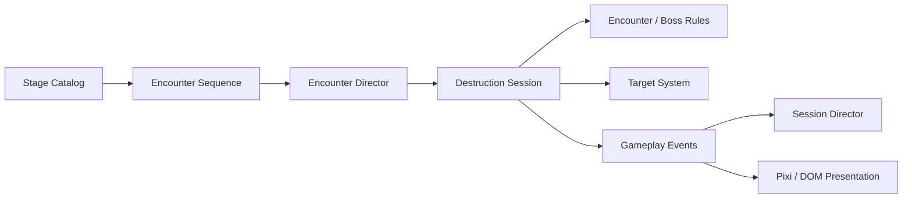
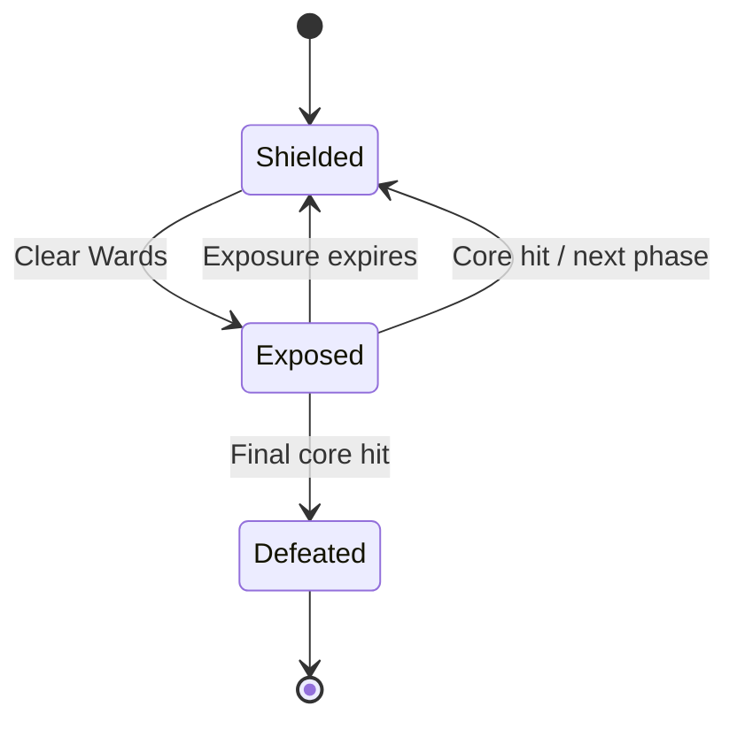
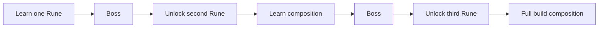
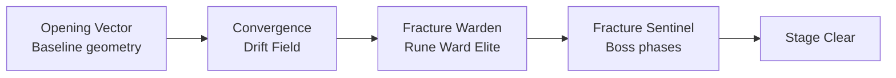

# Rune Ball — P9 Authored Stage & Encounter System

## Why P9 exists

Rune Ball's MVP proved that redirecting the ball, breaking targets, casting Runes, building Flow, and reaching Overdrive can produce a satisfying short-session power fantasy.

The larger structural limitation was repetition: targets continuously refilled inside one arena, so the player had little reason to read a situation, prepare a Rune setup, or choose one Rune sequence over another.

P9 changes the primary question from:

> How many targets can I destroy before the timer ends?

into:

> What is this encounter asking me to solve, and which Rune setup gives me the cleanest answer?

The timer remains pressure. It is no longer the primary objective.

## Product rule

A Stage is authored content data. Runtime systems execute that data; presentation reports state but does not own encounter rules.

This preserves the simulation / presentation boundary while creating a reusable content-authoring layer for stages, formations, modifiers, Elites, objectives, and Bosses.

## P9.1 — Authored Encounter Foundation — Complete

Established the Stage → Encounter sequence contract:

- Stage data owns an ordered encounter sequence.
- `EncounterDirector` owns start → active → clear → intermission → next → stage clear.
- `TargetSystem` supports explicit authored spawning without automatic refill.
- `DestructionSession` is the integration boundary between encounter lifecycle and combat simulation.
- Overdrive does not inject extra targets into authored formations.
- Stage clear ends the run through the existing session/result flow.
- Existing session chrome reports encounter progress without a second persistent HUD.

The first Shattered Gate slice proved that formation geometry can be authored as gameplay content instead of endless target refill.

## P9.2 — Boss Encounter Contract — Complete

Established Boss as an **arena problem**, not a large HP target.

The first Boss, Fracture Sentinel, uses:

Key contract:

- Boss phases author Ward formation, objective, exposure duration, and core geometry.
- Existing Rune systems solve the Ward structure.
- Ball / Split can cash out an exposed Core.
- No Boss HP scaling or separate damage-stat model.
- Boss state remains renderer-independent and is exposed through gameplay events.
- `EncounterDirector` now advances from an explicit objective-complete signal rather than assuming `targets === 0`.

This generalized lifecycle is the base for future non-clear-all objectives as well.

## P9.3 — Encounter Modifier & Elite Contract — In Progress

P9.3 expands encounter vocabulary without multiplying bespoke systems.

Two reusable concepts are introduced:

- **Encounter Modifier** — changes a local arena rule for one encounter.
- **Elite** — carries a readable rule that changes target priority rather than adding HP.

First validation primitives:

| Primitive | First use | Tactical question |
| --- | --- | --- |
| **Drift Field** | Convergence | When is the moving formation in a useful Rune geometry? |
| **Rune Ward Elite** | Fracture Warden | How do I route a Rune-authored impact into a target that rejects direct Ball damage? |

Detailed contract: `P9-3-ENCOUNTER-MODIFIER-ELITE.md`.

If these primitives are not readable on phone, tune their world-space causality and encounter geometry before adding more modifiers or Elite archetypes.

## P9.4 — Rune Unlock & Stage Progression

Only after the authored encounter vocabulary is credible should Stage completion become progression.

Goals:

- Boss clear unlocks a new Rune or equivalent rules-changing capability.
- Later encounters teach composition between previously learned Runes.
- Stage selection reflects clear / unlock state.
- Progression rewards new behavior and build identity over flat stat inflation.

A likely teaching curve remains:

The exact Rune unlock order should come from playtest evidence rather than being assumed up front.

## P9.5 — Region / Expedition Layer

Do not build a full open world yet.

After Rune Ball has roughly 10–15 proven encounter patterns, authored arenas can be organized into a Region / Expedition structure with branches, hidden routes, Elites, Rune shrines, and region Bosses.

The goal is to gain exploration and route choice without prematurely creating a second traversal-focused core loop.

## Current Shattered Gate vocabulary

The current Stage timer is provisionally 100 seconds while P9.2/P9.3 decision density is evaluated.

## Scope guard

P9 continues to avoid premature meta-system expansion:

- no open-world traversal yet;
- no materials or crafting;
- no additional permanent currencies;
- no random affix / rarity system;
- no arbitrary Rune damage / radius / duration inflation;
- no Boss HP sponge design;
- no Elite HP multiplier design;
- no generic encounter scripting language;
- no large explicit synergy bonus matrix.

Cross-Rune causal-memory changes can still be revisited after authored content demonstrates exactly where live-overlap synergy is too restrictive.

## Current success thesis

P9 is successful when Rune Ball can produce a growing set of recognizable tactical questions through authored **geometry, local rules, priority targets, and Boss phases**, while preserving the same core Ball + Rune interaction language.

The next major proof after P9.3 is not more encounter rules. It is whether this vocabulary is strong enough to support meaningful **unlock progression and Stage-to-Stage motivation**.
