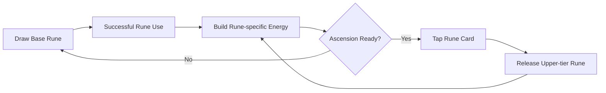
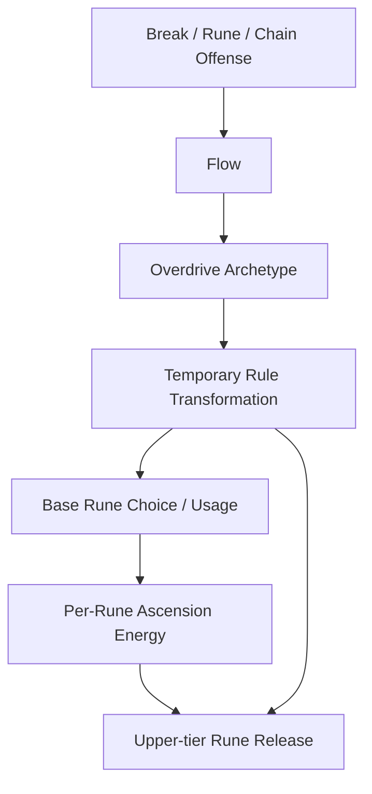

# Rune Ball — Post-MVP Progression Expansion Candidates

> Deferred design candidates only. Do not implement these before the MVP core loop is validated through P6.

## Product rule

Progression should deepen **gesture expression, setup/payoff decisions, and Overdrive transformation** rather than replace them with conventional stat inflation.

The validated core grammar remains:

```text
Swipe = trajectory authority
Rune gesture = rule-changing setup / payoff
Flow = escalation
Overdrive = temporary rule-breaking climax
```

Post-MVP systems should create new interactions around that grammar instead of turning Rune Ball into a button-driven skill game.

---

## Candidate A — Overdrive Archetypes

### Concept

The MVP proves one generic Overdrive state. Post-MVP, a run/build could choose an **Overdrive Archetype** that changes what the 10–15 second climax does.

The archetype should primarily transform rules, Rune behavior, or arena relationships rather than add flat percentage bonuses.

### Example archetypes

| Archetype | Rule transformation |
|---|---|
| **Resonance** | Rune effects last substantially longer and multiple active Rune states become easier to overlap. |
| **Cataclysm** | Unlocks a temporary high-impact special Rune during Overdrive. |
| **Echo** | Rune effects repeat or gain additional echoes during the climax. |
| **Singularity** | Vortex evolves into a stronger collapse/setup state that can convert into a payoff event. |
| **Conduit** | Chain gains deeper propagation or additional links. |
| **Rebound Drive** | Rebound becomes a sustained offensive state and wall routing matters more during Overdrive. |

### Design intent

Different Overdrive Archetypes should create different answers to:

> “What do I try to do during my short release window?”

For example, one build may want to stack long-lived Rune fields, while another wants to create one large Chain payoff.

### Guardrails

- Do not add a second control mode.
- Do not automate the core play loop.
- Avoid archetypes that are only `+X% damage` or `+Y% speed`.
- Preserve Ball / Gesture readability during the highest-intensity state.
- Overdrive should still feel like a temporary climax, not the new baseline state.

---

## Candidate B — Rune Cards + Ascension Release

### Concept

Represent each equipped Rune as an **individual compact card at the bottom edge of the portrait layout**.

The card is not the primary way to cast the Rune. The normal Rune is still activated by its gesture.

Instead, each successful Rune use contributes to that Rune card's own **Ascension Energy**. When the card reaches full energy, the player can tap the card to release an **upper-tier Rune**.



### Baseline progression hypothesis

For the first post-MVP prototype:

- each equipped Rune owns an independent energy meter;
- energy primarily increases from successful uses of that Rune;
- using Vortex therefore progresses Vortex's card, not a shared ultimate meter;
- a fully charged card becomes an intentional tap target;
- tapping consumes the stored energy and triggers one authored upper-tier effect.

This creates a second decision layer without replacing the gesture system:

```text
Gesture frequently
  → specialize a Rune during the run
  → charge its card
  → choose when to release the upper-tier form
```

### Example upper-tier directions

| Base Rune | Base identity | Possible upper-tier direction |
|---|---|---|
| **Vortex / Circle** | Setup / target gathering | **Singularity** — stronger pull followed by a collapse / payoff pulse. |
| **Split / V** | Attack footprint | **Prism / Legion** — more echoes, persistent traces, or repeated collision footprints. |
| **Chain / Z** | Next-impact payoff | **Conduit / Storm** — multi-hop propagation, branching links, or temporary chain-on-impact state. |

These names and exact effects are placeholders. The important rule is that the upper-tier form should be a **qualitative evolution of the base Rune's identity**.

### Why this direction is promising

Rune Cards could solve several future product needs with one coherent system:

- provide each Rune with a persistent, readable progression state during a run;
- create specialization without needing a large inventory screen;
- introduce a deliberate tap decision that is meaningfully different from gesture casting;
- give future Rune unlocks / variants a natural presentation surface;
- make “I use this Rune a lot” mechanically visible and rewarding;
- create a bridge between moment-to-moment action and longer run-build identity.

### UI / interaction contract

The card row should extend the existing mobile UI system rather than become a conventional skill bar.

- Keep the cards anchored to the bottom safe area, outside the core arena whenever possible.
- MVP-derived constraint: preserve the central gameplay area as the dominant visual region.
- Start with a maximum of the three equipped Rune cards visible at once.
- A card in normal / charging state should be visually quiet.
- Ascension Energy should be readable through one clear fill / ring / edge treatment, not multiple meters and badges.
- Only a fully charged card should become a strong interactive affordance.
- Ready-state tap targets should remain comfortably touchable on mobile (~44 pt class target size).
- Gesture drawing should remain available across the gameplay surface without requiring the player to begin gestures on a card.
- The visual state should distinguish at minimum: charging → ready → release → reset.

### Critical guardrail: cards do not replace gesture casting

Do **not** make the Rune Card a second way to cast the normal Rune.

If the player can simply tap Circle / V / Z cards for their base effects, the gesture system becomes optional and Rune Ball loses one of its validated identities.

The intended separation is:

```text
Draw gesture = frequent base Rune expression
Tap charged card = infrequent Ascension release
```

### Key risks to test later

1. **Spam incentive** — if energy is purely usage-count based, players may draw low-value Runes only to charge the card. The first prototype can use successful-use count, but should measure whether meaningful resolution needs to contribute more than empty casting.
2. **Attention shift** — players should not stare at the bottom cards instead of tracking the ball and targets.
3. **Input conflict** — a card tap must not create accidental Rune paths or interfere with immediate return to Swipe control.
4. **Release frequency** — Ascension should be rare enough to feel earned but common enough to influence a run.
5. **Visual hierarchy** — a charged card can demand attention; uncharged cards should not compete with Ball / Rune / Target readability.

---

## Candidate C — Combined Build Identity

The two candidate systems can eventually compose without being the same system:



This produces two orthogonal build questions:

- **Rune Card / Ascension:** which Rune am I specializing and preparing to release?
- **Overdrive Archetype:** what happens to my whole build when the climax begins?

Example future synergy:

```text
Vortex-focused build
  + Singularity Ascension
  + Resonance Overdrive
  → longer Vortex setup
  → charge / release Singularity
  → Overdrive extends the setup window
  → Chain converts the clustered field into a payoff
```

The goal is emergent combinations, not a large list of independent bonuses.

---

## Evaluation order after MVP

Do not prototype both progression axes simultaneously.

Recommended sequence:

1. Validate Rune Cards + Ascension as a standalone run-level decision layer.
2. Validate one or two Overdrive Archetypes independently.
3. Only then test cross-system synergy.
4. Expand content only if the interaction produces meaningfully different play patterns.

If either system primarily increases UI load or stat output without changing player decisions, simplify or remove it.
