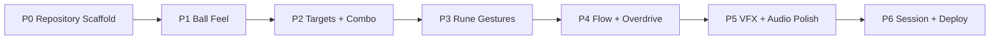

# Rune Ball — MVP Roadmap

> Goal: reach a mobile-playable 60–90 second vertical slice that proves ball feel, rune input, chain destruction, and Overdrive before adding roguelite/meta systems.

## Delivery strategy

Each phase must leave the game playable and answer one risk question. Do not hide weak core feel behind added content or progression.



## P0 — Repository-complete scaffold

**Objective:** create `rune-ball/` as a complete repository citizen with stable renderer bootstrap and Pages-safe build.

### Deliverables

- [ ] `rune-ball/package.json` + lockfile
- [ ] Vite + strict TypeScript + PixiJS
- [ ] explicit async bootstrap with logs and visible failure state
- [ ] portrait mobile shell + centered desktop portrait viewport
- [ ] deterministic game loop / update boundary
- [ ] `npm test` and `npm run build`
- [ ] base path `/2D-game-playground/rune-ball/`
- [ ] `.github/workflows/rune-ball.yml`
- [ ] `game-pages.yml` registration in validation + landing page
- [ ] `pages-bootstrap.yml` registration in build + complete-site list + landing page

### Gate

- `npm ci`
- `npm test`
- `npm run build`
- deployed-style asset paths are subpath-safe
- renderer failure never leaves an empty `#app`
- mobile + desktop first frame renders reliably

## P1 — Ball Feel Gate

**Objective:** answer one question before adding enemies or runes: **is redirecting the magical ball satisfying by itself?**

### Deliverables

- [ ] ball state and deterministic motion loop
- [ ] portrait arena bounds
- [ ] wall bounce response
- [ ] four directional swipe intents
- [ ] angle bucketing + minimum gesture threshold
- [ ] swipe-driven controlled redirect / impulse
- [ ] speed clamp and tuning constants
- [ ] ball trail placeholder
- [ ] wall-hit flash / transient placeholder
- [ ] test coverage for gesture direction classification and motion invariants

### Temporary presentation

Use simple geometric arena and one glowing ball. No final particles, targets, scoring, or rune system yet.

### Playtest gate

On an actual phone:

- a player can intentionally redirect the ball with one thumb
- input feels immediate rather than floaty
- wall bounce remains readable at maximum normal speed
- repeatedly swiping for 30 seconds is intrinsically pleasant enough to continue

If this fails, stop and retune input/motion before proceeding.

## P2 — Destruction + Combo Gate

**Objective:** turn ball movement into a repeatable impact loop.

### Deliverables

- [ ] Crystal target
- [ ] Armored Crystal target
- [ ] target spawn zones / lightweight director
- [ ] circle/target collision
- [ ] destruction events
- [ ] basic shard/spark pooling
- [ ] score
- [ ] combo increment + forgiving decay/reset window
- [ ] target density tuning
- [ ] event-driven VFX hooks
- [ ] tests for target state, collision outcomes, combo rules

### Gate

A 30–45 second session with no runes must already produce readable escalation from normal hit → break → short chain of breaks.

Do not proceed if impacts feel interchangeable or target density creates long dead periods.

## P3 — Rune Gesture Gate

**Objective:** prove that drawn shapes can coexist with fast directional swipes without confusing input.

### Deliverables

- [ ] pointer path sampler
- [ ] path normalization / simplification
- [ ] swipe vs rune intent separation
- [ ] Circle recognizer → Vortex
- [ ] V recognizer → Split
- [ ] Z recognizer → Chain
- [ ] rune charge meter
- [ ] drawn gesture trail
- [ ] canonical glyph confirmation beat
- [ ] failed recognition feedback that does not interrupt play
- [ ] unit tests with representative gesture samples

### Rune effects

**Vortex**
- pulls nearby targets toward a useful impact zone

**Split**
- creates temporary three-way attack echoes / traces

**Chain**
- empowers next impact to propagate across nearby targets

### Playtest gate

On phone, a new player can:

- perform normal directional swipes without accidental rune activations
- intentionally trigger all three runes after seeing their shape once
- understand that rune effects change setup/payoff rather than act as generic damage buttons

Recognition tuning is part of this phase; do not postpone it behind content polish.

## P4 — Flow + Overdrive Gate

**Objective:** close the escalation loop and create the first true power-fantasy climax.

### Deliverables

- [ ] Flow accumulation model
- [ ] Flow presentation intensity hooks
- [ ] Overdrive threshold
- [ ] 10–15 second Overdrive state
- [ ] reduced rune cost / temporary free rune behavior
- [ ] increased target density
- [ ] combo protection during Overdrive
- [ ] stronger trail / impact / shockwave tier
- [ ] Overdrive entry and exit event sequence
- [ ] deterministic state tests

### Gate

A competent 60–90 second run naturally reaches Overdrive approximately once, and the player can clearly describe the difference between pre-Overdrive buildup and the climax.

If Overdrive feels merely faster/noisier, rework payoff before adding more systems.

## P5 — VFX + Audio Characterization

**Objective:** make the proven loop feel premium while preserving readability and mobile frame pacing.

### VFX deliverables

- [ ] final-ish ball core treatment
- [ ] sampled trail / trail mesh
- [ ] Tier 1 contact sparks
- [ ] Tier 2 crystal break shards
- [ ] Tier 3 rune chain effect
- [ ] Tier 4 Overdrive release
- [ ] shockwave ring
- [ ] rune draw / recognition treatment
- [ ] camera punch tiers
- [ ] pooled effect budget / hard caps
- [ ] reduced-motion configuration

### Audio deliverables

- [ ] normal hit transient
- [ ] crystal break layer
- [ ] combo milestone accent
- [ ] one distinct activation sound per rune
- [ ] rune recognition suction / confirmation beat
- [ ] Overdrive entry bass drop
- [ ] Overdrive music/intensity layer
- [ ] result sting
- [ ] autoplay-safe initialization after user gesture

### Performance gate

Test highest planned effect density on actual mobile hardware.

- 60 fps target in normal play
- Overdrive must remain responsively playable
- no runaway allocations / particle growth
- degradation rules reduce decoration before gameplay clarity

## P6 — Session Loop + Deploy

**Objective:** package the mechanic as a complete, replayable MVP and verify production deployment.

### Session deliverables

- [ ] 60–90 second run timer / authored run director
- [ ] score summary
- [ ] longest combo
- [ ] rune usage / chain summary
- [ ] Overdrive destruction count
- [ ] instant Retry
- [ ] minimal first-run gesture onboarding
- [ ] sound toggle
- [ ] reduced-motion toggle
- [ ] local dev telemetry for gesture recognition / combo / Overdrive timing / frame spikes

### CI / Pages

- [ ] PR build/test does not unintentionally publish
- [ ] `main` deployment updates complete-site Pages state
- [ ] bootstrap full rebuild contains Rune Ball and all registered games
- [ ] no existing game disappears from validation lists

### Browser smoke tests

Desktop + mobile:

```js
document.querySelector('#app') !== null
document.querySelector('canvas') !== null
document.querySelector('#app')?.dataset.bootstrapError === undefined
```

Also verify:

- [ ] first interactive frame is visible
- [ ] pointer/touch input works after reload
- [ ] audio unlocks after explicit interaction
- [ ] assets return successfully from `/2D-game-playground/rune-ball/`
- [ ] complete run → results → retry works repeatedly

## MVP validation decision

After P6, evaluate these before expanding scope:

1. Is the ball fun before progression rewards?
2. Are swipe and rune gestures both reliable on a phone?
3. Do players intentionally create rune setups for larger chains?
4. Does Overdrive create a memorable release moment?
5. Do players voluntarily retry?

If fewer than four are convincingly true, continue core-loop iteration rather than adding meta systems.

## Post-MVP candidates

Only after validation.

Detailed progression hypotheses are recorded in [POST-MVP-PROGRESSION.md](./POST-MVP-PROGRESSION.md).

### Progression expansion candidates

- **Overdrive Archetypes** — a run/build changes how the short Overdrive climax rewrites Rune and arena rules, instead of relying on flat stat bonuses.
- **Rune Cards + Ascension Release** — each equipped Rune gets a compact bottom-edge card; successful uses build Rune-specific energy, and a full card can be tapped to release an upper-tier Rune without replacing gesture casting.

### Mechanic depth

- Rune Mashup / combo gestures
- additional physical rule-changing runes
- target formations and moving hazards
- arena modifiers
- elite targets
- boss ritual structures

### Run progression

- 3-choice rune modifiers between arenas
- 8–12 minute multi-arena runs
- build synergies
- run-specific ball mutations

### Meta progression

- rune unlocks
- cosmetic ball cores / trails
- arena themes
- challenge modifiers

Avoid conventional stat inflation if it makes gesture/physics manipulation secondary.

## Definition of MVP done

Rune Ball MVP is done when:

1. the 60–90 second session is playable end-to-end on mobile;
2. basic swipe control is satisfying and deterministic;
3. Circle, V, and Z gestures are forgiving and mechanically distinct;
4. combo/Flow/Overdrive form one readable escalation curve;
5. VFX/audio provide four distinct impact tiers without losing readability;
6. gesture/domain tests and production build pass;
7. GitHub Pages deployment is complete-site safe;
8. mobile/desktop smoke tests confirm renderer boot, canvas mount, touch input, audio unlock, and valid subpath assets;
9. playtest evidence supports or rejects the core power-fantasy hypothesis before scope expands.
