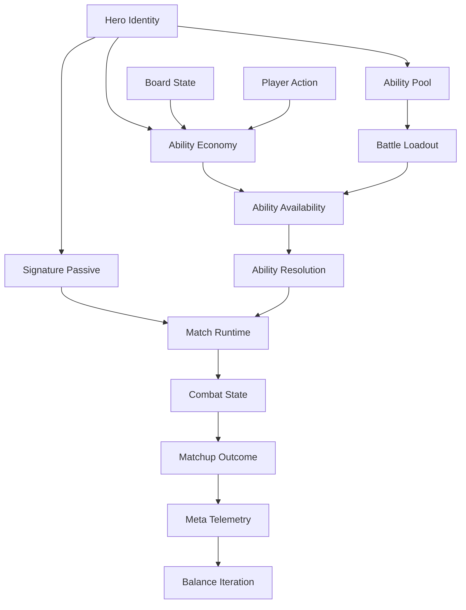
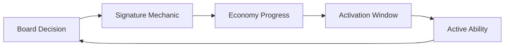
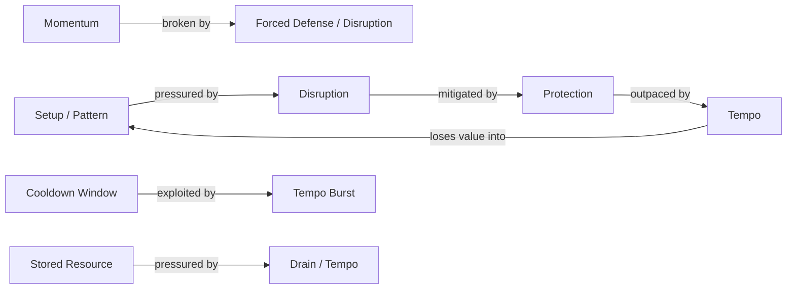
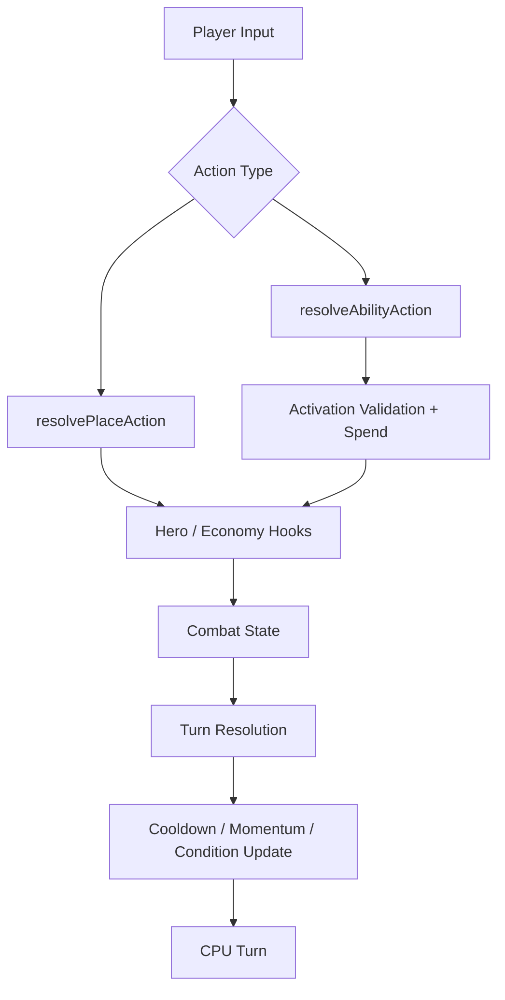
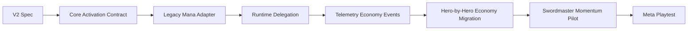

# Gomoku RPG — Hero Ability System Specification

Status: Draft v2  
Scope: Hero identity, signature mechanics, ability economies, active abilities, loadouts, counter model, runtime boundaries, and balance telemetry.  
Supersedes: v1 assumption that active abilities are primarily balanced around one shared Mana economy.

## 1. Product goal

The hero system should make each hero feel like a different way to read and manipulate a Gomoku board, not merely a different bundle of effects funded by the same resource.

Core principles:

> Heroes define a gameplay engine. Abilities express that engine. Board decisions still decide the match.

> The cost of an ability is not necessarily Mana. The meaningful cost is the work required to earn an activation window.

The system should continue to allow T0/T1 builds to emerge, but strong builds must expose readable counterplay and must not bypass the alternating-turn foundation of Gomoku.

## 2. Why v2 changes the model

V1 successfully established:

- authoritative hero identity and signature passive;
- two configurable active-skill slots;
- effect metadata and counter tags;
- CPU loadout compatibility;
- loadout-aware telemetry;
- the first new setup/control hero.

The remaining structural issue is that `SkillDefinition.cost` and runtime Mana checks still make the shared Mana loop the default activation model.

If every hero follows:

```text
board pattern -> gain Mana -> spend Mana -> use skill
```

then heroes can have different effects while still sharing the same strategic rhythm. V2 moves activation economy into hero identity so different heroes can earn and time power differently.

## 3. System model



### Design responsibilities

| Layer | Responsibility |
| --- | --- |
| Hero Identity | Defines role, fantasy, signature mechanic, and strategic bias |
| Signature Passive | Changes board valuation or rewards hero-specific play |
| Ability Economy | Defines how activation windows are earned, spent, refreshed, or lost |
| Ability Pool | Defines tactical tools compatible with the hero engine |
| Loadout | Selects the active tools brought into a match |
| Ability | Defines targeting, effect, turn cost, and explicit activation requirement |
| Combat State | Stores board/effect state and reusable economy runtime state |
| Telemetry | Measures hero + build + economy performance |

## 4. Hero contract

A hero is a gameplay engine composed of identity, passive, economy, and abilities.

Target model:

```ts
export type HeroDefinition = {
  id: HeroId;
  nameKey: HeroId;
  role: HeroRole;

  signaturePassive: PassiveId;
  abilityEconomy: AbilityEconomyDefinition;

  abilityPool: readonly AbilityId[];
  defaultLoadout: HeroLoadout;

  playstyleTags: readonly PlaystyleTag[];
  synergyTags: readonly EffectTag[];
  counterTags: readonly EffectTag[];
};
```

### Rules

1. Every hero has one authoritative signature passive in v2.
2. Every hero declares one primary ability economy.
3. The passive and economy together should define the hero's recurring gameplay loop.
4. Active abilities should reinforce that loop rather than function as unrelated utility buttons.
5. Loadout choice remains meaningful, but a hero is not required to expose every ability as freely interchangeable content.
6. Shared abilities remain possible only when their activation semantics are compatible with multiple hero economies.

## 5. Ability economy contract

V2 defines a small reusable set of economy archetypes rather than inventing a bespoke engine for every hero.

```ts
export type AbilityEconomyKind =
  | 'resource'
  | 'cooldown'
  | 'conditional'
  | 'momentum'
  | 'charge'
  | 'limited-use';
```

Recommended target shape:

```ts
export type AbilityEconomyDefinition =
  | {
      kind: 'resource';
      resourceId: ResourceId;
      max: number;
    }
  | {
      kind: 'cooldown';
    }
  | {
      kind: 'conditional';
    }
  | {
      kind: 'momentum';
      resourceId: ResourceId;
      max: number;
      decay?: MomentumDecayRule;
    }
  | {
      kind: 'charge';
    }
  | {
      kind: 'limited-use';
      usesPerMatch: number;
    };
```

### Economy archetypes

| Economy | Core question | Example fit |
| --- | --- | --- |
| Resource | Save or spend stored power? | Arcanist Mana |
| Cooldown | Is this the correct turn to commit a tool? | Vanguard |
| Conditional | Can I create the board state that enables the ability? | Architect |
| Momentum | Can I preserve aggressive sequencing long enough to cash out? | Swordmaster |
| Charge | Can I telegraph power now and realize it later? | Future setup hero |
| Limited Use | Which critical moment deserves the scarce activation? | Future ultimate-style hero |

### Constraint

Different display names such as Mana, Pressure, Sword Momentum, or Focus do not automatically require different runtime engines. If two resources share identical gain/spend semantics, they should reuse the same economy primitive with different data and UI vocabulary.

## 6. Ability activation contract

`cost: number` is no longer the authoritative activation rule.

Target model:

```ts
export type AbilityActivationRule =
  | {
      kind: 'resource';
      resourceId: ResourceId;
      amount: number;
    }
  | {
      kind: 'cooldown';
      turns: number;
    }
  | {
      kind: 'condition';
      conditionId: AbilityConditionId;
    }
  | {
      kind: 'resource-and-condition';
      resourceId: ResourceId;
      amount: number;
      conditionId: AbilityConditionId;
    }
  | {
      kind: 'limited-use';
      uses: number;
    };
```

`SkillDefinition` evolves toward an ability definition:

```ts
export type AbilityDefinition = {
  id: AbilityId;
  activation: AbilityActivationRule;
  consumesTurn: boolean;
  targetType: SkillTargetType;
  descriptionKey: SkillDescriptionKey;

  legalSources?: (context: AbilityContext) => Pos[];
  legalTargets: (context: AbilityContext, source?: Pos) => Pos[];
  execute: (context: AbilityContext, target: Pos, source?: Pos) => CombatState;

  availability: AbilityAvailability;
  category: SkillCategory;
  effectTags: readonly EffectTag[];
  synergyTags: readonly EffectTag[];
  counterTags: readonly EffectTag[];
  riskProfile: RiskProfile;
};
```

The runtime must ask the activation system whether an ability is ready rather than directly checking Mana.

## 7. Runtime economy state

Economy runtime state should remain generic and serializable.

Recommended direction:

```ts
export type ActorAbilityState = {
  resources: Partial<Record<ResourceId, number>>;
  cooldowns: Partial<Record<AbilityId, number>>;
  charges: Partial<Record<AbilityId, number>>;
  uses: Partial<Record<AbilityId, number>>;
  flags: Partial<Record<AbilityConditionId, boolean>>;
};
```

This state may initially coexist with the legacy `CombatState.resources[player].mana` field during migration.

### State rules

1. Economy state is actor-owned, not hero-global.
2. Economy mutations must be deterministic and replayable.
3. Economy updates occur through explicit domain functions, not UI code.
4. Ability execution must not secretly modify activation state outside the economy layer.
5. New economy types should reuse this state shape before adding bespoke combat fields.

## 8. Signature mechanic vs active ability

Not every hero mechanic should become a button.

A signature mechanic may trigger from:

- placement patterns;
- proximity to enemy stones;
- maintaining a sequence of offensive actions;
- creating a formation;
- surviving a cooldown window;
- spending or preserving a resource.

Healthy hero flow:



This keeps the board as the primary interaction surface and prevents the game from becoming a hotbar-first RPG.

## 9. Loadout model in v2

Two active slots remain the mobile UX ceiling, but v2 distinguishes hero engine from build choice.

Preferred conceptual model:

```text
Hero
├── Signature Passive
├── Ability Economy
├── Core Ability / Core Mechanic
└── Flex Ability Selection
```

The current two-skill loadout remains a valid transitional representation:

```ts
export type HeroLoadout = {
  heroId: HeroId;
  skillIds: readonly [SkillId, SkillId];
};
```

V2 does not immediately require a new loadout type. The first migration changes activation semantics before changing slot topology.

Future heroes may declare one core ability as mandatory and expose only the second slot as configurable, but that is a later content-policy decision rather than a required runtime assumption.

## 10. Current and target hero economies

| Hero | Current | Target direction | Strategic loop |
| --- | --- | --- | --- |
| Arcanist | Shared Mana | Resource / Mana | Generate and sequence spell economy efficiently |
| Vanguard | Shared Mana | Cooldown | Commit reliable tactical tools at the right turn |
| Shade | Shared Mana + Pressure passive | Pressure resource | Contest enemy space to earn disruption power |
| Architect | Shared Mana + Formation passive | Conditional / Formation | Build supported structures that unlock control tools |
| Swordmaster | Future | Momentum | Sustain offensive sequencing to unlock finishers |

These are migration targets, not all-at-once implementation requirements.

## 11. Example: Swordmaster

Swordmaster should validate the Momentum archetype rather than copy the Mana loop.

Example economy:

```text
Create a new two-line threat  -> +1 Momentum
Create a new three-line threat -> +2 Momentum
Opponent successfully breaks the sequence -> lose Momentum
Maximum Momentum -> Finisher window
```

Potential active abilities:

- `Step`: spend 1 Momentum to reposition a stone while preserving formation continuity.
- `Sever`: spend 2 Momentum on a constrained anti-protection/disruption action.
- `Flash`: only available at maximum Momentum as a telegraphed finisher window.

The exact content remains outside the core migration slice. The architectural requirement is that this hero can exist without pretending Momentum is generic Mana.

## 12. Effect vocabulary

V1 effect vocabulary remains valid and independent from activation economy.

| Family | Effects |
| --- | --- |
| Placement | Place, Move, Reposition |
| Protection | Guard |
| Control | Seal, Force |
| Disruption | Push, Remove, Convert |
| Zone | Temporary blocked area, hazardous cell |
| Resource | Gain, Refund, Drain |
| Information | Reveal, Mark, Threat hint |
| Pattern | Combo, Formation, sequence state |

A new activation economy does not justify inventing a new board effect. Economy and effect are orthogonal design axes.

## 13. Counter model

Counters remain effect- and timing-based rather than named-hero hard counters.



Economy counterplay should create timing pressure, not deterministic shutdown.

Preferred matchup target remains:

- soft counter: 52/48–55/45;
- strong counter: 55/45–60/40;
- sustained 65/35+ should trigger design review.

## 14. Power-budget contract

Mana cost is replaced by **activation difficulty** as the top-level cost concept.

Every ability must be reviewed on:

| Axis | Question |
| --- | --- |
| Activation difficulty | How hard is it to earn the activation window? |
| Resource / cooldown cost | What explicit economy value is consumed or locked? |
| Tempo | Does the ability consume the whole turn? |
| Setup | What board condition must already exist? |
| Range | How constrained are source and target positions? |
| Risk | Can use weaken the user's own board or future engine? |
| Telegraph | Can the opponent see the power window coming? |
| Counter window | Can the opponent disrupt, delay, or exploit it? |
| Persistence | How long does the effect remain? |
| Action economy | Does it create additional placements/actions? |

### Hard boundaries

1. No unconditional extra turn.
2. No unconditional additional stone after a normal placement.
3. Multi-action mechanics require setup, telegraphing, and dedicated balance review.
4. Moving an existing stone is preferable to creating an extra stone when equivalent tactical value is possible.
5. Enemy removal must remain constrained even when activation difficulty is high.
6. A difficult economy does not excuse an unanswerable effect.

## 15. Ability design checklist

An ability is implementation-ready only when these are explicit:

- tactical purpose;
- activation rule;
- activation acquisition path;
- turn cost;
- legal source/target rule;
- effect tags;
- setup requirement;
- telegraph;
- counter window;
- synergy and opportunity cost;
- board readability;
- CPU evaluation feasibility;
- telemetry required to measure readiness, use, and conversion.

## 16. Telemetry requirements

Hero win rate remains insufficient.

V2 telemetry should support:

- hero and loadout pick/win rate;
- ability pick/use/opportunity rate;
- activation-ready opportunities;
- activation conversion rate (`used / ready windows`);
- resource generated, spent, and wasted where applicable;
- average cooldown idle turns where applicable;
- conditional trigger frequency;
- momentum peak and decay frequency;
- matchup win rate by hero + loadout + economy profile;
- game length and first/second-player split.

Recommended analysis unit remains:

```text
Hero + Loadout + Economy + Opponent Hero + Opponent Loadout + Result
```

Telemetry schemas should use generic economy event vocabulary where possible rather than adding one column per future hero resource.

## 17. Runtime architecture boundary

The match pipeline remains recognizable:



The key v2 boundary is:

> `resolveAbilityAction` must not directly know that Mana is the universal cost model.

Instead it delegates to an activation/economy service that can answer:

```ts
canActivate(context, ability)
consumeActivation(context, ability)
advanceEconomy(context, event)
```

## 18. Migration strategy



### V2 Slice A — Core specification and domain contract

- Introduce `AbilityActivationRule` and economy types.
- Keep existing skills and gameplay behavior unchanged through a Mana adapter.
- Preserve `cost` only as a compatibility alias during migration.

### V2 Slice B — Runtime activation service

- Move affordability checks out of `resolveSkillAction`.
- Centralize activation validation and spend behavior.
- Keep current Mana behavior identical for existing content.

### V2 Slice C — Generic economy state

- Add actor ability-state storage for cooldown/resource/condition primitives.
- Keep replay/save determinism.
- Do not migrate every hero simultaneously.

### V2 Slice D — First economy migration

Recommended first migrations:

1. Arcanist stays Resource/Mana as control case.
2. Vanguard moves to Cooldown to validate non-resource activation.
3. Shade moves to Pressure resource.
4. Architect moves toward Formation conditions.

### V2 Slice E — Swordmaster pilot

Add Swordmaster only after Resource, Cooldown, and Conditional primitives are stable. Swordmaster then validates Momentum as the first deliberately sequence-sensitive economy.

## 19. Acceptance criteria for the core migration

The v2 core is ready when:

1. `SkillDefinition.cost` is no longer the authoritative runtime activation rule.
2. Existing content can express its current Mana behavior through `activation` metadata.
3. Runtime checks activation through one domain service.
4. Mana behavior remains unchanged until a hero is intentionally migrated.
5. CPU and player use the same activation readiness rules.
6. Activation failures distinguish generic unavailable state from specific economy reasons for UI/telemetry.
7. Economy state is deterministic and replay-compatible.
8. A cooldown-based hero can be added without modifying the core ability resolver.
9. A conditional or momentum hero can be added without pretending its progress is Mana.

## 20. Out of scope for the first v2 core migration

- Migrating every current hero economy in one PR.
- Swordmaster content implementation.
- More than two visible active-skill buttons.
- Mid-match deckbuilding.
- Relics that replace signature mechanics.
- PvP draft/bans.
- Automated balance tuning.
- Complex hidden-information mechanics.

## 21. Governing design principles

1. Preserve Gomoku as the primary decision surface.
2. Hero identity is `Passive + Economy + Ability Kit`, not just a skin over shared Mana.
3. Prefer a small set of reusable economy primitives over one bespoke engine per hero.
4. Activation difficulty is part of power budget.
5. Strong mechanics require telegraph, opportunity cost, or counter windows.
6. Counter effects and timing windows, not named heroes.
7. Economy and board effects are orthogonal; reuse both independently.
8. Two visible active abilities remain the mobile cognitive-load target.
9. Some hero power should emerge from board actions automatically rather than from buttons.
10. Balance decisions should eventually be driven by build + economy + matchup evidence.
