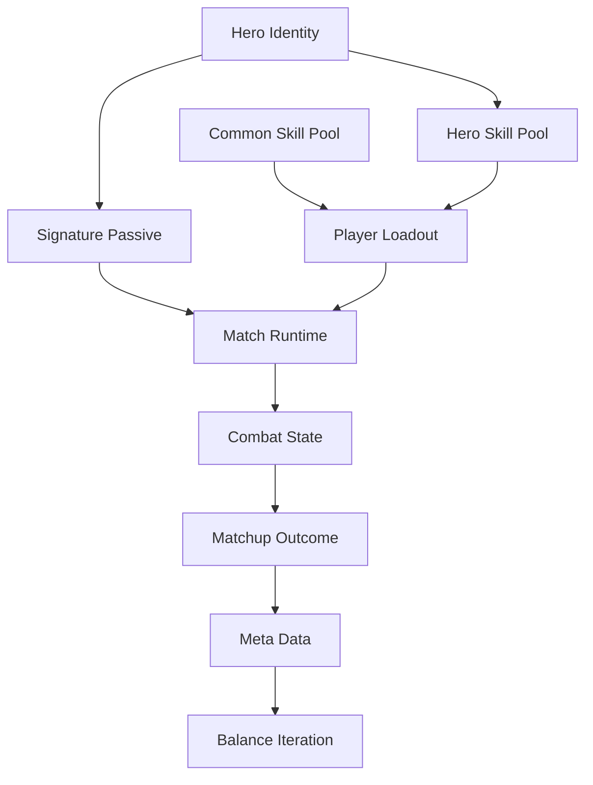
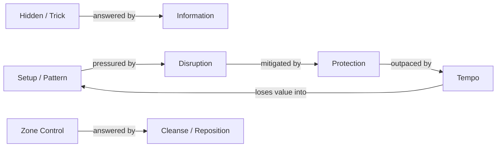
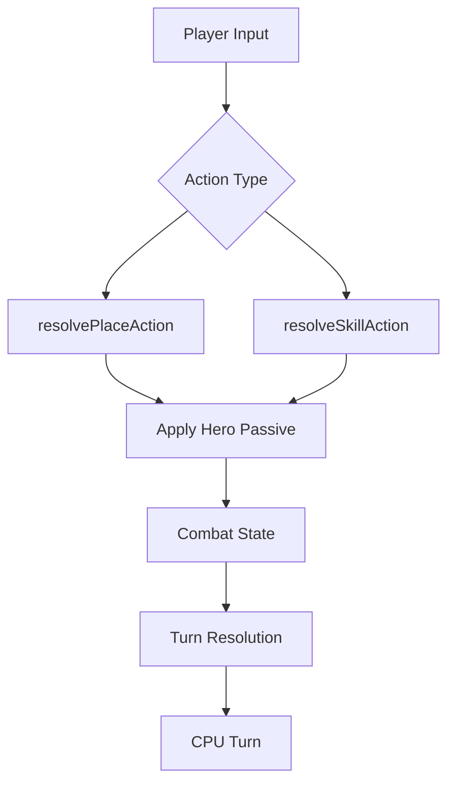
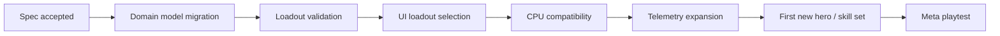

# Gomoku RPG — Hero & Skill System Specification

Status: Draft v1  
Scope: Hero identity, active-skill loadouts, effect vocabulary, counter model, and balance boundaries.  
Non-goal: This document does not change runtime behavior by itself.

## 1. Product goal

The hero/skill system should create a readable but evolving meta without letting any single hero or skill invalidate normal Gomoku decision-making.

Core principle:

> Heroes define strategic identity, skills define strategic choices, and board decisions still decide the match.

The system should allow T0/T1 builds to emerge, but every high-performing build must expose meaningful counterplay. Balance is therefore evaluated as an interaction ecosystem rather than as isolated hero power.

## 2. Current baseline

The current implementation already provides the foundations required for this model:

- `HeroDefinition` separates static hero data from `HeroLoadout`.
- Heroes currently expose an innate passive, a skill pool, and a default loadout.
- Skills are data-driven through `SkillDefinition`, including mana cost, turn consumption, targeting rules, and execution.
- Match runtime resolves placement and skill actions through a common action-resolution pipeline and applies hero passives afterward.
- `CombatState` already supports temporary board effects such as Guard, Seal, Flame, forced placement, and Corruption.

The main structural limitation is that the current loadout model is effectively fixed around one common skill (`Blink`) plus one hero-specific skill. The v1 specification removes that restriction without requiring a rewrite of the match runtime.

## 3. System model



### Design responsibilities

| Layer | Responsibility |
| --- | --- |
| Hero | Defines identity and strategic bias |
| Signature Passive | Changes how the hero values board states or actions |
| Skill Pool | Defines which active tools the hero can build around |
| Loadout | Defines the player's current build |
| Skill | Provides a tactical action with explicit costs and counter windows |
| Combat State | Stores board and temporary effects |
| Meta / Telemetry | Measures actual matchup and build performance |

## 4. Hero contract

A hero is an identity container, not a fixed skill bundle.

Target domain model:

```ts
export type HeroDefinition = {
  id: HeroId;
  nameKey: HeroId;
  role: HeroRole;

  signaturePassive: PassiveId;
  skillPool: readonly SkillId[];
  defaultLoadout: HeroLoadout;

  playstyleTags: readonly PlaystyleTag[];
  synergyTags: readonly EffectTag[];
  counterTags: readonly EffectTag[];
};
```

### Rules

1. Every hero has exactly one signature passive in v1.
2. The signature passive belongs to hero identity and is not an equippable loadout slot.
3. The passive should alter playstyle, board valuation, timing, or resource incentives; pure unconditional stat gains should be avoided.
4. A hero exposes a curated skill pool rather than owning exactly one active skill.
5. A default loadout exists only as onboarding/recommendation data.
6. Hero tags are design and analytics metadata; they must not become hidden combat modifiers.

### Signature-passive quality bar

A signature passive is healthy when it answers at least one of these questions differently from other heroes:

- Where do I prefer to place my next stone?
- When do I prefer to spend mana?
- Which board patterns am I incentivized to create?
- Which temporary effects am I willing to contest or ignore?
- Which timing window is my strongest?

Current examples already move in this direction:

- Vanguard `Fortified`: rewards mana-producing placement with protection.
- Arcanist `Flow`: rewards active-skill usage through mana refund.
- Shade `Pressure`: rewards aggressive placement adjacent to enemy stones.

## 5. Loadout contract

V1 loadout rule:

> One hero + its fixed signature passive + two equipped active skills.

Target model:

```ts
export type HeroLoadout = {
  heroId: HeroId;
  skillIds: readonly [SkillId, SkillId];
};
```

### Rules

1. Passive is resolved from `HeroDefinition`, not copied into loadout state.
2. Both equipped skills must be legal members of the selected hero's accessible skill pool.
3. V1 uses exactly two active-skill slots to keep mobile cognitive load bounded.
4. `Blink` becomes a normal common-pool option rather than a mandatory global slot.
5. Loadout legality must be validated independently from match execution.
6. Future relic/subclass systems may modify passives, but that is explicitly outside v1.

### Why two active skills

The match HUD already needs to communicate board state, mana, passive feedback, targeting state, temporary effects, and opponent information. Two active skills create meaningful build diversity without turning the mobile interface into a hotbar-management problem.

## 6. Skill contract

Skills remain data-driven tactical actions. Existing runtime fields should be preserved.

Target model:

```ts
export type SkillDefinition = {
  id: SkillId;

  // Runtime contract
  cost: number;
  consumesTurn: boolean;
  targetType: SkillTargetType;
  descriptionKey: SkillDescriptionKey;
  legalSources?: (context: SkillContext) => Pos[];
  legalTargets: (context: SkillContext, source?: Pos) => Pos[];
  execute: (context: SkillContext, target: Pos, source?: Pos) => CombatState;

  // Design / analytics metadata
  availability: SkillAvailability;
  category: SkillCategory;
  effectTags: readonly EffectTag[];
  synergyTags: readonly EffectTag[];
  counterTags: readonly EffectTag[];
  riskProfile: RiskProfile;
};
```

Suggested availability model:

```ts
export type SkillAvailability =
  | { kind: 'common' }
  | { kind: 'hero-pool'; heroIds: readonly HeroId[] };
```

A separate `signature` active-skill ownership tier is not required in v1. Hero identity should primarily live in the passive; active skills should remain buildable tools.

## 7. Effect vocabulary

New skills should prefer composing known effects over introducing bespoke state fields.

Initial vocabulary:

| Family | Effects | Current examples |
| --- | --- | --- |
| Placement | Place, Move, Reposition | Blink, Charge |
| Protection | Guard | Guard, Bulwark |
| Control | Seal, Force | Seal, forced-placement runtime support |
| Disruption | Push, Remove, Convert | Charge, Corrupt |
| Zone | Temporary blocked area, hazardous cell | Flame, Corruption |
| Resource | Gain, Refund, Drain | Pattern mana, Flow, Pressure |
| Information | Reveal, Mark, Threat hint | Future |
| Pattern | Combo, Formation, sequence state | Future |

### Vocabulary rule

A new `CombatState` field should be added only when the mechanic cannot be represented by an existing effect family without creating misleading semantics.

Each new effect must define:

- lifetime;
- ownership;
- valid targets;
- stacking/overwrite rule;
- interaction with existing effects;
- removal/counter path;
- UI telegraph requirement.

## 8. Counter model

Counters are defined primarily between effects, not between named heroes.

This prevents the roster from becoming a hard-coded rock-paper-scissors table as the game scales.



### Matchup target

A designed counter should normally create an advantage, not a deterministic win.

Preferred design target for comparable player skill:

- soft counter: approximately 52/48–55/45;
- strong counter: approximately 55/45–60/40;
- sustained 65/35+ matchup should be treated as a likely design problem unless intentionally created by a temporary mode or extreme draft condition.

These percentages are balance targets, not runtime guarantees. They must eventually be validated from match telemetry.

## 9. Power-budget contract

Mana cost alone is not sufficient to balance a skill. In Gomoku, a turn is often more valuable than mana because one move can create or answer an immediate win threat.

Every active skill must be reviewed on these axes:

| Axis | Question |
| --- | --- |
| Mana | How much stored resource is spent? |
| Tempo | Does the skill consume the whole turn? |
| Setup | What board condition must already exist? |
| Range | How constrained are source and target positions? |
| Risk | Can using the skill weaken the user's own board? |
| Counter window | Can the opponent anticipate or answer the effect? |
| Persistence | How long does the effect remain? |
| Action economy | Does the skill effectively create additional placements/actions? |

### Hard boundary: action economy

Extra placements and extra turns are high-risk mechanics because they can bypass the alternating-turn foundation of Gomoku.

V1 rules:

1. No unconditional extra turn.
2. No unconditional additional stone placement after a normal placement.
3. Any future multi-action mechanic requires explicit setup, telegraphing, and a dedicated balance review.
4. Moving an existing stone is preferable to creating an extra stone when similar tactical value can be achieved.

### Hard boundary: unconditional removal

"Remove any enemy stone" is not considered healthy merely because it has a high mana cost.

Enemy-stone removal must include meaningful constraints such as adjacency, setup, vulnerable-state requirements, protection counterplay, limited target class, or temporary aftermath.

## 10. Skill design checklist

A skill is not ready for implementation until all of the following are specified:

- Tactical purpose.
- Mana cost.
- Turn cost.
- Legal source/target rule.
- Effect vocabulary tags.
- Setup requirement.
- Counter window.
- Expected synergy.
- Expected anti-synergy or opportunity cost.
- Board readability / telegraph.
- CPU-evaluation feasibility.
- Telemetry events required to measure usage and performance.

## 11. Initial hero migration

Existing heroes can migrate without deleting their current identities.

### Vanguard

Role: Defense / Tempo

- Signature passive: `Fortified`
- Candidate pool: `Charge`, `Guard`, `Bulwark`, `Blink`
- Strategic identity: converts productive placement into resilient local board presence.

Potential builds:

- Aggressive: Charge + Blink
- Defensive: Guard + Bulwark
- Tempo: Charge + Guard

### Arcanist

Role: Control / Zone

- Signature passive: `Flow`
- Candidate pool: `Phase`/Flame, `Seal`, `Blink`, future zone-control skill
- Strategic identity: gets greater efficiency from carefully timed active-skill sequencing.

### Shade

Role: Disruption / Pressure

- Signature passive: `Pressure`
- Candidate pool: `Corrupt`, `Blink`, future trick skill, future anti-setup skill
- Strategic identity: gains resources by contesting enemy space and converts that pressure into disruption.

These candidate pools are specification targets only. Existing runtime loadouts remain unchanged until the implementation slice explicitly migrates them.

## 12. Meta and telemetry requirements

Hero win rate alone is insufficient for balance decisions.

Balance analysis should eventually support these dimensions:

- hero pick rate;
- hero win rate;
- loadout pick rate;
- loadout win rate;
- skill pick/use/opportunity rate;
- average mana spent per skill;
- matchup win rate by hero + loadout;
- first-player / second-player split where applicable;
- game length;
- surrender/early-end rate if introduced later.

Recommended analysis unit:

```text
Hero + Loadout + Opponent Hero + Opponent Loadout + Result
```

A T0 build is acceptable when the environment contains viable responses and the advantage comes from efficiency or metagame fit rather than from bypassing core decision rules.

## 13. Runtime architecture boundary

V1 should preserve the current match pipeline:



The first implementation slice should focus on domain-model migration rather than rewriting action resolution.

Expected implementation areas:

- `heroes.ts`: remove duplicated compatibility concepts once consumers migrate; make passive identity authoritative; expose curated skill pools.
- `skills.ts`: add design metadata and replace fixed ownership assumptions with availability metadata.
- loadout validation: introduce explicit legality rules for two equipped skills.
- presentation/UI: render two configurable skills instead of assuming mandatory Blink + hero skill.
- CPU: evaluate the equipped loadout rather than relying on one predetermined hero skill.
- telemetry: record loadout identity for matchup analysis.

## 14. Migration strategy



### Slice 1 — Domain contract

- Introduce target metadata/types.
- Keep current gameplay behavior unchanged.
- Keep compatibility aliases only where necessary for staged migration.

### Slice 2 — Configurable two-skill loadout

- Remove mandatory Blink assumption.
- Validate selected skills against the hero pool.
- Update skill bar and hero-management UI.

### Slice 3 — CPU and telemetry

- CPU consumes actual equipped loadout.
- Match records include loadout identity.
- Add balance-facing metrics.

### Slice 4 — Content expansion

- Add new skills using the effect vocabulary.
- Add new heroes only after counter and power-budget review.

## 15. Acceptance criteria

The hero/skill architecture is ready for content expansion when:

1. A hero's identity is represented by one authoritative signature passive.
2. A player can equip two legal active skills from the hero's accessible pool.
3. Blink is optional rather than globally mandatory.
4. New skills can declare effect, synergy, and counter metadata without changing runtime semantics.
5. Every implemented skill has explicit mana, tempo, setup, and counter boundaries.
6. CPU and player use the same loadout legality model.
7. Match records can identify the loadout used for later meta analysis.
8. Existing Vanguard, Arcanist, and Shade gameplay can be migrated without requiring a match-runtime rewrite.

## 16. Out of scope for v1

- Equipment/relics that replace hero passives.
- More than two active-skill slots.
- Mid-match deckbuilding or roguelike skill drafting.
- Hero variants/subclasses that alter the base passive.
- PvP drafting/bans.
- Automated balance tuning.
- Hidden-information skills until board-state visibility rules are separately specified.

## 17. Governing design principles

1. Preserve Gomoku as the primary decision surface.
2. Strong mechanics require visible costs or counter windows.
3. Counter effects, not named heroes.
4. Prefer reusable effect vocabulary over one-off state mechanics.
5. Hero identity should remain readable even across multiple viable builds.
6. A meta can be uneven; it must not be answerless.
7. Balance changes should ultimately be driven by matchup/build evidence rather than hero win rate alone.
