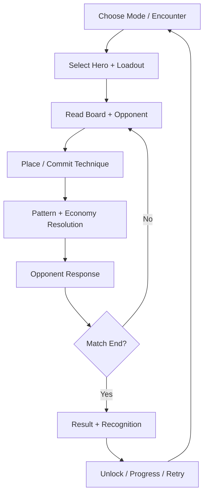
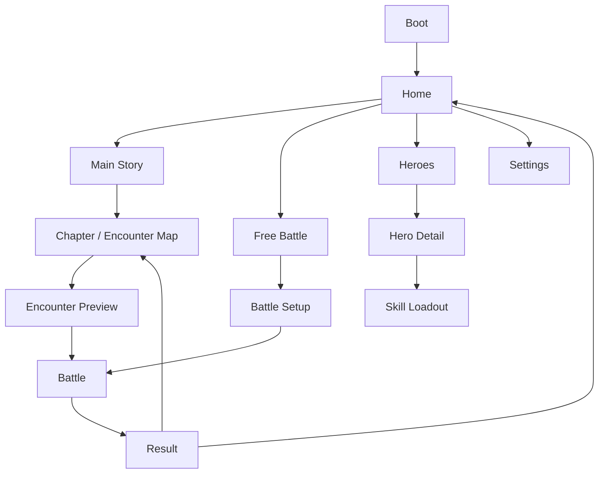
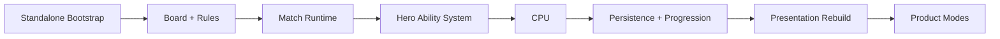
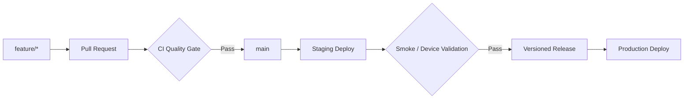

# Gomoku RPG — Product Foundation

Status: P0 Product Definition  
Purpose: Define the product identity, v1 boundaries, target architecture, naming direction, and release principles before extracting the game into a standalone repository.

---

## 1. Product transition

`gomoku-rpg` started as a mobile-first prototype testing whether Gomoku becomes meaningfully deeper when board patterns generate tactical resources that can be spent on board manipulation.

The implemented product has moved beyond that prototype. It now contains multiple hero identities, multiple ability economies, configurable ability kits, CPU decision systems, replay/history, telemetry, localization, progression foundations, and planned Story / Free Battle / Roguelike modes.

P0 therefore reclassifies the project from:

> Experimental Gomoku + RPG prototype

into:

> A standalone tactical strategy game where Gomoku is the combat grammar and heroes alter how players create, defend, and manipulate board patterns.

The standalone project must preserve validated gameplay while replacing prototype-level product structure and presentation.

---

# 2. Product vision

## Vision statement

Create a mobile-first tactical strategy game where every hero represents a different way of reading and manipulating a Gomoku board, while placement, pattern recognition, tempo, and threat construction remain the source of victory.

## Player fantasy

The player should feel like they are not merely playing a stronger version of Gomoku, but mastering a roster of tactical disciplines that reinterpret the same board.

Examples:

- Vanguard controls tempo through reliable reusable techniques.
- Arcanist accumulates and spends Mana for deliberate board manipulation.
- Shade gains power by contesting enemy space.
- Architect creates formations that open tactical ability windows.
- Swordmaster maintains offensive Momentum and converts pressure into finishers.

The fantasy comes from changing **how the board is valued**, not from replacing the board with an unrelated combat layer.

---

# 3. Core product pillars

## P1 — Board decisions remain authoritative

Abilities may alter positioning, tempo, legal opportunities, resources, and tactical sequences, but they must not make Gomoku pattern construction irrelevant.

A strong ability should create a new board decision, not skip the board decision.

## P2 — Heroes are gameplay engines

A hero is defined by:

- strategic identity;
- signature passive;
- ability economy;
- ability pool;
- recurring tactical loop.

Different heroes should change what the player pays attention to on the board.

## P3 — Horizontal mastery over vertical power

Progression should primarily unlock:

- heroes;
- abilities;
- build options;
- modes;
- challenges;
- cosmetics where appropriate.

Permanent raw ATK / DEF style stat growth is outside the core product direction.

## P4 — Learn through play

Story encounters should teach board concepts, hero mechanics, threat construction, resource timing, and counterplay through encounter structure rather than long tutorial text.

## P5 — Readability before spectacle

Board state, threats, ability readiness, resources, turn ownership, and targeting must remain immediately readable on a portrait mobile screen.

Effects should reinforce decisions rather than obscure them.

## P6 — Short-session depth

The game should support meaningful tactical sessions suitable for mobile play without requiring long RPG maintenance loops between matches.

---

# 4. Product positioning

## Genre

Primary:

- Tactical strategy
- Board strategy

Secondary:

- Hero-based strategy
- Light RPG progression

The product should not primarily present itself as a traditional stat-driven RPG.

## Platform priority

1. Mobile Web / PWA-capable browser experience
2. Desktop Web
3. Native packaging may be evaluated later

Portrait mobile remains the primary UX constraint.

## Core differentiator

The differentiator is not simply "Gomoku with skills".

The differentiator is:

> A shared deterministic board language supports multiple hero-specific tactical engines, creating matchup, build, and mastery depth without abandoning the clarity of Gomoku.

---

# 5. Target audience

Primary audience:

- players who enjoy compact tactical games;
- board-game players who like pattern recognition;
- strategy players who enjoy hero / build identity;
- mobile players who prefer short matches with meaningful decisions.

Secondary audience:

- players interested in roguelike buildcraft once the core game is mastered;
- competitive players if PvP is introduced later.

The initial release does not require serving a hardcore Gomoku competitive audience.

---

# 6. Core gameplay loop



The moment-to-moment loop must remain dominated by:

1. threat recognition;
2. placement choice;
3. ability timing;
4. opponent prediction;
5. resource / condition management.

---

# 7. Product mode structure

Long-term product modes remain:

- Main Story
- Free Battle
- Roguelike

PvP is a possible future mode but is not part of the standalone foundation requirement.

## Main Story

Purpose:

- teach the game;
- introduce heroes;
- create structured difficulty progression;
- provide canonical unlock flow.

## Free Battle

Purpose:

- low-friction replay;
- hero / build experimentation;
- difficulty practice;
- reuse unlocked encounters and opponents.

## Roguelike

Purpose:

- advanced mastery;
- high-variance buildcraft;
- replayability after core systems are understood.

Roguelike should reuse the same combat rules and hero architecture rather than fork into a separate game engine.

---

# 8. v1 release scope

The standalone repository should be structured for the long-term roadmap, but the first production release must remain deliberately smaller.

## In scope for v1

### Modes

- Main Story: Easy + Normal chapters
- Free Battle

### Combat

- 9×9 board as primary board size
- current alternating-turn foundation
- hero-specific ability economies
- configurable hero loadouts where already validated
- deterministic rules and replay-compatible action history

### Heroes

Target: 4–5 production-ready heroes.

A hero is production-ready only when it has:

- clear gameplay identity;
- complete economy loop;
- readable counterplay;
- CPU compatibility;
- UI vocabulary;
- telemetry coverage;
- balance acceptance from playtest.

### Difficulty

Production-facing:

- Easy
- Normal

Hard may be used selectively as boss / preview content, but v1 does not need to expose the entire six-tier ladder as complete content.

### Progression

- local player profile;
- Story progress;
- hero unlock state;
- Soul economy if retained after validation;
- loadout persistence;
- settings persistence.

### Product shell

- Boot
- Home
- Story navigation
- Free Battle setup
- Hero / loadout management
- Battle
- Result
- Settings

### Operations

- staging environment;
- production environment;
- release version display;
- analytics / diagnostics boundary;
- save schema versioning;
- deploy smoke checks.

## Explicitly out of scope for v1

- online PvP;
- matchmaking;
- account backend;
- guild / social systems;
- live-service event framework;
- complete Roguelike release;
- full Easy → Chaos Story campaign;
- 15×15 as mandatory default gameplay;
- large vertical-stat progression;
- monetization implementation.

These exclusions are scope protection, not permanent product decisions.

---

# 9. Product information architecture



Roguelike should remain hidden until its product loop is sufficiently complete.

---

# 10. UX principles

## Mobile-first interaction

The primary target remains portrait mobile.

Important actions must:

- be thumb reachable;
- not depend on hover;
- not require precision smaller than normal mobile touch targets;
- clearly communicate disabled / ready / targeting states;
- preserve board visibility while selecting abilities.

## Battle screen priority

Information hierarchy:

1. board and tactical state;
2. active player / turn state;
3. hero economy readiness;
4. active techniques;
5. secondary telemetry / flavor.

The HUD must not compete visually with the board.

## Interaction contract

Every player action should visibly answer:

- What can I do?
- Why is this unavailable?
- What will this target?
- Will this consume my turn?
- What changed after resolution?

---

# 11. Design-system direction

The standalone project should establish a small semantic design system before rebuilding screens.

## Foundation tokens

- color;
- typography;
- spacing;
- radius;
- elevation;
- motion duration;
- interaction state.

## Semantic components

Examples:

- Surface
- Panel
- ActionButton
- AbilityButton
- ResourceIndicator
- HeroBadge
- StatusChip
- Dialog
- Toast / CombatFeedback

Economy-specific presentation should use shared semantic components.

For example, Mana, Pressure, Momentum, Cooldown, and Formation should configure a shared `ResourceIndicator` / readiness model where possible rather than each introducing an unrelated HUD component.

## Visual direction

Retain the existing direction:

- abstract hero identity;
- restrained premium presentation;
- strong board readability;
- compact pixel / geometric influence;
- minimal HUD noise.

P0 does not lock final art style assets. It locks the requirement for visual consistency and semantic UI behavior.

---

# 12. Product naming direction

`gomoku-rpg` remains the prototype codename only.

The final product name should communicate a tactical identity rather than describe implementation genre.

## Naming criteria

A candidate should ideally be:

- short;
- pronounceable;
- visually distinctive;
- usable without "Gomoku" or "RPG" in the primary name;
- compatible with future Story / Roguelike / PvP expansion;
- suggestive of lines, patterns, grids, tactics, champions, or rule manipulation.

## Current shortlist

### Linebreak

Strength:

- directly evokes breaking / changing lines;
- aligns with abilities that manipulate ordinary Gomoku structure;
- strong tactical identity.

Risk:

- generic software / typography meaning may make discoverability or trademark clearance harder.

### Fivefold

Strength:

- subtle connection to five-in-a-row;
- flexible fantasy identity;
- easy to extend with subtitle.

Risk:

- does not immediately communicate board strategy.

### Gridbound

Strength:

- evokes heroes bound to a tactical board;
- stronger fantasy / strategy tone.

Risk:

- less direct connection to five-in-a-row.

### Patternfall

Strength:

- emphasizes pattern manipulation;
- strong fantasy tone.

Risk:

- weaker immediate board-game association.

### Nexus Five

Strength:

- competitive / tactical tone;
- retains the meaningful "five" signal.

Risk:

- more conventional sci-fi naming.

## P0 naming decision

No final external brand is locked in P0.

Internal preferred candidate: **Linebreak**.

Before repository rename / public launch, naming requires a separate availability check covering at minimum:

- GitHub repository namespace;
- common search-engine ambiguity;
- app-store naming collision if native packaging is planned;
- domain availability where relevant;
- basic trademark risk screening.

Until that check is complete, `gomoku-rpg` remains the migration source identifier.

---

# 13. Standalone technical direction

## Technology

Retain unless migration evidence proves otherwise:

- PixiJS 8
- TypeScript
- Vite
- Vitest

P0 does not authorize an engine rewrite.

The existing renderer/bootstrap failure handling must be preserved as a production constraint during migration: renderer initialization must be observable, canvas mounting must be verified, and bootstrap must surface a visible failure rather than leave an empty page.

---

# 14. Target architecture

Use a domain-oriented modular architecture rather than a framework-heavy Clean Architecture implementation.

```text
src/
├─ app/
│  ├─ bootstrap/
│  ├─ routing/
│  └─ game-session/
│
├─ game/
│  ├─ board/
│  ├─ match/
│  ├─ action/
│  ├─ rules/
│  └─ combat/
│
├─ heroes/
│  ├─ domain/
│  ├─ abilities/
│  ├─ economies/
│  └─ content/
│
├─ ai/
│  ├─ decision/
│  ├─ evaluation/
│  ├─ difficulty/
│  └─ telemetry/
│
├─ progression/
│  ├─ profile/
│  ├─ heroes/
│  ├─ currencies/
│  └─ unlocks/
│
├─ modes/
│  ├─ story/
│  ├─ free-battle/
│  └─ roguelike/
│
├─ presentation/
│  ├─ screens/
│  ├─ components/
│  ├─ hud/
│  ├─ feedback/
│  └─ animation/
│
├─ design-system/
│  ├─ tokens/
│  ├─ components/
│  └─ motion/
│
├─ platform/
│  ├─ environment/
│  ├─ storage/
│  ├─ analytics/
│  ├─ diagnostics/
│  └─ audio/
│
└─ shared/
```

## Dependency principles

1. `game/` owns deterministic board / match rules and does not depend on Pixi presentation.
2. `presentation/` renders state and requests actions; it does not directly mutate domain state.
3. `heroes/` defines hero mechanics through stable gameplay boundaries rather than screen-specific branches.
4. `ai/` consumes the same authoritative rule APIs used by player actions.
5. `modes/` orchestrate content around the combat engine rather than duplicate combat rules.
6. `platform/` isolates browser storage, environment, analytics, diagnostics, and future service integrations.
7. `app/` composes modules and owns application lifecycle.

---

# 15. Migration strategy

Do not perform a Big Bang rewrite.

The standalone repository should begin as a minimal working product shell, then migrate validated gameplay domains in dependency order.



Each migration slice must preserve behavior through characterization / domain tests before structural cleanup changes behavior.

Architecture migration and gameplay rebalance should not be mixed in the same slice unless the behavior change is required to establish a valid domain boundary.

---

# 16. Repository strategy

The production game should live in its own repository.

The current `2D-game-playground/gomoku-rpg` directory remains:

- prototype history;
- migration source;
- playtest evidence;
- reference implementation.

The standalone project must not depend on the playground repository at runtime or build time.

No git subtree or shared source dependency is required for the initial extraction.

---

# 17. Branch and release model

Use trunk-based development with environment promotion.



`main` must remain releasable.

Do not introduce a permanent `develop` branch without a concrete need.

---

# 18. Environment model

## Development

Purpose:

- local iteration;
- debug tools;
- test content;
- development diagnostics.

## Staging

Purpose:

- device playtest;
- regression validation;
- content validation;
- release candidate testing;
- pre-production telemetry validation.

Staging may expose diagnostics that are disabled in production.

## Production

Purpose:

- stable public releases only;
- production configuration;
- stable persistence schema;
- production diagnostics / analytics;
- versioned release artifacts.

Application code should consume a typed environment boundary rather than scatter direct `import.meta.env` checks throughout gameplay modules.

---

# 19. CI quality gate

Minimum standalone PR gate:

1. deterministic dependency install;
2. TypeScript validation;
3. unit / domain tests;
4. production build;
5. artifact / bootstrap smoke validation.

Later quality gates may add:

- lint;
- architecture boundary checks;
- browser E2E;
- visual regression;
- performance / bundle budget;
- device matrix smoke tests.

Deployment changes must preserve the previously learned PixiJS bootstrap / blank-screen prevention rules.

---

# 20. Versioning and compatibility

Use semantic versioning.

During `0.x` development the product may intentionally introduce breaking changes to:

- save schema;
- encounter schema;
- content IDs;
- UI navigation;
- balance contracts.

Before `1.0.0`, establish explicit stability contracts for:

- save migration;
- content identifiers;
- progression state;
- release versioning;
- production environment behavior.

A migration path must exist for any persisted production data once the product reaches 1.0 stability expectations.

---

# 21. P0 non-goals

P0 does not:

- rewrite combat code;
- rebalance heroes;
- add new heroes;
- implement Story content;
- implement monetization;
- create a backend;
- implement production deployment;
- finalize art assets;
- finalize the external product name.

P0 defines the constraints under which those later decisions are made.

---

# 22. P0 decisions

The following are considered accepted product assumptions unless explicitly revised:

1. The game becomes an independent production repository.
2. Gomoku board strategy remains the authoritative combat language.
3. Hero economies and abilities alter board valuation rather than replace it.
4. Progression remains primarily horizontal.
5. Portrait mobile is the primary UX target.
6. PixiJS / TypeScript / Vite remain the baseline stack.
7. Architecture migration uses incremental domain extraction rather than rewrite.
8. Main Story + Free Battle form the initial production product shell.
9. Roguelike is architecturally supported but not required for v1.
10. Online PvP and backend account infrastructure are not v1 requirements.
11. `main -> staging -> versioned release -> production` is the target promotion model.
12. Design-system consistency is a prerequisite for the presentation rebuild.
13. `Linebreak` is the current preferred internal naming candidate, not yet the final public brand.

---

# 23. Exit criteria for P0

P0 is complete when this document is accepted and the following decisions are sufficiently stable to bootstrap the standalone project:

- product vision;
- product pillars;
- v1 scope and exclusions;
- mode hierarchy;
- architecture boundaries;
- migration strategy;
- technology baseline;
- environment / release model;
- naming direction.

The next phase is:

> **P1 — Standalone Bootstrap**

P1 should create the independent repository and prove the complete empty-product release path before migrating gameplay code.
