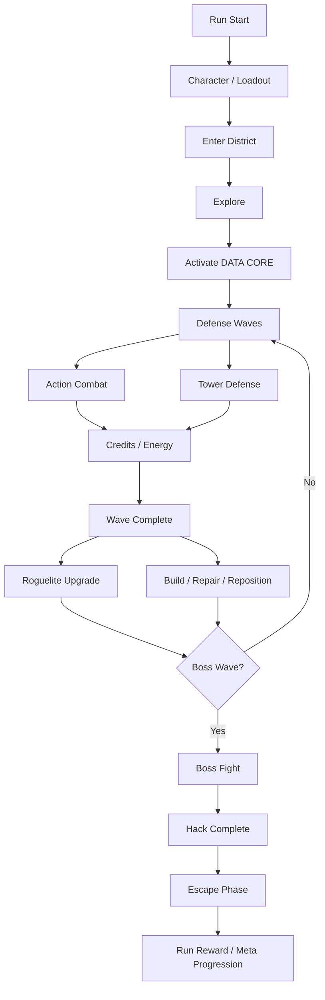
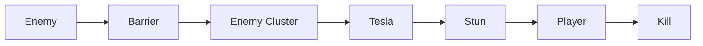
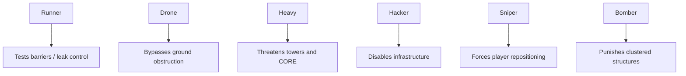
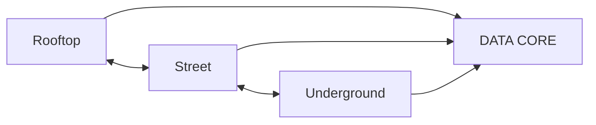
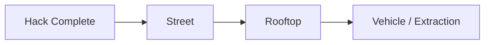
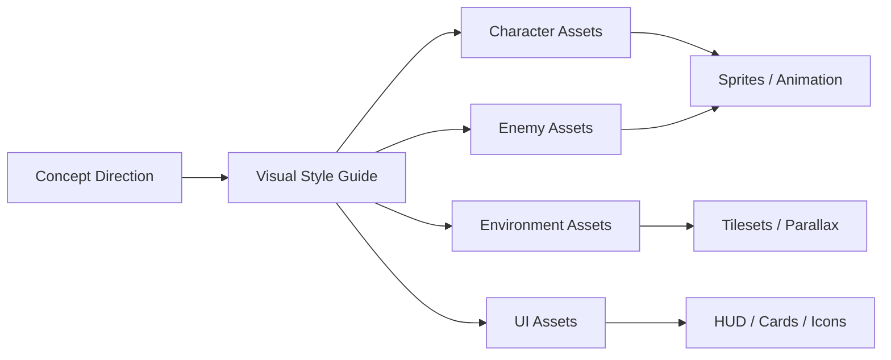
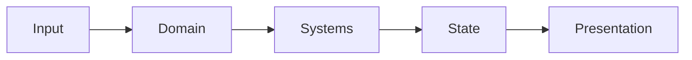
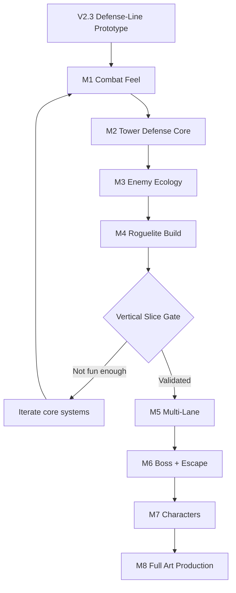

# NEON SIEGE Roadmap

> Product direction: side-scrolling cyberpunk action tower-defense RPG with roguelite progression.
>
> The player is part of the defense line: move through the battlefield, fight directly, build infrastructure, survive waves, grow a run-specific build, defeat a boss, and escape.

## Product North Star

The target experience combines five layers into one coherent run:

1. **Action Combat** — responsive movement, shooting, damage feedback, enemy pressure.
2. **Tower Defense** — positional defense infrastructure with distinct roles and synergies.
3. **Roguelite Build** — run-specific upgrades shared across player, weapons, towers, and systems.
4. **Multi-Lane Exploration** — rooftop, street, and underground routes that create battlefield-management decisions.
5. **Run Structure** — defend, escalate, fight a boss, escape, then convert rewards into meta progression.



---

## Development Principles

- **Validate gameplay before expensive art production.** Procedural/vector art is acceptable until the vertical slice proves the combat/defense/build loop.
- **Player and towers form one combat build.** Upgrades should deliberately cross player, weapon, tower, drone, and system boundaries.
- **Defense placement must create decisions.** A tower should not simply be additional passive DPS.
- **Enemies define the defense problem.** New towers are valuable only when enemy archetypes create reasons to use them.
- **Presentation serves readability first.** High-value actors and threats must remain readable against the cyberpunk environment.
- **Mobile and desktop share gameplay rules.** Input adapters may differ, but gameplay behavior must not fork.
- **PixiJS stays in the presentation layer.** Domain/gameplay rules should remain testable without rendering dependencies.

---

# Milestones

## M0 — Prototype Foundation

**Status: substantially complete**

### Goal

Validate that direct character control and tower defense can coexist in the same horizontal battlefield.

### Existing capabilities

- Horizontal movement
- Jump
- Bidirectional shooting
- Enemy waves
- DATA CORE defense objective
- Credits
- Auto Turret
- Tesla Node
- Build nodes
- Mobile touch controls
- Player HP / contact damage / knockback
- Defensive-line targeting rules
- Basic responsive HUD and cyberpunk presentation pass

### Exit criteria

The player can recognize and feel a defensive line:

`Enemy spawn -> defenses -> player fallback/interception -> DATA CORE`

---

## M1 — Combat Feel

### Goal

Make direct combat satisfying before adding substantial content depth.

### Scope

#### Weapons

Initial set:

- Pistol
- SMG
- Shotgun
- Railgun

#### Combat feedback

- Weapon recoil
- Muzzle flash
- Projectile trails
- Hit flash
- Hit stop
- Screen shake
- Damage numbers
- Enemy knockback
- Enemy death feedback
- Player hurt feedback
- Enemy attack anticipation/animation

### Validation

Combat should feel enjoyable even if the player temporarily ignores tower building.

### Exit criteria

- Each weapon has a clearly different rhythm and tactical use.
- Hits and damage are readable without relying on HP numbers.
- Player damage and enemy contact feel dangerous but controllable.

---

## M2 — Tower Defense Core

### Goal

Turn infrastructure into a strategic system rather than passive DPS.

### Initial tower roster

| Tower | Role |
|---|---|
| Auto Turret | Reliable single-target DPS |
| Tesla Node | Short-range crowd control / chain damage |
| Barrier | Blocks and groups ground enemies |
| Drone Dock | Mobile sustained pressure |
| Hack Node | Disables or temporarily converts machine enemies |
| Mine Layer | Area denial / burst damage |

### Required systems

- Build cost and economy tuning
- Tower health where appropriate
- Repair interaction
- Placement constraints
- Targeting priorities
- Cooldowns / attack cadence
- Tower damage feedback
- Tower disable / destruction states
- Combination interactions

### Intended synergy example



### Exit criteria

Players choose towers based on battlefield needs, not only highest DPS per credit.

---

## M3 — Enemy Ecology

### Goal

Create enemy archetypes that force different defensive answers and player movement.

### Enemy roster target

- Grunt
- Runner
- Heavy
- Drone
- Shield
- Hacker
- Sniper
- Bomber
- Elite variants

### Pressure model



### Required systems

- Enemy role data model
- Spawn composition by wave
- Telegraphing
- Target selection
- Attack behavior
- Resistance / vulnerability hooks
- Elite modifiers

### Exit criteria

A player can infer wave composition and change build/positioning decisions in response.

---

## M4 — Roguelite RPG Build

### Goal

Create the first strong replayability loop and reach the **Vertical Slice Gate**.

### Upgrade cadence

At wave checkpoints, present a small choice set such as `Choose 1 of 3`.

### Upgrade domains

#### Player

Examples:

- Dash cooldown reduction
- Kill restores shield
- Airborne damage bonus
- Contact-damage resistance

#### Weapon

Examples:

- Chain Bullet
- Piercing
- Explosive Round
- Smart Ammo

#### Tower

Examples:

- Overclock
- Chain Tesla
- Auto Repair
- Dual Barrel

#### System

Examples:

- Build cost reduction
- Extra build node
- Kill generates energy
- CORE shield

### Key rule

Upgrades should intentionally cross subsystem boundaries where useful.

Example:

`Shock Damage +20%` can affect player shock weapons, Tesla towers, and compatible drones.

### Vertical Slice target

One complete map with approximately:

- 1 character
- 4 weapon archetypes
- 6 tower types
- 6–8 enemy archetypes
- 10 meaningful waves
- 30–40 upgrades
- 1 boss or major encounter placeholder

### Vertical Slice Gate

Do **not** move into expensive full-art production until the following question has a positive answer:

> Does the player want to start another run specifically to try a different build or defensive strategy?

---

## M5 — Multi-Lane Side-Scrolling Battlefield

### Goal

Evolve the prototype from a single horizontal line into battlefield management.

### Target lanes

- Rooftop
- Street
- Underground



### Traversal tools

- Ladder
- Elevator
- Jump pad
- Drop-through platform
- Zipline

### Gameplay implications

- Enemy types may prefer different lanes.
- Some towers may only cover specific lanes or vertical ranges.
- Player movement becomes a strategic resource.
- Build nodes can create different defensive layouts between runs/maps.

### Exit criteria

The player must make meaningful decisions about **where to be**, not only what to shoot or build.

---

## M6 — Boss + Escape

### Goal

Give each run a strong escalation and ending rhythm.

## Boss Wave

Boss encounters should invalidate comfortable static defense patterns.

Example capabilities:

- Destroy towers
- Hack/disable towers
- Spawn drones
- Cross barriers
- Attack the player directly
- Pressure the DATA CORE from multiple angles

### Escape Phase

After the data operation completes, transition from defense into a timed escape.

Example flow:



Potential presentation:

`CORPORATE STRIKE IN 60 SEC`

### Exit criteria

A run ends with a distinct high-intensity sequence rather than simply displaying `Wave Complete`.

---

## M7 — Character System

### Goal

Introduce characters that meaningfully reshape the build space.

### Candidate archetypes

#### Hayate — Street Samurai

- High mobility
- Dash melee
- Execution mechanics

#### Zero — Hacker

- Enemy hacking
- Chain virus effects
- Infrastructure control

#### Forge — Engineer

- Lower tower costs
- Repair bonuses
- Drone specialization

### Design rule

Characters must not be minor stat variants. Each character should alter viable strategies, upgrade priorities, or tower interactions.

### Exit criteria

Changing character materially changes how the player approaches the same map and wave set.

---

## M8 — Full Art Production

### Goal

Move from procedural prototype presentation toward the target cyberpunk visual identity after gameplay validation.

### Asset pipeline



### Asset categories

- Character sprites
- Enemy sprites
- Tower sprites
- Boss sprites
- Environment tilesets
- Rooftop/street/underground modules
- Neon signs and props
- Parallax city backgrounds
- Combat VFX
- HUD frames
- Tower icons
- Upgrade cards
- Skill icons
- Character portraits

### Visual hierarchy target

Avoid filling the screen with equally bright neon.

Recommended composition baseline:

- Dark / neutral: ~60–70%
- Teal / cyan: ~15–20%
- Magenta: ~10%
- Amber: ~5%
- White: highlights only

Dynamic gameplay actors, projectiles, critical alerts, and interaction targets should carry the strongest local contrast.

---

# Architecture Roadmap

The current prototype has accumulated too much responsibility in `main.ts`. Before M1 becomes large, move toward a gameplay/presentation separation.

## Target structure

```text
neon-siege/src/

app/
  Game.ts
  GameLoop.ts

domain/
  combat/
  tower/
  enemy/
  wave/
  progression/

entities/
  Player.ts
  Enemy.ts
  Tower.ts
  Core.ts
  Projectile.ts

systems/
  CombatSystem.ts
  EnemySystem.ts
  TowerSystem.ts
  WaveSystem.ts
  BuildSystem.ts

presentation/
  PlayerView.ts
  EnemyView.ts
  TowerView.ts
  EnvironmentView.ts
  HudView.ts
  VfxSystem.ts

input/
  KeyboardInput.ts
  TouchInput.ts

content/
  enemies.ts
  towers.ts
  upgrades.ts
  weapons.ts
```

## Dependency direction



### Rules

- Domain entities must not depend on PixiJS.
- Rendering objects must not own authoritative gameplay state.
- Keyboard and touch input map into the same command/state model.
- Content definitions should be data-driven where practical.
- Balance values should gradually move out of rendering/game-loop code.
- Systems should be independently testable.

---

# Execution Order



---

# Near-Term Backlog

The next implementation sequence after V2.3 should be:

1. Refactor prototype architecture enough to prevent `main.ts` from becoming the permanent game architecture.
2. Implement M1 combat-feel baseline around the current weapon.
3. Extract weapon data/behavior so multiple weapon archetypes can be added safely.
4. Stabilize enemy contact/attack behavior and combat feedback.
5. Expand tower roles only after direct combat is readable and satisfying.
6. Begin enemy ecology together with tower expansion so each new tower has a concrete problem to solve.
7. Reach the M4 vertical slice before committing to full production art.

---

# Definition of Success

The roadmap is successful when the game evolves from a technical prototype into a repeatable run loop where:

- movement and shooting are satisfying;
- defense placement creates meaningful tradeoffs;
- enemy composition changes strategy;
- player and tower upgrades interact to form recognizable builds;
- map traversal creates battlefield-management pressure;
- bosses disrupt static solutions;
- escape creates a memorable run ending;
- the final visual production pass can replace prototype presentation without rewriting gameplay architecture.
