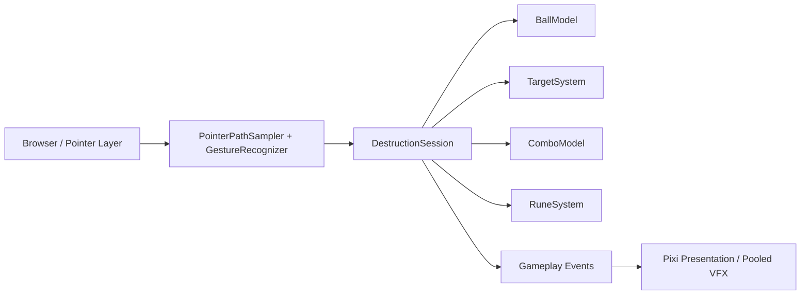

# Rune Ball

Mobile-first neon occult arcade prototype built with PixiJS, Vite, and strict TypeScript.

## Current milestone

**P3 — Rune Gesture Gate**

The validated ball / destruction / rebound loop now supports drawn Rune intent on the same pointer surface without adding skill buttons. P3 focuses on whether fast directional swipes and deliberate shapes remain reliably distinguishable on a phone.

Current slice includes:

- four-way swipe redirect at stable cruise velocity
- Crystal and Armored Crystal targets with score + forgiving Combo
- active rebound utility and chase-aware respawn
- deterministic pointer-path sampling, normalization, simplification, and intent separation
- Circle → Vortex target pull
- V → Split collision echoes
- Z → Chain next-impact propagation
- shared Rune charge generated by meaningful impacts
- drawn gesture trail, canonical glyph confirmation, and non-blocking failure feedback
- minimal persistent Rune readiness HUD using the existing arena visual language

Flow, Overdrive, final VFX/audio characterization, progression, and session results remain out of scope until later gates.

## Commands

```bash
npm ci
npm test
npm run build
npm run dev
```

## Runtime architecture



Renderer initialization is explicitly timed and falls back across WebGL 1, WebGL, and WebGPU. Failure renders a visible error state into `#app` instead of leaving a blank page.

## Deployment

Production base path:

`/2D-game-playground/rune-ball/`

`npm run build` runs TypeScript validation, Vite production build, and a dist check that rejects root-relative `/assets/` references.
