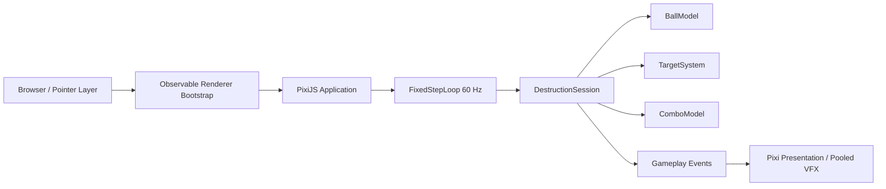

# Rune Ball

Mobile-first neon occult arcade prototype built with PixiJS, Vite, and strict TypeScript.

## Current milestone

**P2.2 — Velocity Identity & Rebound Readability**

The P1 ball feel and P2 destruction/combo loop are now tuned around a clearer velocity language: normal swipes control direction at a stable cruise speed, while wall rebounds create the first temporary high-speed state with a distinct in-world visual signature.

Current slice includes:

- four-way swipe redirect with deterministic fixed-step motion
- stable cruise-speed steering without cumulative swipe-spam acceleration
- Crystal and Armored Crystal targets
- score + forgiving Combo
- pooled hit / break feedback
- temporary higher-speed rebound tier
- mild forward-cone rebound assist that never replaces swipe control
- rebound compression / launch beat, brighter extended trail, and directional wall response
- chase-aware target respawn bias
- lightweight target materialize animation on respawn

Rune recognition, Flow, Overdrive, final VFX/audio, and session results remain out of scope until later gates.

## Commands

```bash
npm ci
npm test
npm run build
npm run dev
```

## Runtime architecture



Renderer initialization is explicitly timed and falls back across WebGL 1, WebGL, and WebGPU. Failure renders a visible error state into `#app` instead of leaving a blank page.

## Deployment

Production base path:

`/2D-game-playground/rune-ball/`

`npm run build` runs TypeScript validation, Vite production build, and a dist check that rejects root-relative `/assets/` references.
