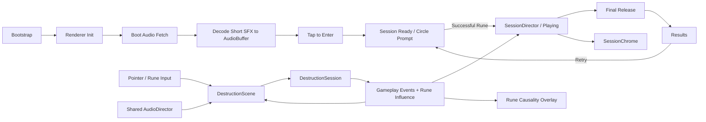

# Rune Ball

Mobile-first neon occult arcade prototype built with PixiJS, Vite, and strict TypeScript.

## Current milestone

**P6.1.1 — Rune Onboarding + Causality Pass**

P0–P5 established the mobile control, target destruction, Rune, Flow / Overdrive, VFX, and production-safe audio foundation. P6.1 added the 75-second session, Final Release, Results, Retry, and background-aware run timer.

Real-device P6.1 testing validated the session structure but exposed two remaining authorship issues: the run-start affordance did not naturally teach Rune casting, and large chain bursts still felt like natural system accumulation rather than clearly player-authored consequences.

Session lifecycle remains:

`Boot → Audio Preload / Decode → Tap to Enter → Ready → Playing → Final Release → Results → Retry`

P6.1.1 changes only the Ready / causality presentation:

- Ready state shows a centered animated Circle Rune gesture prompt with no tutorial paragraph or modal
- Swipe input remains available while Ready but does not start the timer
- the first successful Rune activation starts the 75-second run
- Rune-influenced Break events carry explicit `runeInfluence` attribution from the gameplay domain
- a lightweight bounded world-space overlay repeats the corresponding Circle / V / Z signature on Rune-authored Breaks
- Chain propagation receives a stronger matching causal accent
- Results, Retry, Flow, Combo, target density, Rune mechanics, Overdrive rules, audio, and balance remain unchanged
- page visibility lifecycle continues to pause BGM, SFX context, and run time while backgrounded

Audio asset provenance and CC0 licensing are recorded in `public/audio/ASSET-LICENSES.md`.

The P6.1.1 gate is whether the player can infer Rune casting from the first interaction and later attribute spectacle to their own Rune actions without explanatory UI. See `docs/plans/rune-ball/P6-1-1-ONBOARDING-CAUSALITY.md`.

P6.2 still owns sound / reduced-motion controls, preference persistence, final deployment hardening, and production smoke validation.

## Commands

```bash
npm ci
npm test
npm run build
npm run dev
```

## Runtime architecture



`SessionDirector` remains renderer-independent. `SessionChrome` owns timer / Results / first-action presentation, while `RuneCausalityOverlay` consumes explicit gameplay attribution events. Collision, Rune, Flow, Overdrive, and target rules remain inside the existing domain systems.

Renderer initialization is explicitly timed and falls back across WebGL 1, WebGL, and WebGPU. Required boot-audio failure is visible instead of silently entering an inaudible session.

## Deployment

Production base path:

`/2D-game-playground/rune-ball/`

`npm run build` runs TypeScript validation, Vite production build, and dist checks for both the Pages asset base and the required shipped audio files.
