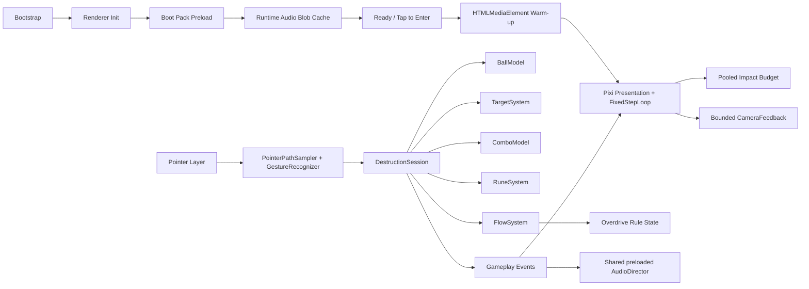

# Rune Ball

Mobile-first neon occult arcade prototype built with PixiJS, Vite, and strict TypeScript.

## Current milestone

**P5.3 — Preload + Audio Warm-up Gate**

The validated Swipe / Rebound / destruction / Rune / Flow / Overdrive loop already has a product-facing visual hierarchy. P5.3 corrects two real-device issues found after asset-backed audio shipped: BGM did not begin until a later Rune interaction, and the first Rune could stall gameplay while media work happened on demand.

The runtime now uses an explicit startup lifecycle:

`Boot → Preload → Ready → Tap to Enter → Audio Warm-up → Gameplay`

Current slice includes:

- four-way swipe redirect at stable cruise velocity
- Crystal and Armored Crystal targets with score + forgiving Combo
- active rebound utility and chase-aware respawn
- Circle → Vortex, V → Split, and Z → Chain Rune gestures
- shared Rune charge generated by meaningful impacts
- Flow accumulation and one 12-second Overdrive climax
- tapered sampled ball trail and rotating core / sigil treatment
- distinct pooled Contact / Break / Overdrive particle tiers with hard caps
- directional Chain propagation and canonical Rune confirmation treatment
- bounded camera punch hierarchy with one readable directional punch + small recoil; no continuous shake
- screen-scale Overdrive response reserved for entry / release rather than continuously flashing
- **CC0 asset BGM:** `Claimed by the Void`, with OGG primary and MP3 compatibility fallback
- asset SFX mapping for Contact, armored impact, Break, Rebound, Vortex, Split, Chain, Overdrive entry / exit, and a result-sting hook
- browser codec selection: Ogg/Vorbis when supported, MP3 fallback otherwise
- startup progress UI using the existing cyan / violet / deep-navy visual language
- selected runtime audio is fetched into local Blob URLs before the game is allowed to start
- media elements are prepared before the Ready state
- the explicit Enter tap starts BGM and primes reusable SFX voices under mobile autoplay rules
- the FixedStepLoop is attached only after audio warm-up resolves, moving first-play decoder cost outside gameplay
- Flow / Overdrive drive BGM intensity without changing track pitch
- `prefers-reduced-motion` support for camera displacement, large flashes, and secondary effect density
- HUD cleanup: success states are primarily communicated by world feedback; text remains contextual for failed Rune input / insufficient charge

Audio asset provenance and CC0 licensing are recorded in `public/audio/ASSET-LICENSES.md`.

P5.3 does not change gameplay balance. The preload gate intentionally loads only the boot-critical runtime format rather than both OGG and MP3 copies. P6 still owns the 60–90 second run director, results / retry loop, sound and reduced-motion toggles, telemetry, and final production deployment validation.

## Commands

```bash
npm ci
npm test
npm run build
npm run dev
```

## Runtime architecture



Renderer initialization is explicitly timed and falls back across WebGL 1, WebGL, and WebGPU. Required boot-audio failure is visible instead of silently entering an inaudible session.

## Deployment

Production base path:

`/2D-game-playground/rune-ball/`

`npm run build` runs TypeScript validation, Vite production build, and dist checks for both the Pages asset base and the required shipped audio files.
