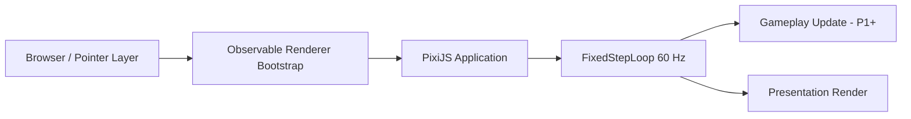

# Rune Ball

Mobile-first neon occult arcade prototype built with PixiJS, Vite, and strict TypeScript.

## Current milestone

**P0 — Repository-complete Scaffold**

This slice proves only the runtime shell: renderer startup, deterministic update boundary, portrait layout, tests, production asset paths, and repository Pages integration. Ball movement and gameplay input begin in P1.

## Commands

```bash
npm ci
npm test
npm run build
npm run dev
```

## Runtime architecture



Renderer initialization is explicitly timed and falls back across WebGL 1, WebGL, and WebGPU. Failure renders a visible error state into `#app` instead of leaving a blank page.

## Deployment

Production base path:

`/2D-game-playground/rune-ball/`

`npm run build` runs TypeScript validation, Vite production build, and a dist check that rejects root-relative `/assets/` references.
