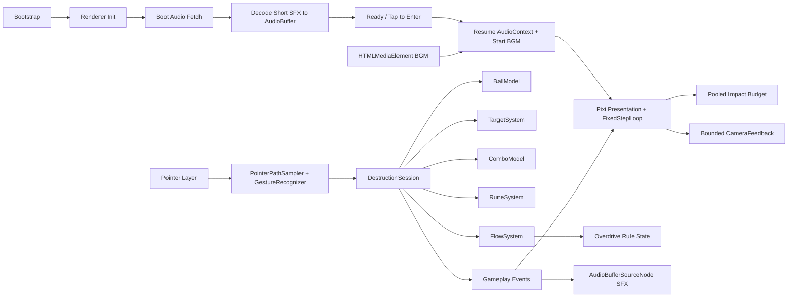

# Rune Ball

Mobile-first neon occult arcade prototype built with PixiJS, Vite, and strict TypeScript.

## Current milestone

**P5.4 — Buffered SFX Runtime Gate**

Real-device testing of P5.3 showed that downloading media before entry was not enough: the first `Tap to Enter` could remain stuck in a prepare state, and each `HTMLAudioElement` SFX playback could still cause visible gameplay stalls. P5.4 changes the runtime split rather than adding more media-element warm-up.

Startup lifecycle:

`Boot → Preload bytes → Decode SFX → Ready → Tap to Enter → Resume AudioContext + Start BGM → Gameplay`

Current slice includes:

- four-way swipe redirect at stable cruise velocity
- Crystal and Armored Crystal targets with score + forgiving Combo
- active rebound utility and chase-aware respawn
- Circle → Vortex, V → Split, and Z → Chain Rune gestures
- shared Rune charge generated by meaningful impacts
- Flow accumulation and one 12-second Overdrive climax
- tapered sampled ball trail and rotating core / sigil treatment
- distinct pooled Contact / Break / Overdrive particle tiers with hard caps
- directional Chain propagation and canonical Rune confirmation treatment
- bounded camera punch hierarchy with one readable directional punch + small recoil; no continuous shake
- screen-scale Overdrive response reserved for entry / release rather than continuously flashing
- **CC0 asset BGM:** `Claimed by the Void`, with OGG primary and MP3 compatibility fallback
- asset SFX mapping for Contact, armored impact, Break, Rebound, Vortex, Split, Chain, Overdrive entry / exit, and a result-sting hook
- browser codec selection: Ogg/Vorbis when supported, MP3 fallback otherwise
- startup progress UI using the existing cyan / violet / deep-navy visual language
- boot audio bytes are fetched before entry
- all short SFX are decoded during loading into reusable in-memory `AudioBuffer`s
- BGM remains an `HTMLAudioElement`; short SFX no longer use media-element voice pools
- `Tap to Enter` only resumes the `AudioContext` and starts BGM; it performs no SFX decode / seek / priming
- entry activation has a bounded timeout and returns to a retryable Ready state instead of hanging indefinitely
- gameplay SFX use `AudioBufferSourceNode` with a hard concurrent-source cap
- the FixedStepLoop starts only after the explicit entry activation resolves
- Flow / Overdrive drive BGM intensity without changing track pitch
- `prefers-reduced-motion` support for camera displacement, large flashes, and secondary effect density
- HUD cleanup: success states are primarily communicated by world feedback; text remains contextual for failed Rune input / insufficient charge

Audio asset provenance and CC0 licensing are recorded in `public/audio/ASSET-LICENSES.md`.

P5.4 does not change gameplay balance. P6 still owns the 60–90 second run director, results / retry loop, sound and reduced-motion toggles, telemetry, and final production deployment validation.

## Commands

```bash
npm ci
npm test
npm run build
npm run dev
```

## Runtime architecture



Renderer initialization is explicitly timed and falls back across WebGL 1, WebGL, and WebGPU. Required boot-audio failure is visible instead of silently entering an inaudible session.

## Deployment

Production base path:

`/2D-game-playground/rune-ball/`

`npm run build` runs TypeScript validation, Vite production build, and dist checks for both the Pages asset base and the required shipped audio files.
