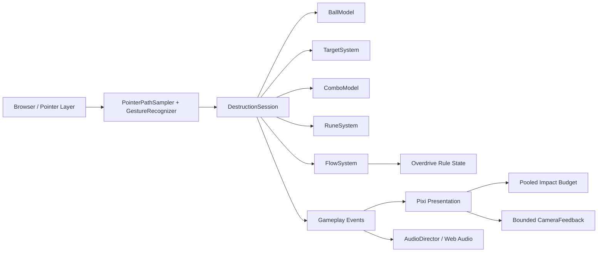

# Rune Ball

Mobile-first neon occult arcade prototype built with PixiJS, Vite, and strict TypeScript.

## Current milestone

**P5 — VFX + Audio Characterization**

The validated Swipe / Rebound / destruction / Rune / Flow / Overdrive loop now has a product-facing audiovisual hierarchy. P5 does not add gameplay rules; it makes the existing events readable by sight and sound without relying on prototype state labels.

Current slice includes:

- four-way swipe redirect at stable cruise velocity
- Crystal and Armored Crystal targets with score + forgiving Combo
- active rebound utility and chase-aware respawn
- Circle → Vortex, V → Split, and Z → Chain Rune gestures
- shared Rune charge generated by meaningful impacts
- Flow accumulation and one 12-second Overdrive climax
- tapered sampled ball trail and final-ish rotating core / sigil treatment
- distinct pooled Contact / Break / Overdrive particle tiers with hard caps
- directional Chain propagation and canonical Rune confirmation treatment
- bounded camera punch hierarchy: none on normal contact, light on Break, stronger on Chain, strongest on Overdrive entry
- screen-scale Overdrive response reserved for entry / release rather than continuously flashing
- Web Audio procedural characterization for contact, break, Rebound, Combo milestones, each Rune, Chain, Overdrive entry / exit, and a result-sting hook for P6
- autoplay-safe audio initialization on the first explicit pointer interaction
- `prefers-reduced-motion` support for camera displacement, large flashes, and secondary effect density
- HUD cleanup: success states are primarily communicated by world feedback; text remains contextual for failed Rune input / insufficient charge

P6 still owns the 60–90 second run director, results / retry loop, sound and reduced-motion toggles, telemetry, and final production deployment validation.

## Commands

```bash
npm ci
npm test
npm run build
npm run dev
```

## Runtime architecture



Renderer initialization is explicitly timed and falls back across WebGL 1, WebGL, and WebGPU. Failure renders a visible error state into `#app` instead of leaving a blank page.

## Deployment

Production base path:

`/2D-game-playground/rune-ball/`

`npm run build` runs TypeScript validation, Vite production build, and a dist check that rejects root-relative `/assets/` references.
