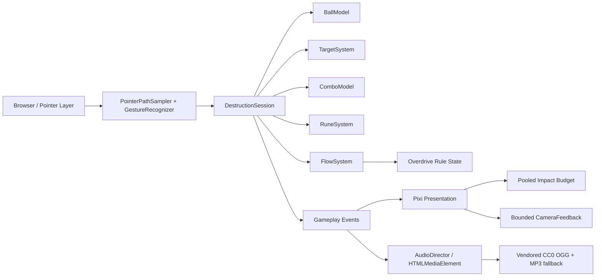

# Rune Ball

Mobile-first neon occult arcade prototype built with PixiJS, Vite, and strict TypeScript.

## Current milestone

**P5.2 — Asset Audio Delivery Gate**

The validated Swipe / Rebound / destruction / Rune / Flow / Overdrive loop already has a product-facing visual hierarchy. P5.2 replaces the inaudible procedural Web Audio experiment with a materially different delivery path: vendored CC0 BGM/SFX played through `HTMLAudioElement`.

Current slice includes:

- four-way swipe redirect at stable cruise velocity
- Crystal and Armored Crystal targets with score + forgiving Combo
- active rebound utility and chase-aware respawn
- Circle → Vortex, V → Split, and Z → Chain Rune gestures
- shared Rune charge generated by meaningful impacts
- Flow accumulation and one 12-second Overdrive climax
- tapered sampled ball trail and rotating core / sigil treatment
- distinct pooled Contact / Break / Overdrive particle tiers with hard caps
- directional Chain propagation and canonical Rune confirmation treatment
- bounded camera punch hierarchy with one readable directional punch + small recoil; no continuous shake
- screen-scale Overdrive response reserved for entry / release rather than continuously flashing
- **CC0 asset BGM:** `Claimed by the Void`, with OGG primary and MP3 compatibility fallback
- asset SFX mapping for Contact, armored impact, Break, Rebound, Vortex, Split, Chain, Overdrive entry / exit, and a result-sting hook
- browser codec selection: Ogg/Vorbis when supported, MP3 fallback otherwise
- first-pointer media activation plus SFX-pool priming for mobile browser playback restrictions
- Flow / Overdrive drive BGM intensity without changing track pitch
- `prefers-reduced-motion` support for camera displacement, large flashes, and secondary effect density
- HUD cleanup: success states are primarily communicated by world feedback; text remains contextual for failed Rune input / insufficient charge

Audio asset provenance and CC0 licensing are recorded in `public/audio/ASSET-LICENSES.md`.

P5.2 does not change gameplay. P6 still owns the 60–90 second run director, results / retry loop, sound and reduced-motion toggles, telemetry, and final production deployment validation.

## Commands

```bash
npm ci
npm test
npm run build
npm run dev
```

## Runtime architecture



Renderer initialization is explicitly timed and falls back across WebGL 1, WebGL, and WebGPU. Failure renders a visible error state into `#app` instead of leaving a blank page.

## Deployment

Production base path:

`/2D-game-playground/rune-ball/`

`npm run build` runs TypeScript validation, Vite production build, and dist checks for both the Pages asset base and the required shipped audio files.
