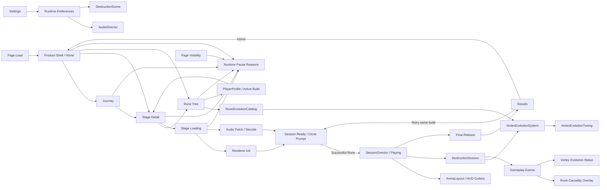

# Rune Ball

Mobile-first neon occult arcade game prototype built with PixiJS, Vite, and strict TypeScript.

## Current milestone

**P8.2.1 — Rune Tree + Arena Clarity Refinement**

P0–P6 established the mobile arena loop, Rune gestures, Flow / Overdrive, VFX/audio, 75-second sessions, Results / Retry, accessibility controls, persisted settings, and background-aware lifecycle behavior. P7.2 replaced the temporary tap-Ascension experiment with automatic Rune Evolution: the player configures a Vortex path and qualified uses evolve it at runtime.

P8.1 added the complete product shell (Home, Journey, Rune Tree, Stage Detail, Run, Results, Settings), and P8.1.1 made application entry Home-first with gameplay runtime loading deferred until `START RUN`.

P8.2 established a real Rune Tree and shared `RuneEvolutionCatalog`. P8.2.1 refines that validated shell from phone feedback:

```text
Open Web → Home
           ├─ Journey → Stage Detail ─┐
           └─ Runes                   │
                ↓                     │
         Choose Rune Card             │
                ↓                     │
      Tap graphical path node         │
                ↓                     │
        Path switches directly        │
                └─────────────────────┘
                                      ↓
                                  START RUN
                                      ↓
                         Level Title + Loading Bar
                                      ↓
       Top HUD gutter / Collision Arena / Rune gutter
                                      ↓
                              Run → Results
                                   ├─ Retry
                                   └─ Home
```

### Product shell contract

- **Home** is immediately available on page load and presents one dominant `PLAY` action, current Stage, current Rune Build, and secondary `JOURNEY` / `RUNES` destinations.
- **Journey** is the authored stage progression surface. Only implemented stages are playable; future stages are explicitly locked.
- **Rune Tree** keeps Vortex / Split / Chain as readable Rune cards. The selected Rune's evolution graph is glyph-first; tapping a Vortex evolution node immediately makes that branch active, while names, mechanics, play pattern, and thresholds live in the detail surface below.
- **Vortex** supports `Gravity Well → Singularity` and `Orbit → Event Horizon`. Gravity remains cluster/collapse; Orbit is now deliberately longer-lived to reinforce capture/control.
- **Split / Chain** remain selectable Base Runes with intentionally unauthored graphical branch placeholders rather than fake unlock content.
- **Stage Detail** owns the run briefing: objective, current Rune Build, edit route, and `START RUN`.
- **Stage Loading** appears only after `START RUN` and shows only the selected level title and loading bar.
- **Run** uses a physical UI hierarchy: top telemetry/system gutter, clean rounded collision Arena, and bottom Rune/evolution gutter. Score, Combo, Flow/Overdrive, Rune charge, and Rune guide no longer occupy collision space.
- **Results** keeps `RETRY` primary and `HOME` secondary. Retry preserves the selected Stage and Rune Build and reuses the resident runtime without loading again.
- **Settings** remains a higher system layer and is not promoted into primary navigation.

The current playable stage remains the existing 75-second `Shattered Gate` session. `Prism Wake` and `Null Cathedral` are navigation/content placeholders only; P8 does not claim those gameplay variants are implemented.

Rune names, Vortex path identities, evolution thresholds, node descriptions, runtime stage names, and build summaries share `RuneEvolutionCatalog`. Vortex field tuning is isolated in `VortexEvolutionTuning`, while `ArenaLayout` owns the screen-space relationship between HUD gutters and collision bounds.

See `docs/plans/rune-ball/P8-1-PRODUCT-SHELL.md`, `docs/plans/rune-ball/P8-1-1-HOME-FIRST-BOOT.md`, `docs/plans/rune-ball/P8-2-RUNE-TREE-UX.md`, and `docs/plans/rune-ball/P8-2-1-RUNE-TREE-ARENA-CLARITY.md`.

The final Production Pages Smoke Gate remains intentionally deferred while product/content design continues.

Audio asset provenance and CC0 licensing remain recorded in `public/audio/ASSET-LICENSES.md`.

## Commands

```bash
npm ci
npm test
npm run build
npm run dev
```

## Runtime architecture



`SessionDirector`, `VortexEvolutionSystem`, collision, Rune, Flow, Overdrive, target, and scoring logic remain renderer-independent. `GameShell` owns product navigation, `RuneTreePanel` owns Rune configuration UI state, `PlayerProfile` owns persisted build choice, `ArenaLayout` owns presentation geometry, and stage entry owns lazy renderer/audio preparation before gameplay begins.

Renderer initialization remains explicitly timed and falls back across WebGL 1, WebGL, and WebGPU. Required stage-runtime failure remains visible instead of leaving an empty mount element. Audio SFX are fully fetched and decoded before Arena Ready; if browser media activation remains gesture-locked after asynchronous loading, the first arena pointer input retries activation without another modal.

## Deployment

Production base path:

`/2D-game-playground/rune-ball/`

Rune Ball continues to ship through `.github/workflows/rune-ball.yml` and the shared Pages workflow. `npm run build` runs TypeScript validation, Vite production build, and dist checks for both the Pages asset base and required shipped audio files. The deployed-site smoke pass remains deferred until a release-focused checkpoint.
