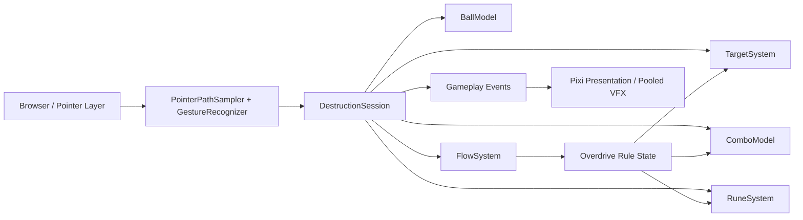

# Rune Ball

Mobile-first neon occult arcade prototype built with PixiJS, Vite, and strict TypeScript.

## Current milestone

**P4 — Flow + Overdrive Gate**

The validated ball / destruction / rebound / Rune loop now closes into a single escalation arc: competent offense builds Flow, Flow triggers one authored Overdrive climax, and Overdrive temporarily changes the arena rules rather than acting as a cosmetic speed boost.

Current slice includes:

- four-way swipe redirect at stable cruise velocity
- Crystal and Armored Crystal targets with score + forgiving Combo
- active rebound utility and chase-aware respawn
- Circle → Vortex, V → Split, and Z → Chain Rune gestures
- shared Rune charge generated by meaningful impacts
- Flow accumulation from hits, breaks, Rune setup, and Chain payoff
- one 12-second Overdrive climax per mechanic-gate session
- free Rune activation during Overdrive
- Combo protection during Overdrive
- target density ramp from 8 to 11 during Overdrive
- stronger temporary trail / impact / shockwave presentation tier
- entry / exit Overdrive event sequence with a shared Flow / countdown meter

Final VFX/audio characterization, meta progression, and session results remain out of scope until later gates.

## Commands

```bash
npm ci
npm test
npm run build
npm run dev
```

## Runtime architecture



Renderer initialization is explicitly timed and falls back across WebGL 1, WebGL, and WebGPU. Failure renders a visible error state into `#app` instead of leaving a blank page.

## Deployment

Production base path:

`/2D-game-playground/rune-ball/`

`npm run build` runs TypeScript validation, Vite production build, and a dist check that rejects root-relative `/assets/` references.
