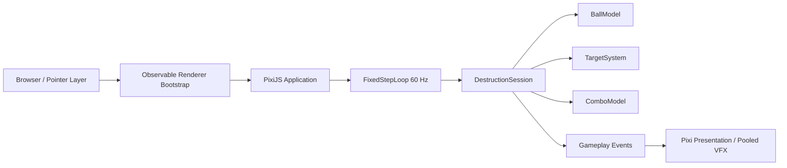

# Rune Ball

Mobile-first neon occult arcade prototype built with PixiJS, Vite, and strict TypeScript.

## Current milestone

**P2.1 — Rebound Utility & Chase Flow**

The validated P1 ball-feel loop and P2 destruction/combo loop are now extended so wall bounces actively return the ball into useful play instead of creating dead travel time.

Current slice includes:

- four-way swipe redirect with deterministic fixed-step motion
- Crystal and Armored Crystal targets
- score + forgiving Combo
- pooled hit / break feedback
- temporary rebound speed boost
- mild forward-cone rebound assist that never replaces swipe control
- chase-aware target respawn bias to reduce dead air

Rune recognition, Flow, Overdrive, final VFX/audio, and session results remain out of scope until later gates.

## Commands

```bash
npm ci
npm test
npm run build
npm run dev
```

## Runtime architecture



Renderer initialization is explicitly timed and falls back across WebGL 1, WebGL, and WebGPU. Failure renders a visible error state into `#app` instead of leaving a blank page.

## Deployment

Production base path:

`/2D-game-playground/rune-ball/`

`npm run build` runs TypeScript validation, Vite production build, and a dist check that rejects root-relative `/assets/` references.
