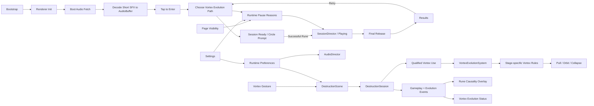

# Rune Ball

Mobile-first neon occult arcade prototype built with PixiJS, Vite, and strict TypeScript.

## Current milestone

**P7.2 — Vortex Evolution Tree Gate**

P0–P5 established mobile control, target destruction, Rune, Flow / Overdrive, VFX, and production-safe buffered audio. P6 packaged the mechanic into a 75-second run with Results / Retry, Rune-first onboarding, explicit causality feedback, runtime Sound / Reduced Motion controls, persisted preferences, and background-aware lifecycle handling.

The final Production Pages Smoke Gate remains intentionally deferred while the project explores the Post-MVP progression track.

P7.1 tested a Vortex Ascension card and one-shot Singularity tap release. Real-device feedback validated readable per-Rune progression and the upper-tier Vortex presentation, but the manual tap model did not match the intended build grammar and cast-count charging encouraged low-value Rune spam. P7.2 supersedes that runtime interaction model.

Current progression grammar:

```text
Choose Vortex path before the run
→ play only with Swipe + Rune gestures
→ qualified Vortex uses advance automatically
→ 3 uses: Tier 1
→ 6 uses: Tier 2
→ evolved rules persist for the rest of the run
```

P7.2 provides two Vortex paths:

- **Gravity → Gravity Well → Singularity**: increasingly strong gathering; Tier 2 Vortexes end with a collapse payoff.
- **Orbit → Orbit → Event Horizon**: target capture gains tangential / orbital motion and a longer control field.

A Vortex only counts as a qualified evolution use when at least one target is inside its effective field at cast time. Empty/off-target casts still spend normal Rune charge but do not advance evolution.

There is no Ascension tap button in P7.2. The in-run evolution surface is informational only; automatic evolution is communicated primarily through world-space feedback. See `docs/plans/rune-ball/P7-2-VORTEX-EVOLUTION.md`.

Audio asset provenance and CC0 licensing remain recorded in `public/audio/ASSET-LICENSES.md`.

## Commands

```bash
npm ci
npm test
npm run build
npm run dev
```

## Runtime architecture



`SessionDirector`, `VortexEvolutionSystem`, collision, Rune, Flow, Overdrive, target, and scoring logic remain renderer-independent. Pre-run build selection is presentation/application state; the gameplay domain receives the selected path and owns qualification plus evolved behavior.

Renderer initialization is explicitly timed and falls back across WebGL 1, WebGL, and WebGPU. Required boot-audio failure remains visible instead of silently entering an inaudible session.

## Deployment

Production base path:

`/2D-game-playground/rune-ball/`

Rune Ball continues to ship through `.github/workflows/rune-ball.yml` and the shared Pages workflow. `npm run build` runs TypeScript validation, Vite production build, and dist checks for both the Pages asset base and required shipped audio files. The final deployed-site smoke pass is deferred until the next release-focused checkpoint.
