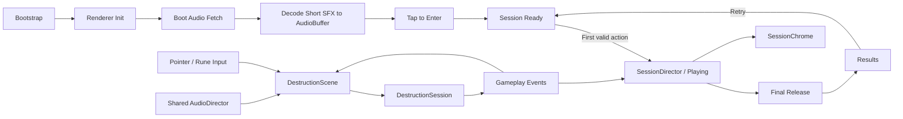

# Rune Ball

Mobile-first neon occult arcade prototype built with PixiJS, Vite, and strict TypeScript.

## Current milestone

**P6.1 — Session Loop + Authorship Gate**

P0–P5 established the mobile control, target destruction, Rune, Flow / Overdrive, VFX, and production-safe audio foundation. Real-device P5 corrections are now part of the baseline: short SFX are pre-decoded `AudioBuffer`s, BGM / SFX pause correctly in the background, and target-break mix has been calibrated down.

P6.1 packages the proven mechanic into one replayable run without adding progression rewards.

Session lifecycle:

`Boot → Audio Preload / Decode → Tap to Enter → Ready → Playing → Final Release → Results → Retry`

Current slice includes:

- four-way swipe redirect at stable cruise velocity
- Crystal and Armored Crystal targets with score + forgiving Combo
- active rebound utility and chase-aware respawn
- Circle → Vortex, V → Split, and Z → Chain Rune gestures
- shared Rune charge generated by meaningful impacts
- Flow accumulation and one 12-second Overdrive climax
- pooled VFX / bounded camera feedback with reduced-motion support
- CC0 asset BGM with OGG primary and MP3 compatibility fallback
- pre-decoded `AudioBuffer` SFX with bounded concurrent sources
- page visibility lifecycle that pauses BGM, SFX context, and P6 run time while backgrounded
- **75-second authored run**; the timer starts only on the first valid Swipe or successful Rune
- final 3-second release window without introducing a second control mode
- event-driven run statistics: Score, Max Combo, Breaks, Rune Casts, Overdrive Breaks, and Chain Links
- modal Results surface with one primary `RETRY` action
- Retry rebuilds a clean gameplay scene and resets the fixed-step accumulator

Audio asset provenance and CC0 licensing are recorded in `public/audio/ASSET-LICENSES.md`.

P6.1 does not add Rune Cards, Overdrive Archetypes, meta progression, new target types, or balance changes. The gate is whether the spectacle-forward loop still feels authored by the player and creates voluntary replay desire. See `docs/plans/rune-ball/P6-SESSION-LOOP.md`.

P6.2 owns sound / reduced-motion controls, preference persistence, final deployment hardening, and production smoke validation.

## Commands

```bash
npm ci
npm test
npm run build
npm run dev
```

## Runtime architecture



`SessionDirector` is renderer-independent and observes the existing gameplay event stream. `SessionChrome` owns only the timer / Results presentation. Collision, Rune, Flow, Overdrive, and target rules remain inside the existing domain systems.

Renderer initialization is explicitly timed and falls back across WebGL 1, WebGL, and WebGPU. Required boot-audio failure is visible instead of silently entering an inaudible session.

## Deployment

Production base path:

`/2D-game-playground/rune-ball/`

`npm run build` runs TypeScript validation, Vite production build, and dist checks for both the Pages asset base and the required shipped audio files.
