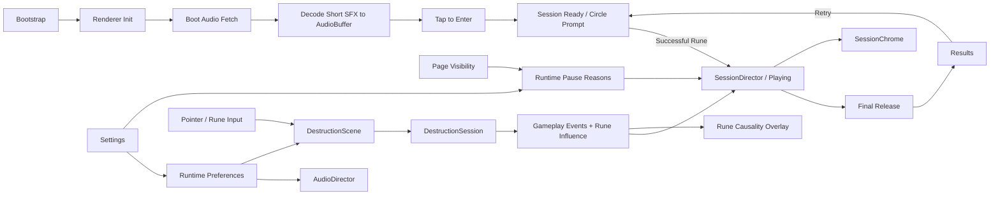

# Rune Ball

Mobile-first neon occult arcade prototype built with PixiJS, Vite, and strict TypeScript.

## Current milestone

**P6.2 — Production Controls + Deploy Gate**

P0–P5 established mobile control, target destruction, Rune, Flow / Overdrive, VFX, and production-safe buffered audio. P6.1 packaged the mechanic into a 75-second run with Final Release, Results, Retry, background-aware timing, Rune-first onboarding, explicit Rune causality feedback, and a clearer Ready-state target perimeter layout.

Session lifecycle:

`Boot → Audio Preload / Decode → Tap to Enter → Ready → Playing → Final Release → Results → Retry`

P6.2 is the production-hardening slice:

- secondary Settings launcher outside the persistent gameplay HUD
- Sound toggle connected to the shared `AudioDirector`
- Reduced Motion toggle connected to the existing Scene / camera / impact reductions
- first-visit Reduced Motion inherits `prefers-reduced-motion`
- explicit preferences persist through a versioned `localStorage` record
- Settings opening pauses gameplay input and Session time without stopping BGM
- runtime pause is composed from independent page-visibility and Settings reasons
- Settings uses familiar switch affordances, safe-area placement, platform system typography, focus containment, and reduced-transparency / increased-contrast fallbacks
- existing Pages deployment pipeline remains authoritative; no parallel deploy path is introduced

Audio asset provenance and CC0 licensing remain recorded in `public/audio/ASSET-LICENSES.md`.

P6.2 does not add Rune Cards, Overdrive Archetypes, progression, accounts, backend services, new targets, or balance changes. See `docs/plans/rune-ball/P6-2-PRODUCTION-CONTROLS.md`.

## Commands

```bash
npm ci
npm test
npm run build
npm run dev
```

## Runtime architecture



`SessionDirector` remains renderer-independent. Collision, Rune, Flow, Overdrive, target, and scoring rules remain inside the gameplay domain. Settings and persisted preferences sit at the application boundary and only configure existing runtime systems.

Renderer initialization is explicitly timed and falls back across WebGL 1, WebGL, and WebGPU. Required boot-audio failure remains visible instead of silently entering an inaudible session.

## Deployment

Production base path:

`/2D-game-playground/rune-ball/`

Rune Ball continues to ship through `.github/workflows/rune-ball.yml` and the shared Pages workflow. `npm run build` runs TypeScript validation, Vite production build, and dist checks for both the Pages asset base and required shipped audio files.
