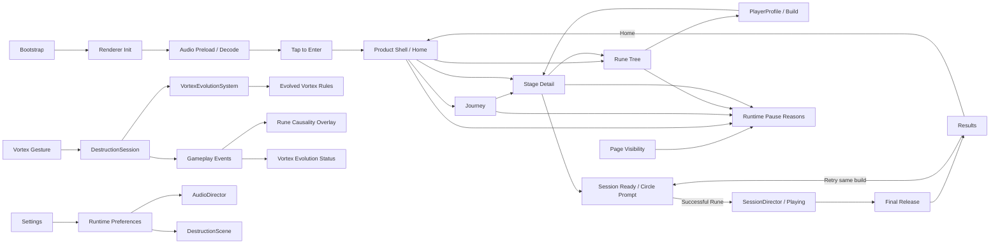

# Rune Ball

Mobile-first neon occult arcade game prototype built with PixiJS, Vite, and strict TypeScript.

## Current milestone

**P8.1 — Product Shell & Navigation Gate**

P0–P6 established the mobile arena loop, Rune gestures, Flow / Overdrive, VFX/audio, 75-second sessions, Results / Retry, accessibility controls, persisted settings, and background-aware lifecycle behavior. P7.2 replaced the temporary tap-Ascension experiment with automatic Rune Evolution: the player configures a Vortex path and qualified uses evolve it at runtime.

P8.1 moves the project from a prototype entry flow toward a complete game information architecture. Product navigation now owns build and stage configuration before gameplay:

```text
Boot → Tap to Enter → Home
                      ├─ Journey → Stage Detail → Run → Results → Retry / Home
                      └─ Runes → Configure Evolution Path → Home

Stage Detail → Edit Runes → Stage Detail
Settings remains a global system layer.
```

### Product shell contract

- **Home** presents one dominant `PLAY` action, current Stage, current Rune Build, and secondary `JOURNEY` / `RUNES` destinations.
- **Journey** is the authored stage progression surface. Only implemented stages are playable; future stages are explicitly locked.
- **Rune Tree** owns persistent build configuration. Vortex currently supports `Gravity Well → Singularity` and `Orbit → Event Horizon`; Split / Chain remain base Runes until their trees are authored.
- **Stage Detail** owns the run briefing: objective, current Rune Build, edit route, and `START RUN`.
- **Run** remains gesture-first. There is no pre-run build picker modal.
- **Results** keeps `RETRY` primary and adds `HOME` secondary. Retry preserves the selected Stage and Rune Build.
- **Settings** remains a higher system layer and is not promoted into primary navigation.

The current playable stage remains the existing 75-second `Shattered Gate` session. `Prism Wake` and `Null Cathedral` are navigation/content placeholders only; P8.1 does not claim those gameplay variants are implemented.

See `docs/plans/rune-ball/P8-1-PRODUCT-SHELL.md`.

The final Production Pages Smoke Gate remains intentionally deferred while product/content design continues.

Audio asset provenance and CC0 licensing remain recorded in `public/audio/ASSET-LICENSES.md`.

## Commands

```bash
npm ci
npm test
npm run build
npm run dev
```

## Runtime architecture



`SessionDirector`, `VortexEvolutionSystem`, collision, Rune, Flow, Overdrive, target, and scoring logic remain renderer-independent. `GameShell` owns product navigation/presentation, `PlayerProfile` owns persisted build choice, and the gameplay domain receives the selected path when a run is created.

Renderer initialization remains explicitly timed and falls back across WebGL 1, WebGL, and WebGPU. Required boot-audio failure remains visible instead of silently entering an inaudible session.

## Deployment

Production base path:

`/2D-game-playground/rune-ball/`

Rune Ball continues to ship through `.github/workflows/rune-ball.yml` and the shared Pages workflow. `npm run build` runs TypeScript validation, Vite production build, and dist checks for both the Pages asset base and required shipped audio files. The deployed-site smoke pass remains deferred until a release-focused checkpoint.
