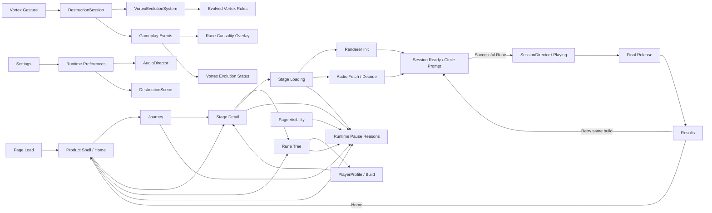

# Rune Ball

Mobile-first neon occult arcade game prototype built with PixiJS, Vite, and strict TypeScript.

## Current milestone

**P8.1.1 — Home-first Boot Flow**

P0–P6 established the mobile arena loop, Rune gestures, Flow / Overdrive, VFX/audio, 75-second sessions, Results / Retry, accessibility controls, persisted settings, and background-aware lifecycle behavior. P7.2 replaced the temporary tap-Ascension experiment with automatic Rune Evolution: the player configures a Vortex path and qualified uses evolve it at runtime.

P8.1 added the first complete product information architecture: Home, Journey, Rune Tree, Stage Detail, Run, Results, and Settings. P8.1.1 corrects runtime ownership now that Home exists: the website opens directly on Home, while renderer/audio preparation is deferred until the player actually enters a stage.

```text
Open Web → Home
           ├─ Journey → Stage Detail ─┐
           └─ Runes → Configure Build │
                                      ↓
                                  START RUN
                                      ↓
                         Level Title + Loading Bar
                                      ↓
                                  Arena Ready
                                      ↓
                              Run → Results
                                   ├─ Retry
                                   └─ Home
```

### Product shell contract

- **Home** is immediately available on page load and presents one dominant `PLAY` action, current Stage, current Rune Build, and secondary `JOURNEY` / `RUNES` destinations.
- **Journey** is the authored stage progression surface. Only implemented stages are playable; future stages are explicitly locked.
- **Rune Tree** owns persistent build configuration. Vortex currently supports `Gravity Well → Singularity` and `Orbit → Event Horizon`; Split / Chain remain base Runes until their trees are authored.
- **Stage Detail** owns the run briefing: objective, current Rune Build, edit route, and `START RUN`.
- **Stage Loading** appears only after `START RUN` and intentionally shows only the selected level title and loading bar.
- **Run** remains gesture-first. There is no pre-run build picker modal or extra Tap-to-Enter gate.
- **Results** keeps `RETRY` primary and `HOME` secondary. Retry preserves the selected Stage and Rune Build and reuses the resident runtime without loading again.
- **Settings** remains a higher system layer and is not promoted into primary navigation.

The current playable stage remains the existing 75-second `Shattered Gate` session. `Prism Wake` and `Null Cathedral` are navigation/content placeholders only; P8 does not claim those gameplay variants are implemented.

See `docs/plans/rune-ball/P8-1-PRODUCT-SHELL.md` and `docs/plans/rune-ball/P8-1-1-HOME-FIRST-BOOT.md`.

The final Production Pages Smoke Gate remains intentionally deferred while product/content design continues.

Audio asset provenance and CC0 licensing remain recorded in `public/audio/ASSET-LICENSES.md`.

## Commands

```bash
npm ci
npm test
npm run build
npm run dev
```

## Runtime architecture



`SessionDirector`, `VortexEvolutionSystem`, collision, Rune, Flow, Overdrive, target, and scoring logic remain renderer-independent. `GameShell` owns product navigation/presentation, `PlayerProfile` owns persisted build choice, and stage entry owns lazy renderer/audio preparation before gameplay begins.

Renderer initialization remains explicitly timed and falls back across WebGL 1, WebGL, and WebGPU. Required stage-runtime failure remains visible instead of leaving an empty mount element. Audio SFX are still fully fetched and decoded before Arena Ready; if browser media activation remains gesture-locked after asynchronous loading, the first arena pointer input retries activation without adding another modal.

## Deployment

Production base path:

`/2D-game-playground/rune-ball/`

Rune Ball continues to ship through `.github/workflows/rune-ball.yml` and the shared Pages workflow. `npm run build` runs TypeScript validation, Vite production build, and dist checks for both the Pages asset base and required shipped audio files. The deployed-site smoke pass remains deferred until a release-focused checkpoint.
