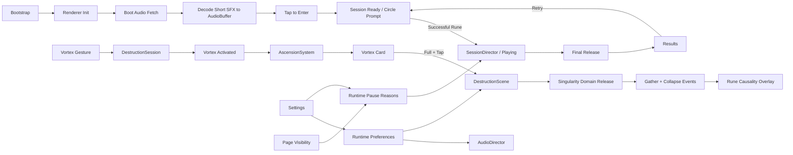

# Rune Ball

Mobile-first neon occult arcade prototype built with PixiJS, Vite, and strict TypeScript.

## Current milestone

**P7.1 — Rune Card Interaction Gate**

P0–P5 established mobile control, target destruction, Rune, Flow / Overdrive, VFX, and production-safe buffered audio. P6 packaged the mechanic into a 75-second run with Results / Retry, Rune-first onboarding, explicit causality feedback, runtime Sound / Reduced Motion controls, persisted preferences, and background-aware lifecycle handling.

The final Production Pages Smoke Gate is intentionally deferred while the project explores the previously documented Post-MVP progression track.

Session lifecycle remains:

`Boot → Audio Preload / Decode → Tap to Enter → Ready → Playing → Final Release → Results → Retry`

P7.1 adds one deliberately narrow progression vertical slice:

- one Vortex Ascension card at the bottom safe area
- four successful Vortex casts charge the card from 0 → 100
- Split / Chain do not charge it
- charging state remains visually quiet and non-interactive
- full charge changes the card into a deliberate `SINGULARITY READY` tap target
- tapping the card does **not** cast normal Vortex; it releases the upper-tier Singularity
- Singularity anchors to the ball, strongly gathers targets, then resolves through a Vortex-authored collapse pulse
- card interaction is disabled with gameplay input during Settings, background pause, and Results
- Retry resets Ascension Energy

The P7.1 risk is whether this second tap decision deepens the gesture-first loop without turning Rune Ball into a skill-bar game or pulling attention away from the arena. See `docs/plans/rune-ball/P7-1-RUNE-CARD-ASCENSION.md`.

Audio asset provenance and CC0 licensing remain recorded in `public/audio/ASSET-LICENSES.md`.

## Commands

```bash
npm ci
npm test
npm run build
npm run dev
```

## Runtime architecture



`SessionDirector`, `AscensionSystem`, collision, Rune, Flow, Overdrive, target, and scoring logic remain renderer-independent. The DOM card is presentation only; a release is consumed only after the gameplay domain accepts it.

Renderer initialization is explicitly timed and falls back across WebGL 1, WebGL, and WebGPU. Required boot-audio failure remains visible instead of silently entering an inaudible session.

## Deployment

Production base path:

`/2D-game-playground/rune-ball/`

Rune Ball continues to ship through `.github/workflows/rune-ball.yml` and the shared Pages workflow. `npm run build` runs TypeScript validation, Vite production build, and dist checks for both the Pages asset base and required shipped audio files. The final deployed-site smoke pass is deferred until the next release-focused checkpoint.
