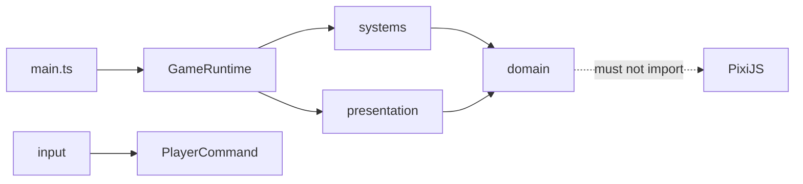

# VERTEX Refactoring Roadmap

## Goal

Reduce regression risk while keeping MVP iteration speed high. Refactors must preserve gameplay behavior unless a PR explicitly says otherwise.

## Target dependency direction

## R1 — Input + Commands

Status: completed

- Extract swipe thresholds and strength mapping from `main.ts`.
- Convert keyboard and pointer gestures into `PlayerCommand` values.
- Keep execution of commands in the current runtime temporarily.
- Add unit tests locking existing mobile gesture semantics.

## R2 — Gameplay Events + FX

Status: completed in `main`

- Introduce typed gameplay events (`dash-started`, `landed`, `wall-jumped`, `drone-killed`, `crystal-picked`, `player-hit`).
- Move Dash trail, burst particles, and existing camera impulses behind an FX boundary.
- Gameplay orchestration emits events; Pixi presentation consumes them.
- Regression target: gameplay refactors must not be able to silently remove established FX.

## R3 — World Generation

Status: completed in PR #66

- Extract band generation and spawn policy from `main.ts`.
- Return data-only world entities/bands.
- Introduce deterministic seeded generation for reproducible traversal bugs.
- Preserve current gap, rest-band, wall, hazard, drone, and crystal probabilities.

## R4 — World State / Pixi View Separation

Status: in progress

- Remove `Graphics` references from gameplay entity state.
- Give entities stable IDs.
- Renderer owns `Map<EntityId, Graphics>` view registries.
- Collision and generation operate only on data.

## R5 — GameRuntime + Systems

- Make `main.ts` bootstrap-only.
- Introduce orchestration through `GameRuntime`.
- Extract Movement, Collision, Camera, and WorldGeneration systems.
- Keep Domain independent from PixiJS.

## Guardrails

During R1–R5, do not mix architecture work with jump tuning, Dash tuning, spawn-rate changes, new gameplay objects, Flow redesign, or visual restyling. Each refactor PR must run tests and `npm run build` before merge.
